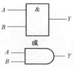
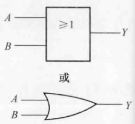
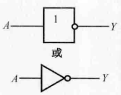
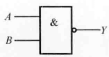
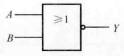
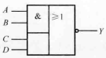
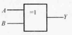
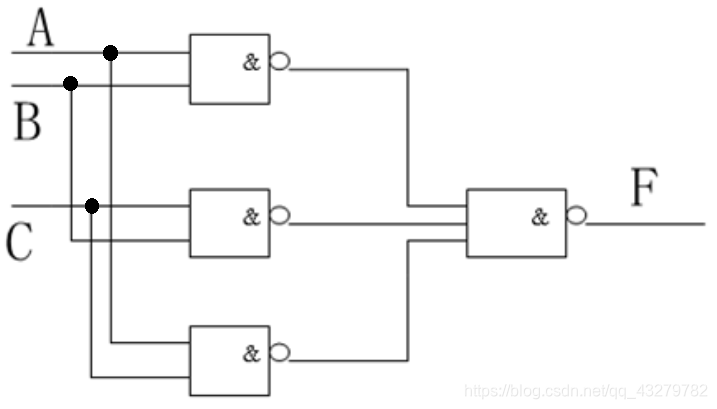
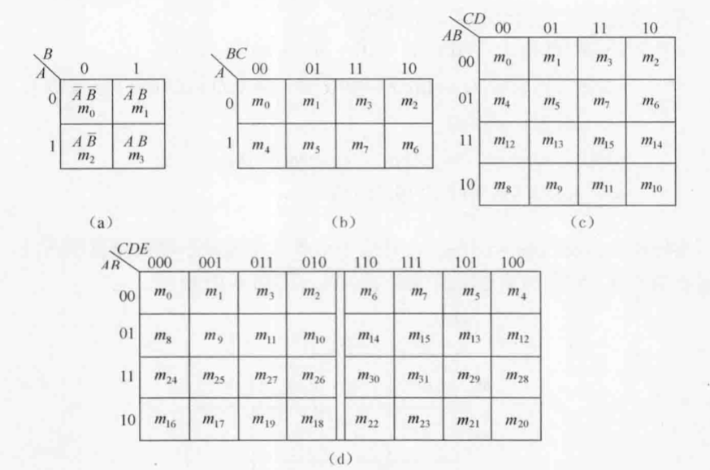

# 数字逻辑基础

## 逻辑变量与运算

**逻辑变量**（也称为 布尔 变量）用于描述客观事物对立统一的两个方面。**逻辑代数**中常用单个大写字母或者单个大写字母加下标表示逻辑变量。在二值逻辑中，每个逻辑变量只有0和1两种可能，0和1不在具有数值意义，而是表示两种不同的逻辑状态（真和假）。

### 基本逻辑运算

|运算名称|运算符号|图形符号|真值表|运算特点|
|-|-|-|-|-|
|逻辑与（乘） AND|$Y=A\cdot B=AB$||A 0 0 1 1 B 0 1 0 1 Y 0 0 0 1|有假为假，全真为真|
|逻辑或（加） OR|$Y=A+B$||A 0 0 1 1 B 0 1 0 1 Y 0 1 1 1|有真为真，全假为假|
|逻辑非（求反） NOT|$Y=\overline{A}$||A 0 1 Y 1 0||

### 复合逻辑运算

|运算名称|运算符号|图形符号|真值表|运算特点|
|-|-|-|-|-|
|逻辑与非 NAND|$Y=\overline{A\cdot B}=\overline{AB}$||A 0 0 1 1 B 0 1 0 1 Y 1 1 1 0|有假为真，全真为假|
|逻辑或非 NOR|$Y=\overline{A+B}$||A 0 0 1 1 B 0 1 0 1 Y 1 0 0 0|有真为假，全假为真|
|逻辑与或非 AON|$Y=\overline{AB+CD}$|||先与再或后非|
|逻辑异或 XOR|$Y=A\cdot \overline{B}+\overline{A}\cdot B=A\oplus B$||A 0 0 1 1 B 0 1 0 1 Y 0 1 1 0|不同为真，相同为假|
|逻辑同或 NXOR|$Y=A\cdot B+\overline{A}\cdot \overline{B}=A\odot B$||A 0 0 1 1 B 0 1 0 1 Y 1 0 0 1|不同为假，相同为真|

## 逻辑代数公式与定理

### 基本公式

基本公式又称**布尔恒等式**，它们反映了逻辑代数运算的基本规律，其正确性都可以用列逻辑真值表的方式加以验证。

|名称|公式1|公式2|
|-|-|-|
|零一律|$A\cdot 1=A$ $A\cdot 0=0$|$A+0=A$ $A+1=1$|
|互补律|$A\overline{A}=0$|$A+\overline{A}=1$|
|重叠律|$AA=A$|$A+A=A$|
|交换律|$AB=BA$|$A+B=B+A$|
|结合律|$A(BC)=(AB)C$|$A+(B+C)=(A+B)+C$|
|分配律|$A(B+C)=AB+AC$|$A+BC=(A+B)(A+C)$|
|反演律 （ 德·摩根 定律）|$\overline{AB}=\overline{A}+\overline{B}$|$\overline{A+B}=\overline{A}\ \overline{B}$|
|对合律 （还原律）|$\overline{\overline{A}}=A$||

### 常用公式

常用公式是利用基本公式导出的，在逻辑函数的化简可以直接使用。

|名称|公式1|公式2|
|-|-|-|
|吸收律|$A(A+B)=A$ $A(\overline{A}+B)=AB$ $(A+B)(\overline{A}+C)(B+C)=(A+B)(\overline{A}+C)$|$A+AB=A$ $A+\overline{A}B=A+B$ $AB+\overline{A}C+BC=AB+\overline{A}C$

### 基本定理

**代入定理**：在任何一个含义某个变量的等式中，若用另外一个逻辑式代入式中所有这个变量的位置，则等式仍然成立。

**反演定理**：对于任意一个逻辑式$Y$，若将其中所有的“·”换成“+”、“+”换成“·”、0换成1、1换成0、原变量换成反变量、反变量换成原变量，则得到的结果就是$\overline{Y}$。

对于任意一个逻辑式$Y$，若将其中所有的“·”换成“+”、“+”换成“·”、0换成1、1换成0，则得到的结果就是$Y^{\prime}$。$Y^{\prime}$称为$Y$的**对偶式**。

**对偶定理**：若两逻辑式相等，则它们的对偶式也相等。

在上面基本公式表和常用公式表中，公式1和公式2就是一对对偶式，显然由对偶定理可得，公式1成立，则公式2也成立。

## 逻辑函数及其表示方式

如果以逻辑变量$A$、$B$、$C$、...作为输入，以运算结果逻辑变量$Y$作为输出，那么当输入变量的取值确定后，输出的取值便唯一确定，输入与输出之间是一种函数关系，称$Y$是$A$、$B$、$C$、...的**逻辑函数**。即

$$
Y=F(A,B,C,...)
$$

下面以“三人表决电路（少数服从多数）”为例说明表示方式。

### 逻辑真值表

将输入变量的所有取值组合所对应的输出值找出来，列成表格，即可得到**逻辑真值表**，简称真值表。

|A|B|C|Y|
|-|-|-|-|
|0|0|0|0|
|0|0|1|0|
|0|1|0|0|
|0|1|1|1|
|1|0|0|0|
|1|0|1|1|
|1|1|0|1|
|1|1|1|1|

### 逻辑函数式

把输入与输出之间的关系写成与、或、非等运算的组合式，即得到了该逻辑关系的**逻辑函数式**。

$$
Y=\overline{A}BC+A\overline{B}C+AB\overline{C}+ABC
$$

### 逻辑图

将逻辑函数中各变量之间的与、或、非关系用图形符号表示出来，就可以画出表示逻辑关系的**逻辑图**。

## 逻辑函数的标准形式

### 最小项之和

在$n$变量的逻辑函数中，若$m$是包含$n$个因子的乘积项，这$n$个变量均以原变量或反变量的形式在$m$中出现且只出现一次，则称$m$为这组变量的**最小项**。最小项的个数为$2^n$个。输入变量的每一组取值都使对应的一个最小项逻辑值等于1，将这一组取值组合为二进制数，其对应的十进制数$i$作为这个最小项的标记的下标$m_i$。

最小项有如下性质：

1. 在输入变量的任意取值下必有一个最小项，有且仅有一个最小项的值为1。
2. 全体最小项之和为1。
3. 任意两个最小项的积为0。
4. 具有逻辑相邻性的两个最小项之和可以合并成一项并消去一对因子。

若两个最小项只有一个因子不同，则称这两个最小项具有**逻辑相邻性**。

利用$A+\overline{A}=1$可以把任何一个逻辑函数化为**最小项之和**的标准形式。

### 最大项之积

在$n$变量的逻辑函数中，若$M$是包含$n$个变量的和，这$n$个变量均以原变量或反变量的形式在$M$中出现且只出现一次，则称$M$为这组变量的**最大项**。最大项的个数为$2^n$个。输入变量的每一组取值都使对应的一个最大项逻辑值等于0，将这一组取值组合为二进制数，其对应的十进制数$i$作为这个最大项的标记的下标$M_i$。

最大项有如下性质：

1. 在输入变量的任意取值下必有一个最大项，有且仅有一个最大项的值为0。
2. 全体最大项之积为0。
3. 任意两个最大项的和为1。
4. 只有一个变量不同的两个最大项的乘积等于个相同变量之和。
5. 相同下标的最大项和最小项的反变量相等，即：

$$
M_i=\overline{m_i}
$$

利用性质5可以把任何一个逻辑函数化为**最大项之积**的标准形式。

## 逻辑函数的公式化简法

逻辑函数的**最简与-或逻辑式**（即“积之和”形式）中，要求与项尽可能少，每个与项中的变量数尽可能少。

### 并项法

利用零一律$A+\overline{A}=1$,可以将两项合为一项，并消去$A$和$\overline{A}$这一对因子。由代入定理可知，$A$可以是任意复杂的逻辑式。

### 吸收法

利用吸收律$A+AB=A$,可以将$AB$消去。由代入定理可知，$A$和$B$都可以是任意复杂的逻辑式。

### 消去法

利用吸收律$A+\overline{A}B=A+B$，消去多余因子。由代入定理可知，$A$和$B$都可以是任意复杂的逻辑式。

### 配项法

由于互补律$A\overline{A}=0$和$A+\overline{A}=1$，可以通过加上$A\overline{A}$或乘以$A+\overline{A}$，有时会使得化简更容易。

## 逻辑函数的卡诺图化简

### 卡诺图及化简

将$n$变量的逻辑函数的全部最小项各用一个小方块表示，并使具有逻辑相邻性的最小项在几何位置上也相邻地排列起来，所得的图形称为$n$变量的** 卡诺 图**。

由于卡诺图几何位置相邻与逻辑上相邻一致，所以几何位置相邻的最小项可以合并。合并只剩下公共因子。$2^n$个相邻的最小项结合，可以消去$n$个取值不同的变量而合并为1项。

卡诺图化简的一般选取原则：

1. 用卡诺图化简逻辑函数时，每一个最小项必须被圈，不能遗漏
2. 某一个最小项可以多次被圈，但是每次被圈时，圈内至少包含一个新的最小项。
3. 圈的个数要尽可能少，圈的大小要尽可能大。
4. 每个圈内只能有$2^n$个最小项，注意四角相邻性和对边相邻性。
5. 有时圈0更方便，但得到的化简结果是原函数的反函数。

### 具有无关项的卡诺图化简

逻辑函数中不会出现或不允许出现的最小项称为**约束项**。在某些输入变量的取值下，函数值为1还是为0，都不会影响电路的功能，这些取值等于1的最小项称为**任意项**，任意项通常由实际应用环境决定。约束项和任意项通称为**无关项**。

在填卡诺图时，无关项使用“×”表示，在化简逻辑函数时，可以将其看作1或0，但至于看作1还是0，要尽可能为了圈的大小大，圈的个数少考虑。

## 逻辑函数的变换与实现

逻辑函数的常用表示方法除了**与-或式**外，还有**与非-与非式**、**或-与式**、**或非-或非式**、**与或非式**。通过不同的表示，在实现为实际电路时，可以在限定器件或者其它情况下灵活运用。

|变换|方法|
|-|-|
|与-或式变换为与非-与非式|按还原律两次取反，然后用反演律展开|
|与-或式变换为或-与式|1.使用$M_i=\overline{m_i}$，但得到的结果不一定最简 2.根据对偶定理两次取对偶式，能够得到最简|
|与-或式变换为或非-或非式|先将与-或式变换为或-与式，再按还原律两次取反，然后用反演律展开|
|与-或式变换为与或非式|先求“最小项之和”形式，再求反函数的与-或形式，最后取反|

## 逻辑函数的Q-M化简