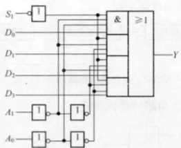
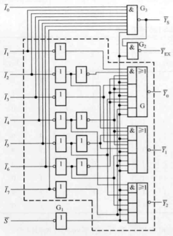
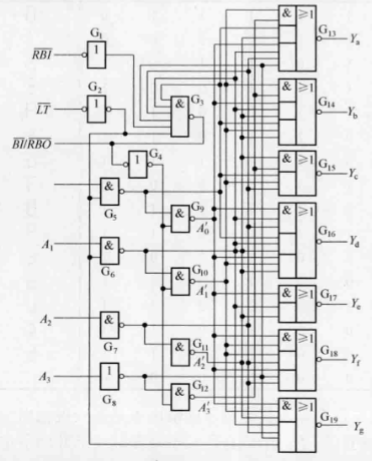
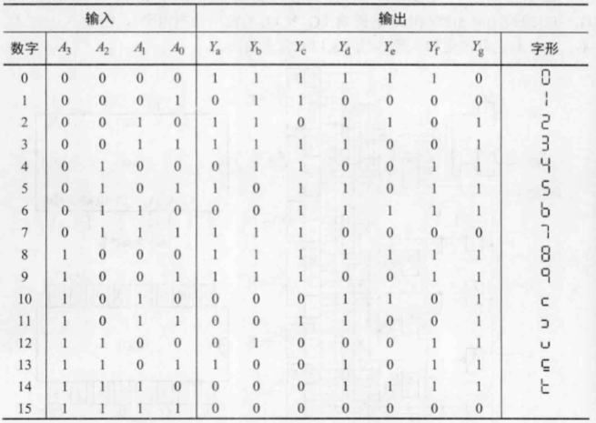

# 组合逻辑电路

## 逻辑门电路

在数字电路中所谓的**门**，是指一种开关作用，在一定的输入条件下，它允许信号通过；当条件不满足时，信号就不能通过。用高、低电平来表示二值逻辑的1和0两种逻辑状态。若用高电平表示逻辑1，低电平表示逻辑0，则称为**正逻辑**，反之称为**负逻辑**。若非特殊说明，一般使用正逻辑。

### 分立元件门电路

由电阻、二极管、三极管等分立元件门构成的逻辑门称为分立元件门。

|分立元件门|电路图|
|-|-|
|二极管与门||
|二极管或门||
|晶体三极管非门||

### TTL集成门电路

**集成电路（IC）**将数字电路中的元器件和连线制作在同一硅片上，因而较之分立元件具有高可靠性和微型化的优点。输入端和输出端均为三极管结构，称为三极管-三极管逻辑电路，简称**TTL电路**。TTL电路时目前双极型数字集成电路中用的最多的一种。

|TTL集成门电路|电路图|典型芯片名称|典型芯片管脚图|用途|
|-|-|-|-|-|
|非门（反相器）||74LS04/CT4004|||
|与非门||74LS00/CT4000|||
|或非门||74LS02/CT4002|||
|与或非门||74LS51/CT405|||
|异或门||74LS86/CT4086|||
|OC门（集电极开路门）||74LS03/CT4003||驱动不同负载 实现电平转换 实现“线与”|
|TS门（三态输出门）||||接成总线结构 实现数据双向传输|

### CMOS集成门电路

两种不同类型的MOS管形成的电路结构，称为互补对称MOS，简称CMOS。**CMOS集成门电路**由CMOS构成。

|CMOS集成门电路|电路图|典型芯片名称|典型芯片管脚图|
|-|-|-|-|
|OD门（漏极开路门）||CC40107||
|TG门（传输门）||CC4016||

## 组合逻辑电路及分析与设计

**组合逻辑电路**有若干个输入$a_0,a_1,...,a_{i-1}$和若干个输出$y_0,y_1,...,y_{j-1}$，输入和输出之间的逻辑关系可以用一组逻辑函数表示：

$$
\begin{cases}
y_0=f_0(a_0,a_1,...,a_{i-1}) \\
y_1=f_1(a_0,a_1,...,a_{i-1}) \\
... \\
y_{j-1}=f_{j-1}(a_0,a_1,...,a_{i-1})
\end{cases}
$$

## 常用中规模组合逻辑电路

|组合逻辑电路|电路图|逻辑函数表达式|典型芯片名称|典型芯片管脚图|功能表（真值表）|功能说明|
|-|-|-|-|-|-|-|
|4位奇偶校验器||$F=A\oplus B\oplus C\oplus D$||||检测输入数据中包含1的个数是偶数还是奇数|
|4选1数据选择器|||74LS153|||从4个输入数据中选择1个输出数据|
|8选1数据选择器|||74LS151|||从8个输入数据中选择1个输出数据|
|8线-3线编码器||$\begin{cases}Y_2=I_4+I_5+I_6+I_7\\Y_1=I_2+I_3+I_6+I_7\\Y_0=I_1+I_3+I_5+I_7 \end{cases}$||||将二进制数码进行编码，只允许一个输入有效|
|8线-3线优先编码器|||74LS148|||将二进制数码进行编码，允许多个输入有效，优先给优先级高的输入进行编码|
|8位二-十进制优先编码器|||74LS147|||将二进制数码进行编码为十进制BCD码，允许多个输入有效，优先给优先级高的输入进行编码|
|3线-8线译码器|||74LS138|||将二进制代码进行译码|
|8位二-十进制译码器|||74LS42|||将十进制BCD码译码为二进制数码|
|BCD-七段显示译码器|||74LS48|||将二进制代码进行译码为显示器字形|
|1位半加器||$\begin{cases}S=A\oplus B\\CO=AB\end{cases}$||||不考虑有来自低位的进位将两个二进制数相加|
|1位全加器||$\begin{cases}S=A\oplus B\oplus CI\\CO=\overline{\overline{AB}\cdot \overline{(A+B)CI}} \end{cases}$||||将两个多位二进制数相加时，除了最低位以外，每一位都考虑来自低位的进位|
|4位串行进位加法器||||||将多个全加器串接|
|4位超前进位加法器||$\begin{cases}S_i=A_i\oplus B_i\oplus (CI)_i\\(CO)_i=A_iB_i+(A_i\oplus B_i)(CI)_i \end{cases}$|74LS283|||各级进位信号同时送到各位全加器的进位输入端|
|1位数值比较器||$\begin{cases}Y_{(A>B)}=A\overline{B}\\Y_{(A<B)}=\overline{A}B\\Y_{(A=B)}=\overline{\overline{A}B+A\overline{B}} \end{cases}$||||对1位数进行比较|
|4位数值比较器|||CC14585|||对4位数进行比较|

## 组合逻辑电路中的竞争-冒险现象