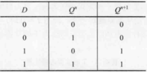
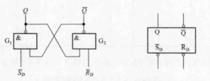

# 时序逻辑电路

## 触发器

在数字系统中，除了能够进行算术运算和逻辑运算的组合逻辑电路外，还需要具有记忆功能的**时序逻辑电路**，构成时序逻辑电路的基本元件是触发器。为了实现记忆1位二进制编码的功能，**触发器**必须具备以下3个基本特点：

1. 具有两个能自行保持的稳定状态，用来表示二进制数的0和1
2. 根据不同的输入信号可以置成0或1状态
3. 输入信号消失后，获得的新状态能自动保持

||RS触发器|JK触发器|D触发器|T触发器|T'触发器|
|-|-|-|-|-|-|
|特性表|||||将T触发器的T=1即可|
|特性方程|$\begin{cases}Q^{n+1}=S+\overline{R}Q^n\\SR=0（约束条件） \end{cases}$|$Q^{n+1}=J\overline{Q^n}+\overline{K}Q^n$|$Q^{n+1}=D$|$Q^{n+1}=T\overline{Q^n}+\overline{T}Q^n$|$Q^{n+1}=\overline{Q^n}$|
|状态转换图||||||
/// caption
触发器功能
///

||RS触发器|JK触发器|D触发器|特点|
|-|-|-|-|-|
|基本型||||结构形式简单，没有CP时钟同步现象|
|同步型||||具有CP时钟同步信号，但存在空翻现象|
|主从型||||在每个CP周期内，状态只能改变一次，没有空翻现象，但存在一次翻转现象|
|边沿型||||触发翻转控制在CP触发边沿到来的一瞬间，而且接收输入信号的时间也控制在CP触发边沿到来前的一瞬间。没有空翻现象和一次翻转现象|
/// caption
触发器电路
///

|施密特触发器|单稳态触发器|多谐振荡器|
|-|-|-|
|用于脉冲波形变换（将正弦波变换为方波）、脉冲整形（将产生波形畸变的不理想波变换为理想的方波）和脉冲鉴幅（将幅度大的脉冲选出）|在外界触发脉冲作用下，能从稳态转到暂稳态，在暂稳态维持一段时间后自动返回稳态，维持时间取决于器件自身参数|不需要外加触发信号就能自动持续地产生矩形脉冲|

|芯片名称|芯片管脚图|功能表（真值表）|电路图|描述|
|-|-|-|-|-|
|74LS112||||集成双JK触发器|
|74LS74||||集成双D触发器|
|CB555（NE555、CG555、5G555）||||可以构成施密特触发器、单稳态触发器、多谐振荡器等各类电路|