# 线性结构

## 线性表

**线性表（Linear List）**简称表，是具有相同类型的数据元素的有限序列，线性表中数据元素的个数称为线性表的长度。长度等于0时称为空表，线性表每个元素按顺序编号（从1开始），称为位置或序号。一个元素的前一个元素称为该元素的前驱，后一个元素称为该元素的后继，第一个元素没有前驱，最后一个元素没有后继，其它元素只有一个前驱和一个后继。

### 顺序表

线性表的顺序存储结构称为**顺序表（Sequential List）**，有些地方把顺序表简单称为数组，这是由于顺序表采用数组存储，因此其在删除和插入等操作较为麻烦，而查询和更新等操作却方便。顺序表中数据元素的存储地址是其序号的线性函数，只要确定了存储顺序的起始地址（基地址），计算任意一个元素的存储地址的时间是想等的，具有这一特点的存储结构称为**随机存取结构**。**顺序存取结构**是一种按地址的逻辑顺序进行读、写操作的存取方法。其特点是存取时间与数据所在的物理地址有关，在存取第N个数据时，必须先访问前N-1个数据。

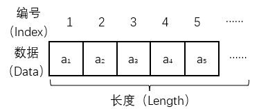
/// caption
顺序表ADT
///

=== "插入"
	```cpp title="Insert"
	Insert(int i, x) {
		if (length >= MaxSize)throw"上溢：顺序表已满";
		if (i<1 || i>length + 1)throw"位置非法";
		for (int j = length; j >= i; j--)data[j] = data[j - 1];
		data[i - 1] = x;
		length++;
	}
	```
=== "删除"
	```cpp title="Delete"
	Delete(int i) {
		if (length == 0)throw"下溢：顺序表为空";
		if (i<1 || i>length + 1)throw"位置非法";
		x = data[i - 1];
		for (int j = i; j < length; j++)data[j - 1] = data[j];
		length--;
		return x;
	}
	```
=== "遍历"
	```cpp title="Order"
	PrintList() {
		cout << "序号\t元素" << endl;
		for (int i = 0; i < length; i++)cout << i + 1 << "\t" << data[i] << endl;
	}
	```
=== "完整示例"
	```cpp title="SeqList.h"
	const int MaxSize = 100;

	template <class DataType>
	class SeqList {
	public:

		/// <summary>
		/// 创建一个空顺序表
		/// </summary>
		SeqList();

		/// <summary>
		/// 创建一个顺序表
		/// </summary>
		/// <param name="a">顺序表数组</param>
		/// <param name="n">顺序表长度</param>
		SeqList(DataType a[], int n);

		/// <summary>
		/// 析构函数：空
		/// </summary>
		~SeqList();

		/// <summary>
		/// 获取线性表的长度
		/// </summary>
		/// <returns>线性表的长度</returns>
		int Length();

		/// <summary>
		/// 按位查找元素
		/// </summary>
		/// <param name="i">元素序号</param>
		/// <returns>第i个元素的值</returns>
		DataType Get(int i);

		/// <summary>
		/// 按值查找元素
		/// </summary>
		/// <param name="x">元素值</param>
		/// <returns>
		/// 第1个值为x的元素的序号
		/// <para>返回0表示未找到</para>
		/// </returns>
		int Locate(DataType x);

		/// <summary>
		/// 插入元素
		/// </summary>
		/// <param name="i">插入位置</param>
		/// <param name="x">元素值</param>
		void Insert(int i, DataType x);

		/// <summary>
		/// 删除元素
		/// </summary>
		/// <param name="i">删除位置</param>
		/// <returns></returns>
		DataType Delete(int i);

		/// <summary>
		/// 遍历元素
		/// </summary>
		void PrintList();

	private:
		DataType data[MaxSize];
		int length;
	};
	```
	```cpp title="SeqList.cpp"
	#include <iostream>
	#include "SeqList.h"
	using namespace std;

	template <class DataType>
	SeqList<DataType>::SeqList() {
		length = 0;
	}

	template <class DataType>
	SeqList<DataType>::SeqList(DataType a[], int n) {
		if (n > MaxSize)throw"参数n非法：n不能超过顺序表的最大长度100";
		for (int i = 0; i < n; i++) data[i] = a[i];
		length = n;
	}

	template <class DataType>
	SeqList<DataType>::~SeqList() {}

	template <class DataType>
	int SeqList<DataType>::Length() {
		return length;
	}

	template <class DataType>
	DataType SeqList<DataType>::Get(int i) {
		if (i<1 || i>length)throw"参数i非法";
		else return data[i - 1];
	}

	template <class DataType>
	int SeqList<DataType>::Locate(DataType x) {
		for (int i = 0; i < length; i++)if (data[i] == x)return i + 1;
		return 0;
	}

	template <class DataType>
	void SeqList<DataType>::Insert(int i, DataType x) {
		if (length >= MaxSize)throw"上溢：顺序表已满";
		if (i<1 || i>length + 1)throw"位置非法";
		for (int j = length; j >= i; j--)data[j] = data[j - 1];
		data[i - 1] = x;
		length++;
	}

	template <class DataType>
	DataType SeqList<DataType>::Delete(int i) {
		if (length == 0)throw"下溢：顺序表为空";
		if (i<1 || i>length + 1)throw"位置非法";
		DataType x = data[i - 1];
		for (int j = i; j < length; j++)data[j - 1] = data[j];
		length--;
		return x;
	}

	template <class DataType>
	void SeqList<DataType>::PrintList() {
		cout << "序号\t元素" << endl;
		for (int i = 0; i < length; i++)cout << i + 1 << "\t" << data[i] << endl;
	}
	```

顺序表本质上还是在对一个数组操作，使用的是静态存储分配。**静态存储分配**是指在编译时为变量分配内存，并且一经分配就始终占有固定的存储单元，直到该变量退出其作用域。**动态存储分配**是指在程序运行期间根据实际需要随时申请内存，并在不需要时释放。为了克服顺序表的缺点，采用动态存储分配来存储线性表，即使用链接存储结构。

### 链表

**链表（Linked List）**是用一组任意的存储单元存放线性表的元素，这组存储单元可以连续也可以不连续，为了能正确表示元素之间的逻辑关系，每个存储单元在存储数据的同时，还必须存储其后继元素所在的地址信息，这个地址信息称为指针，这两部分组成了数据元素的存储映像，称为结点。

#### 单链表

**单链表（Singly Linked List）**中包含数据域和指针域，数据域用于存放数据，指针域中含有一个next指针，用于链接当前结点和下一个结点。

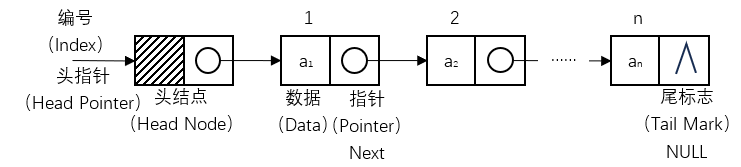
/// caption
单链表ADT
///

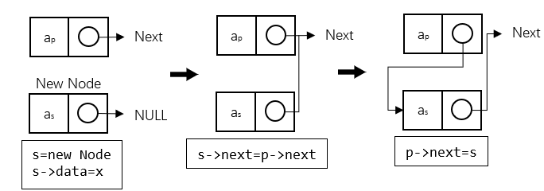
/// caption
单链表插入算法
///

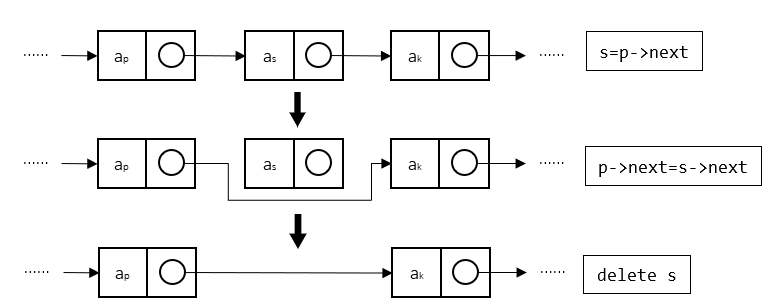
/// caption
单链表删除算法
///

=== "元素"
	```cpp title="Struct"
	struct Node {
		data;
		Node* next;
	};
	```
=== "初始化"
	```cpp title="Init"
	//头插法
	LinkList(a[], int n) {
		first = new Node;
		first->next = NULL;
		for (int i = 0; i < n; i++) {
			Node* s = new Node;
			s->data = a[i];
			s->next = first->next;
			first->next = s;
		}
	}
	//尾插法
	LinkList(a[], int n) {
		first = new Node;
		Node* r = first;
		for (i = 0; i < n; i++) {
			Node* s = new Node;
			s->data = a[i];
			r->next = s;
			r = s;
		}
		r->next = NULL;
	}
	```
=== "插入"
	```cpp title="Insert"
	Insert(int i, x) {
		Node* p = first;
		int count = 0;
		while (p != NULL && count < i - 1) {
			p = p->next;
			count++;
		}
		if (p == NULL)throw"位置非法";
		else {
			Node* s = new Node;
			s->data = x;
			s->next = p->next;
			p->next = s;
		}
	}
	```
=== "删除"
	```cpp title="Delete"
	Delete(int i) {
		Node* p = first;
		int count = 0;
		while (p != NULL && count < i - 1) {
			p = p->next;
			count++;
		}
		if (p == NULL || p->next == NULL)throw"位置非法";
		else {
			Node* q = p->next;
			x = q->data;
			p->next = q->next;
			delete q;
			return x;
		}
	}
	```
=== "遍历"
	```cpp title="Order"
	PrintList() {
		Node* p = first->next;
		int i = 1;
		cout << "序号\t元素" << endl;
		while (p != NULL) {
			cout << i << "\t" << p->data << endl;
			p = p->next;
			i++;
		}
	}
	```
=== "完整示例"
	```cpp title="LinkList.h"
	template <class DataType>
	struct Node {
		DataType data;
		Node<DataType>* next;
	};

	template <class DataType>
	class LinkList {
	public:

		/// <summary>
		/// 创建一个空链表
		/// </summary>
		LinkList();

		/// <summary>
		/// 创建一个链表
		/// </summary>
		/// <param name="a">链表数组</param>
		/// <param name="n">链表长度</param>
		LinkList(DataType a[], int n);

		/// <summary>
		/// 析构函数
		/// </summary>
		~LinkList();

		/// <summary>
		/// 获取链表的长度
		/// </summary>
		/// <returns>链表的长度</returns>
		int Length();

		/// <summary>
		/// 按位查找元素
		/// </summary>
		/// <param name="i">元素序号</param>
		/// <returns>第i个元素的值</returns>
		DataType Get(int i);

		/// <summary>
		/// 按值查找元素
		/// </summary>
		/// <param name="x">元素值</param>
		/// <returns>
		/// 第1个值为x的元素的序号
		/// <para>返回0表示未找到</para>
		/// </returns>
		int Locate(DataType x);

		/// <summary>
		/// 插入元素
		/// </summary>
		/// <param name="i">插入位置</param>
		/// <param name="x">元素值</param>
		void Insert(int i, DataType x);

		/// <summary>
		/// 删除元素
		/// </summary>
		/// <param name="i">删除位置</param>
		/// <returns></returns>
		DataType Delete(int i);

		/// <summary>
		/// 遍历元素
		/// </summary>
		void PrintList();

	private:
		Node<DataType>* first;
	};
	```
	```cpp title="LinkList.cpp"
	#include <iostream>
	#include "LinkList.h"
	using namespace std;

	template <class DataType>
	LinkList<DataType>::LinkList() {
		first = new Node<DataType>;
		first->next = NULL;
	}

	template <class DataType>
	LinkList<DataType>::LinkList(DataType a[], int n) {
		//头插法
		first = new Node<DataType>;
		first->next = NULL;
		for (int i = 0; i < n; i++) {
			Node<DataType>* s = new Node<DataType>;
			s->data = a[i];
			s->next = first->next;
			first->next = s;
		}
		//尾插法
		/*
		first = new Node<DataType>;
		Node<DataType>* r = first;
		for (i = 0; i < n; i++) {
			Node<DataType>* s = new Node<DataType>;
			s->data = a[i];
			r->next = s;
			r = s;
		}
		r->next = NULL;
		*/
	}

	template <class DataType>
	LinkList<DataType>::~LinkList() {
		while (first != NULL) {
			Node<DataType>* q = first;
			first = first->next;
			delete q;
		}
	}

	template <class DataType>
	int LinkList<DataType>::Length() {
		Node<DataType>* p = first->next;
		int count = 0;
		while (p != NULL) {
			p = p->next;
			count++;
		}
		return count;
	}

	template <class DataType>
	DataType LinkList<DataType>::Get(int i) {
		Node<DataType>* p = first->next;
		int count = 1;
		while (p != NULL && count < i) {
			p = p->next;
			count++;
		}
		if (p == NULL)throw"参数i非法";
		else return p->data;
	}

	template <class DataType>
	int LinkList<DataType>::Locate(DataType x) {
		Node<DataType>* p = first->next;
		int count = 1;
		while (p != NULL) {
			if (p->data == x)return count;
			p = p->next;
			count++;
		}
		return 0;
	}

	template <class DataType>
	void LinkList<DataType>::Insert(int i, DataType x) {
		Node<DataType>* p = first;
		int count = 0;
		while (p != NULL && count < i - 1) {
			p = p->next;
			count++;
		}
		if (p == NULL)throw"位置非法";
		else {
			Node<DataType>* s = new Node<DataType>;
			s->data = x;
			s->next = p->next;
			p->next = s;
		}
	}

	template <class DataType>
	DataType LinkList<DataType>::Delete(int i) {
		Node<DataType>* p = first;
		int count = 0;
		while (p != NULL && count < i - 1) {
			p = p->next;
			count++;
		}
		if (p == NULL || p->next == NULL)throw"位置非法";
		else {
			Node<DataType>* q = p->next;
			DataType x = q->data;
			p->next = q->next;
			delete q;
			return x;
		}
	}

	template <class DataType>
	void LinkList<DataType>::PrintList() {
		Node<DataType>* p = first->next;
		int i = 1;
		cout << "序号\t元素" << endl;
		while (p != NULL) {
			cout << i << "\t" << p->data << endl;
			p = p->next;
			i++;
		}
	}
	```

#### 循环链表

在单链表中，如果将终端结点的指针域由空指针改为指向头结点，就使整个单链表形成一个环，这种头尾相接的单链表称为循环单链表，简称**循环链表（Circular Linked List）**。循环链表的操作方式和单链表相差无几。

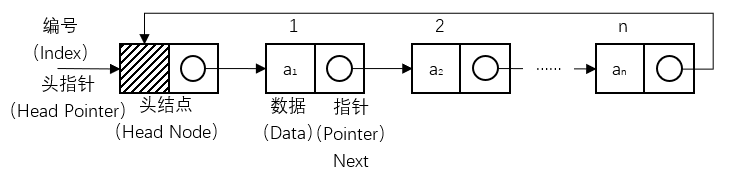
/// caption
循环链表ADT
///

=== "元素"
	```cpp title="Struct"
	struct Node {
		data;
		Node* next;
	};
	```
=== "初始化"
	```cpp title="Init"
	//头插法
	LinkList(a[], int n) {
		first = new Node;
		first->next = first;
		for (int i = 0; i < n; i++) {
			Node* s = new Node;
			s->data = a[i];
			s->next = first->next;
			first->next = s;
		}
	}
	//尾插法
	LinkList(a[], int n) {
		first = new Node;
		Node* r = first;
		for (i = 0; i < n; i++) {
			Node* s = new Node;
			s->data = a[i];
			r->next = s;
			r = s;
		}
		r->next = first;
	}
	```
=== "插入"
	```cpp title="Insert"
	Insert(int i, x) {
		Node* p = first;
		int count = 0;
		while (p != NULL && count < i - 1) {
			p = p->next;
			count++;
		}
		if (p == NULL)throw"位置非法";
		else {
			Node* s = new Node;
			s->data = x;
			s->next = p->next;
			p->next = s;
		}
	}
	```
=== "删除"
	```cpp title="Delete"
	Delete(int i) {
		Node* p = first;
		int count = 0;
		while (p != NULL && count < i - 1) {
			p = p->next;
			count++;
		}
		if (p == NULL || p->next == NULL)throw"位置非法";
		else {
			Node* q = p->next;
			x = q->data;
			p->next = q->next;
			delete q;
			return x;
		}
	}
	```
=== "遍历"
	```cpp title="Order"
	PrintList() {
		Node* p = first->next;
		int i = 1;
		cout << "序号\t元素" << endl;
		while (p != first) {
			cout << i << "\t" << p->data << endl;
			p = p->next;
			i++;
		}
	}
	```
=== "完整示例"
	```cpp title="LinkList.h"
	template <class DataType>
	struct Node {
		DataType data;
		Node<DataType>* next;
	};

	template <class DataType>
	class LinkList {
	public:

		/// <summary>
		/// 创建一个空链表
		/// </summary>
		LinkList();

		/// <summary>
		/// 创建一个链表
		/// </summary>
		/// <param name="a">链表数组</param>
		/// <param name="n">链表长度</param>
		LinkList(DataType a[], int n);

		/// <summary>
		/// 析构函数
		/// </summary>
		~LinkList();

		/// <summary>
		/// 获取链表的长度
		/// </summary>
		/// <returns>链表的长度</returns>
		int Length();

		/// <summary>
		/// 按位查找元素
		/// </summary>
		/// <param name="i">元素序号</param>
		/// <returns>第i个元素的值</returns>
		DataType Get(int i);

		/// <summary>
		/// 按值查找元素
		/// </summary>
		/// <param name="x">元素值</param>
		/// <returns>
		/// 第1个值为x的元素的序号
		/// <para>返回0表示未找到</para>
		/// </returns>
		int Locate(DataType x);

		/// <summary>
		/// 插入元素
		/// </summary>
		/// <param name="i">插入位置</param>
		/// <param name="x">元素值</param>
		void Insert(int i, DataType x);

		/// <summary>
		/// 删除元素
		/// </summary>
		/// <param name="i">删除位置</param>
		/// <returns></returns>
		DataType Delete(int i);

		/// <summary>
		/// 遍历元素
		/// </summary>
		void PrintList();

	private:
		Node<DataType>* first;
	};
	```
	```cpp title="LinkList.cpp"
	#include <iostream>
	#include "LinkList.h"
	using namespace std;

	template <class DataType>
	LinkList<DataType>::LinkList() {
		first = new Node<DataType>;
		first->next = first;
	}

	template <class DataType>
	LinkList<DataType>::LinkList(DataType a[], int n) {
		//头插法
		first = new Node<DataType>;
		first->next = first;
		for (int i = 0; i < n; i++) {
			Node<DataType>* s = new Node<DataType>;
			s->data = a[i];
			s->next = first->next;
			first->next = s;
		}
		//尾插法
		/*
		first = new Node<DataType>;
		Node<DataType>* r = first;
		for (i = 0; i < n; i++) {
			Node<DataType>* s = new Node<DataType>;
			s->data = a[i];
			r->next = s;
			r = s;
		}
		r->next = first;
		*/
	}

	template <class DataType>
	LinkList<DataType>::~LinkList() {
		while (first != NULL) {
			Node<DataType>* q = first;
			first = first->next;
			delete q;
		}
	}

	template <class DataType>
	int LinkList<DataType>::Length() {
		Node<DataType>* p = first->next;
		int count = 0;
		while (p != first) {
			p = p->next;
			count++;
		}
		return count;
	}

	template <class DataType>
	DataType LinkList<DataType>::Get(int i) {
		Node<DataType>* p = first->next;
		int count = 1;
		while (p != NULL && count < i) {
			p = p->next;
			count++;
		}
		if (p == NULL)throw"参数i非法";
		else return p->data;
	}

	template <class DataType>
	int LinkList<DataType>::Locate(DataType x) {
		Node<DataType>* p = first->next;
		int count = 1;
		while (p != NULL) {
			if (p->data == x)return count;
			p = p->next;
			count++;
		}
		return 0;
	}

	template <class DataType>
	void LinkList<DataType>::Insert(int i, DataType x) {
		Node<DataType>* p = first;
		int count = 0;
		while (p != NULL && count < i - 1) {
			p = p->next;
			count++;
		}
		if (p == NULL)throw"位置非法";
		else {
			Node<DataType>* s = new Node<DataType>;
			s->data = x;
			s->next = p->next;
			p->next = s;
		}
	}

	template <class DataType>
	DataType LinkList<DataType>::Delete(int i) {
		Node<DataType>* p = first;
		int count = 0;
		while (p != NULL && count < i - 1) {
			p = p->next;
			count++;
		}
		if (p == NULL || p->next == NULL)throw"位置非法";
		else {
			Node<DataType>* q = p->next;
			DataType x = q->data;
			p->next = q->next;
			delete q;
			return x;
		}
	}

	template <class DataType>
	void LinkList<DataType>::PrintList() {
		Node<DataType>* p = first->next;
		int i = 1;
		cout << "序号\t元素" << endl;
		while (p != first) {
			cout << i << "\t" << p->data << endl;
			p = p->next;
			i++;
		}
	}
	```

#### 双链表

在循环链表中，虽然从任一结点出发可以扫描到其它结点，但要找到其前驱结点，则需要遍历整个循环列表。如果希望快速确定表中任一结点的前驱结点，可以在单链表的每个结点中再设置一个指向其前驱结点的指针域，这样就形成了双向循环链表，简称**双链表（Doubly Linked List）**。

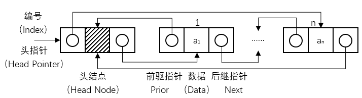
/// caption
双链表ADT
///

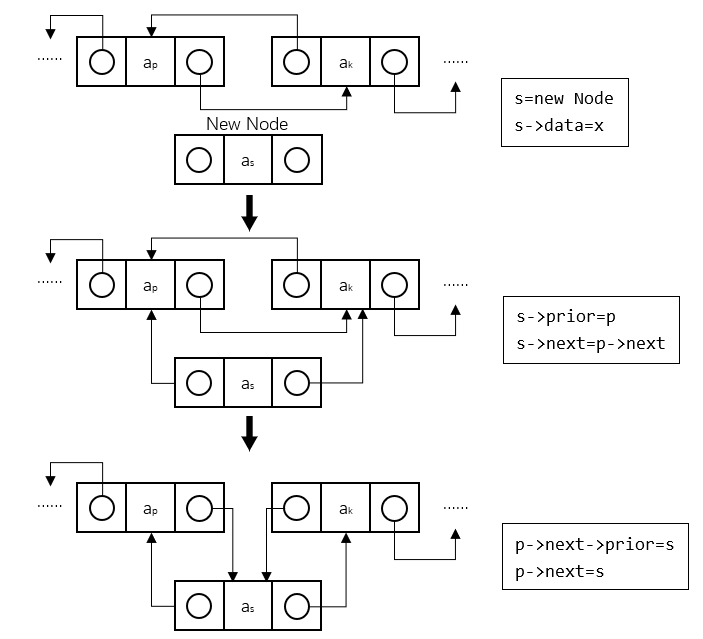
/// caption
双链表插入算法
///

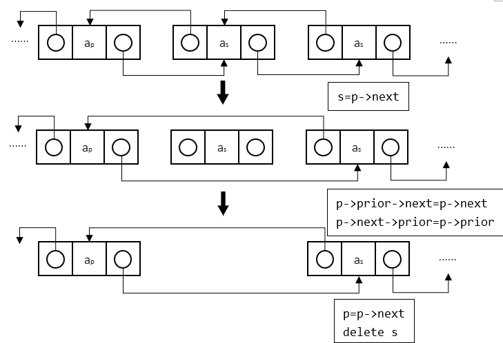
/// caption
双链表删除算法
///

=== "元素"
	```cpp title="Struct"
	struct Node {
		data;
		Node* next, * prior;
	};
	```
=== "初始化"
	```cpp title="Init"
	//头插法
	LinkList(a[], int n) {
		first = new Node;
		first->next = NULL;
		first->prior = NULL;
		for (int i = 0; i < n; i++) {
			Node* s = new Node;
			s->data = a[i];
			s->next = first->next;
			s->prior = first;
			if (first->next != NULL) {
				first->next->prior = s;
			}
			first->next = s;
		}
	//尾插法
	}
	LinkList(a[], int n) {
		first = new Node;
		first->prior = NULL;
		Node* r = first;
		for (int i = 0; i < n; i++) {
			Node* s = new Node;
			s->data = a[i];
			s->prior = r;
			r->next = s;
			r = s;
		}
		r->next = NULL;
	}
	```
=== "插入"
	```cpp title="Insert"
	Insert(int i, x) {
		Node* p = first;
		int count = 0;
		while (p != NULL && count < i - 1) {
			p = p->next;
			count++;
		}
		if (p == NULL) throw "位置非法";
		Node* s = new Node;
		s->data = x;
		s->next = p->next;
		s->prior = p;
		if (p->next != NULL) {
			p->next->prior = s;
		}
		p->next = s;
	}
	```
=== "删除"
	```cpp title="Delete"
	Delete(int i) {
		Node* p = first;
		int count = 0;
		while (p != NULL && count < i - 1) {
			p = p->next;
			count++;
		}
		if (p == NULL || p->next == NULL) throw "位置非法";
		Node* q = p->next;
		x = q->data;
		p->next = q->next;
		if (q->next != NULL) {
			q->next->prior = p;
		}
		delete q;
		return x;
	}
	```
=== "遍历"
	```cpp title="Order"
	PrintList() {
		Node* p = first->next;
		int i = 1;
		cout << "序号\t元素" << endl;
		while (p != NULL) {
			cout << i << "\t" << p->data << endl;
			p = p->next;
			i++;
		}
	}
	```
=== "完整示例"
	```cpp title="LinkList.h"
	template <class DataType>
	struct Node {
		DataType data;
		Node<DataType>* next, * prior;
	};

	template <class DataType>
	class LinkList {
	public:

		/// <summary>
		/// 创建一个空链表
		/// </summary>
		LinkList();

		/// <summary>
		/// 创建一个链表
		/// </summary>
		/// <param name="a">链表数组</param>
		/// <param name="n">链表长度</param>
		LinkList(DataType a[], int n);

		/// <summary>
		/// 析构函数
		/// </summary>
		~LinkList();

		/// <summary>
		/// 获取链表的长度
		/// </summary>
		/// <returns>链表的长度</returns>
		int Length();

		/// <summary>
		/// 按位查找元素
		/// </summary>
		/// <param name="i">元素序号</param>
		/// <returns>第i个元素的值</returns>
		DataType Get(int i);

		/// <summary>
		/// 按值查找元素
		/// </summary>
		/// <param name="x">元素值</param>
		/// <returns>
		/// 第1个值为x的元素的序号
		/// <para>返回0表示未找到</para>
		/// </returns>
		int Locate(DataType x);

		/// <summary>
		/// 插入元素
		/// </summary>
		/// <param name="i">插入位置</param>
		/// <param name="x">元素值</param>
		void Insert(int i, DataType x);

		/// <summary>
		/// 删除元素
		/// </summary>
		/// <param name="i">删除位置</param>
		/// <returns></returns>
		DataType Delete(int i);

		/// <summary>
		/// 遍历元素
		/// </summary>
		void PrintList();

	private:
		Node<DataType>* first;
	};
	```
	```cpp title="LinkList.cpp"
	#include <iostream>
	#include "LinkList.h"
	using namespace std;

	template <class DataType>
	LinkList<DataType>::LinkList() {
		first = new Node<DataType>;
		first->next = NULL;
		first->prior = NULL;
	}

	template <class DataType>
	LinkList<DataType>::LinkList(DataType a[], int n) {
		//头插法
		first = new Node<DataType>;
		first->next = NULL;
		first->prior = NULL;
		for (int i = 0; i < n; i++) {
			Node<DataType>* s = new Node<DataType>;
			s->data = a[i];
			s->next = first->next;
			s->prior = first;
			if (first->next != NULL) {
				first->next->prior = s;
			}
			first->next = s;
		}
		//尾插法
		/*
		first = new Node<DataType>;
		first->prior = NULL;
		Node<DataType>* r = first;
		for (int i = 0; i < n; i++) {
			Node<DataType>* s = new Node<DataType>;
			s->data = a[i];
			s->prior = r;
			r->next = s;
			r = s;
		}
		r->next = NULL;
		*/
	}

	template <class DataType>
	LinkList<DataType>::~LinkList() {
		while (first != NULL) {
			Node<DataType>* q = first;
			first = first->next;
			delete q;
		}
	}

	template <class DataType>
	int LinkList<DataType>::Length() {
		Node<DataType>* p = first->next;
		int count = 0;
		while (p != NULL) {
			p = p->next;
			count++;
		}
		return count;
	}

	template <class DataType>
	DataType LinkList<DataType>::Get(int i) {
		Node<DataType>* p = first->next;
		int count = 1;
		while (p != NULL && count < i) {
			p = p->next;
			count++;
		}
		if (p == NULL)throw"参数i非法";
		else return p->data;
	}

	template <class DataType>
	int LinkList<DataType>::Locate(DataType x) {
		Node<DataType>* p = first->next;
		int count = 1;
		while (p != NULL) {
			if (p->data == x)return count;
			p = p->next;
			count++;
		}
		return 0;
	}

	template <class DataType>
	void LinkList<DataType>::Insert(int i, DataType x) {
		Node<DataType>* p = first;
		int count = 0;
		while (p != NULL && count < i - 1) {
			p = p->next;
			count++;
		}
		if (p == NULL) throw "位置非法";
		Node<DataType>* s = new Node<DataType>;
		s->data = x;
		s->next = p->next;
		s->prior = p;
		if (p->next != NULL) {
			p->next->prior = s;
		}
		p->next = s;
	}

	template <class DataType>
	DataType LinkList<DataType>::Delete(int i) {
		Node<DataType>* p = first;
		int count = 0;
		while (p != NULL && count < i - 1) {
			p = p->next;
			count++;
		}
		if (p == NULL || p->next == NULL) throw "位置非法";
		Node<DataType>* q = p->next;
		DataType x = q->data;
		p->next = q->next;
		if (q->next != NULL) {
			q->next->prior = p;
		}
		delete q;
		return x;
	}

	template <class DataType>
	void LinkList<DataType>::PrintList() {
		Node<DataType>* p = first->next;
		int i = 1;
		cout << "序号\t元素" << endl;
		while (p != NULL) {
			cout << i << "\t" << p->data << endl;
			p = p->next;
			i++;
		}
	}
	```

#### 异或链表

在双链表中，指针域需要两个指针的空间来存储，可以通过利用按位异或的值，仅使用一个指针的内存大小便可以实现双链表的功能，这种链表就是**异或链表（XOR Linked List）**。异或链表本质上还是双链表，操作方式也相差无几，只是获取前驱或者后继指针时需要进行异或运算。

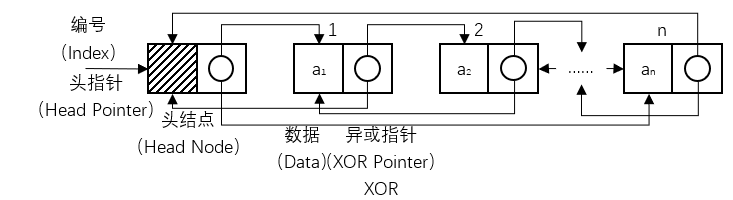
/// caption
异或链表ADT
///

在异或链表中满足：

$$
\begin{cases}
Prior(k-1)=a_{k}->XOR(k)\oplus Next(k+1) \\
Next(k+1)=a_{k}->XOR(k)\oplus Prior(k-1) & 
\end{cases}
$$

=== "元素"
	```cpp title="Struct"
	struct Node {
		data;
		Node* xorPtr;
	};
	```
=== "初始化"
	```cpp title="Init"
	LinkList(a[], int n) {
		first = NULL;
		Node* prev = NULL;
		for (int i = 0; i < n; i++) {
			Node* newNode = new Node;
			newNode->data = a[i];
			if (prev == NULL) {
				first = newNode;
				newNode->xorPtr = XOR(NULL, NULL);
			}
			else {
				newNode->xorPtr = XOR(prev, NULL);
				prev->xorPtr = XOR(XOR(prev->xorPtr, NULL), newNode);
			}
			prev = newNode;
		}
	}
	```
=== "插入"
	```cpp title="Insert"
	Insert(int i, x) {
		if (i < 1) throw "位置非法";
		if (i == 1) {
			Node* newNode = new Node;
			newNode->data = x;
			newNode->xorPtr = XOR(NULL, first);
			if (first != NULL) {
				first->xorPtr = XOR(newNode, XOR(first->xorPtr, NULL));
			}
			first = newNode;
			return;
		}
		Node* prev_prev = NULL;
		Node* prev = NULL;
		Node* current = first;
		for (int j = 1; j < i && current != NULL; j++) {
			prev_prev = prev;
			prev = current;
			current = XOR(prev_prev, current->xorPtr);
		}
		if (prev == NULL) throw "位置非法";
		Node* newNode = new Node<DataType>();
		newNode->data = x;
		Node* next = XOR(prev_prev, prev->xorPtr);
		newNode->xorPtr = XOR(prev, next);
		prev->xorPtr = XOR(prev_prev, newNode);
		if (next != NULL) {
			next->xorPtr = XOR(newNode, XOR(prev, next->xorPtr));
		}
	}
	```
=== "删除"
	```cpp title="Delete"
	Delete(int i) {
		if (i < 1 || first == NULL) throw "位置非法";
		if (i == 1) {
			Node* temp = first;
			Node* next = XOR(NULL, first->xorPtr);
			first = next;
			if (next != NULL) {
				next->xorPtr = XOR(NULL, XOR(temp, next->xorPtr));
			}
			x = temp->data;
			delete temp;
			return x;
		}
		Node* prev_prev = NULL;
		Node* prev = NULL;
		Node* current = first;
		for (int j = 1; j < i && current != NULL; j++) {
			prev_prev = prev;
			prev = current;
			current = XOR(prev_prev, current->xorPtr);
		}
		if (current == NULL) throw "位置非法";
		Node* next = XOR(prev, current->xorPtr);
		prev->xorPtr = XOR(prev_prev, next);
		if (next != NULL) {
			next->xorPtr = XOR(prev, XOR(current, next->xorPtr));
		}
		x = current->data;
		delete current;
		return x;
	}
	```
=== "遍历"
	```cpp title="Order"
	PrintList() {
		Node* prev = NULL;
		Node* current = first;
		int i = 1;
		cout << "序号\t元素" << endl;
		while (current != NULL) {
			cout << i << "\t" << current->data << endl;
			Node* next = XOR(prev, current->xorPtr);
			prev = current;
			current = next;
			i++;
		}
	}
	```
=== "完整示例"
	```cpp title="LinkList.h"
	#include <cstdint>

	template <class DataType>
	struct Node {
		DataType data;
		Node<DataType>* xorPtr;
	};

	template <class DataType>
	class LinkList {
	public:

		/// <summary>
		/// 创建一个空链表
		/// </summary>
		LinkList();

		/// <summary>
		/// 创建一个链表
		/// </summary>
		/// <param name="a">链表数组</param>
		/// <param name="n">链表长度</param>
		LinkList(DataType a[], int n);

		/// <summary>
		/// 析构函数
		/// </summary>
		~LinkList();

		/// <summary>
		/// 获取链表的长度
		/// </summary>
		/// <returns>链表的长度</returns>
		int Length();

		/// <summary>
		/// 按位查找元素
		/// </summary>
		/// <param name="i">元素序号</param>
		/// <returns>第i个元素的值</returns>
		DataType Get(int i);

		/// <summary>
		/// 按值查找元素
		/// </summary>
		/// <param name="x">元素值</param>
		/// <returns>
		/// 第1个值为x的元素的序号
		/// <para>返回0表示未找到</para>
		/// </returns>
		int Locate(DataType x);

		/// <summary>
		/// 插入元素
		/// </summary>
		/// <param name="i">插入位置</param>
		/// <param name="x">元素值</param>
		void Insert(int i, DataType x);

		/// <summary>
		/// 删除元素
		/// </summary>
		/// <param name="i">删除位置</param>
		/// <returns></returns>
		DataType Delete(int i);

		/// <summary>
		/// 遍历元素
		/// </summary>
		void PrintList();

	private:
		Node<DataType>* first;

		inline Node<DataType>* XOR(Node<DataType>* a, Node<DataType>* b) {
			return (Node<DataType>*)((uintptr_t)(a) ^ (uintptr_t)(b));
		}
	};
	```
	```cpp title="LinkList.cpp"
	#include <iostream>
	#include "LinkList.h"
	using namespace std;

	template <class DataType>
	LinkList<DataType>::LinkList() {
		first = NULL;
	}

	template <class DataType>
	LinkList<DataType>::LinkList(DataType a[], int n) {
		first = NULL;
		Node<DataType>* prev = NULL;
		for (int i = 0; i < n; i++) {
			Node<DataType>* newNode = new Node<DataType>();
			newNode->data = a[i];
			if (prev == NULL) {
				first = newNode;
				newNode->xorPtr = XOR(NULL, NULL);
			}
			else {
				newNode->xorPtr = XOR(prev, NULL);
				prev->xorPtr = XOR(XOR(prev->xorPtr, NULL), newNode);
			}
			prev = newNode;
		}
	}

	template <class DataType>
	LinkList<DataType>::~LinkList() {
		if (first == NULL) return;
		Node<DataType>* prev = NULL;
		Node<DataType>* current = first;
		while (current) {
			Node<DataType>* next = XOR(prev, current->xorPtr);
			delete prev;
			prev = current;
			current = next;
		}
		delete prev;
	}

	template <class DataType>
	int LinkList<DataType>::Length() {
		int count = 0;
		Node<DataType>* prev = NULL;
		Node<DataType>* current = first;
		while (current != NULL) {
			count++;
			Node<DataType>* next = XOR(prev, current->xorPtr);
			prev = current;
			current = next;
		}
		return count;
	}

	template <class DataType>
	DataType LinkList<DataType>::Get(int i) {
		if (i < 1) throw "参数i非法";
		Node<DataType>* prev = NULL;
		Node<DataType>* current = first;
		int j = 1;
		while (current != NULL && j < i) {
			Node<DataType>* next = XOR(prev, current->xorPtr);
			prev = current;
			current = next;
			j++;
		}
		if (current == NULL) throw "参数i非法";
		return current->data;
	}

	template <class DataType>
	int LinkList<DataType>::Locate(DataType x) {
		Node<DataType>* prev = NULL;
		Node<DataType>* current = first;
		int count = 1;
		while (current != NULL) {
			if (current->data == x) return count;
			Node<DataType>* next = XOR(prev, current->xorPtr);
			prev = current;
			current = next;
			count++;
		}
		return 0;
	}

	template <class DataType>
	void LinkList<DataType>::Insert(int i, DataType x) {
		if (i < 1) throw "位置非法";
		if (i == 1) {
			Node<DataType>* newNode = new Node<DataType>();
			newNode->data = x;
			newNode->xorPtr = XOR(NULL, first);
			if (first != NULL) {
				first->xorPtr = XOR(newNode, XOR(first->xorPtr, NULL));
			}
			first = newNode;
			return;
		}
		Node<DataType>* prev_prev = NULL;
		Node<DataType>* prev = NULL;
		Node<DataType>* current = first;
		for (int j = 1; j < i && current != NULL; j++) {
			prev_prev = prev;
			prev = current;
			current = XOR(prev_prev, current->xorPtr);
		}
		if (prev == NULL) throw "位置非法";
		Node<DataType>* newNode = new Node<DataType>();
		newNode->data = x;
		Node<DataType>* next = XOR(prev_prev, prev->xorPtr);
		newNode->xorPtr = XOR(prev, next);
		prev->xorPtr = XOR(prev_prev, newNode);
		if (next != NULL) {
			next->xorPtr = XOR(newNode, XOR(prev, next->xorPtr));
		}
	}

	template <class DataType>
	DataType LinkList<DataType>::Delete(int i) {
		if (i < 1 || first == NULL) throw "位置非法";
		if (i == 1) {
			Node<DataType>* temp = first;
			Node<DataType>* next = XOR(NULL, first->xorPtr);
			first = next;
			if (next != NULL) {
				next->xorPtr = XOR(NULL, XOR(temp, next->xorPtr));
			}
			DataType x = temp->data;
			delete temp;
			return x;
		}
		Node<DataType>* prev_prev = NULL;
		Node<DataType>* prev = NULL;
		Node<DataType>* current = first;
		for (int j = 1; j < i && current != NULL; j++) {
			prev_prev = prev;
			prev = current;
			current = XOR(prev_prev, current->xorPtr);
		}
		if (current == NULL) throw "位置非法";
		Node<DataType>* next = XOR(prev, current->xorPtr);
		prev->xorPtr = XOR(prev_prev, next);
		if (next != NULL) {
			next->xorPtr = XOR(prev, XOR(current, next->xorPtr));
		}
		DataType x = current->data;
		delete current;
		return x;
	}

	template <class DataType>
	void LinkList<DataType>::PrintList() {
		Node<DataType>* prev = NULL;
		Node<DataType>* current = first;
		int i = 1;
		cout << "序号\t元素" << endl;
		while (current != NULL) {
			cout << i << "\t" << current->data << endl;
			Node<DataType>* next = XOR(prev, current->xorPtr);
			prev = current;
			current = next;
			i++;
		}
	}
	```

#### 静态链表

**静态链表（Static Linked List）**是用数组来表示单链表，用数组元素的下标来模拟单链表的指针。由于它是利用数组定义的，属于静态存储分配，因此称为静态链表。

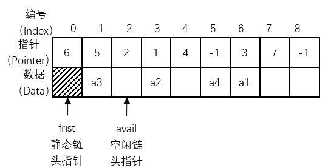
/// caption
静态链表ADT
///

=== "元素"
	```cpp title="Struct"
	struct Node {
		data;
		int next;
	};
	```
=== "初始化"
	```cpp title="Init"
	LinkList(a[], int n) {
		for (int i = 0; i < MaxSize - 1; ++i) List[i].next = i + 1;
		List[MaxSize - 1].next = -1;
		avail = 0;
		first = -1;

		int last = -1;
		for (int i = 0; i < n; ++i) {
			if (avail == -1)throw"参数n非法：n不能超过静态链表的最大长度100";

			int s = avail;
			avail = List[avail].next;

			List[s].data = a[i];
			List[s].next = -1;

			if (first == -1) first = s;
			else List[last].next = s;
			last = s;
		}
	}
	```
=== "插入"
	```cpp title="Insert"
	Insert(int i, x) {
		if (avail == -1) throw"上溢：顺序表已满";
		if (i < 1)throw"位置非法";

		int s = avail;
		avail = List[s].next;
		List[s].data = x;

		if (i == 1) {
			List[s].next = first;
			first = s;
		}
		else {
			int p = first;
			for (int pos = 1; pos < i - 1; pos++) {
				p = List[p].next;
			}
			List[s].next = List[p].next;
			List[p].next = s;
		}
	}
	```
=== "删除"
	```cpp title="Delete"
	Delete(int i) {
		if (avail == 0)throw"下溢：顺序表为空";
		if (i < 1)throw"位置非法";

		if (i == 1) {
			int q = first;
			data = List[q].data;
			first = List[q].next;
			List[q].next = avail;
			avail = q;
		}
		else {
			int p = first;
			for (int pos = 1; pos < i - 1; pos++) p = List[p].next;
			int q = List[p].next;
			data = List[q].data;
			List[p].next = List[q].next;
			List[q].next = avail;
			avail = q;
		}
		return data;
	}
	```
=== "遍历"
	```cpp title="Order"
	PrintList() {
		cout << "序号\t元素" << endl;
		int current = first;
		int count = 1;
		while (current != -1) {
			cout << count << "\t" << List[current].data << endl;
			current = List[current].next;
			count++;
		}
	}
	```
=== "完整示例"
	```cpp title="LinkList.h"
	const int MaxSize = 100;

	template <class DataType>
	struct Node {
		DataType data;
		int next;
	};

	template <class DataType>
	class LinkList {
	public:

		/// <summary>
		/// 创建一个空链表
		/// </summary>
		LinkList();

		/// <summary>
		/// 创建一个链表
		/// </summary>
		/// <param name="a">链表数组</param>
		/// <param name="n">链表长度</param>
		LinkList(DataType a[], int n);

		/// <summary>
		/// 析构函数
		/// </summary>
		~LinkList();

		/// <summary>
		/// 获取链表的长度
		/// </summary>
		/// <returns>链表的长度</returns>
		int Length();

		/// <summary>
		/// 按位查找元素
		/// </summary>
		/// <param name="i">元素序号</param>
		/// <returns>第i个元素的值</returns>
		DataType Get(int i);

		/// <summary>
		/// 按值查找元素
		/// </summary>
		/// <param name="x">元素值</param>
		/// <returns>
		/// 第1个值为x的元素的序号
		/// <para>返回0表示未找到</para>
		/// </returns>
		int Locate(DataType x);

		/// <summary>
		/// 插入元素
		/// </summary>
		/// <param name="i">插入位置</param>
		/// <param name="x">元素值</param>
		void Insert(int i, DataType x);

		/// <summary>
		/// 删除元素
		/// </summary>
		/// <param name="i">删除位置</param>
		/// <returns></returns>
		DataType Delete(int i);

		/// <summary>
		/// 遍历元素
		/// </summary>
		void PrintList();

	private:
		Node<DataType> List[MaxSize];
		int first;
		int avail;
	};
	```
	```cpp title="LinkList.cpp"
	#include <iostream>
	#include "LinkList.h"
	using namespace std;

	template <class DataType>
	LinkList<DataType>::LinkList() {
		for (int i = 0; i < MaxSize - 1; ++i) {
			List[i].next = i + 1;
		}
		List[MaxSize - 1].next = -1;
		avail = 0;
		first = -1;
	}

	template <class DataType>
	LinkList<DataType>::LinkList(DataType a[], int n) {
		for (int i = 0; i < MaxSize - 1; ++i) List[i].next = i + 1;
		List[MaxSize - 1].next = -1;
		avail = 0;
		first = -1;

		int last = -1;
		for (int i = 0; i < n; ++i) {
			if (avail == -1)throw"参数n非法：n不能超过静态链表的最大长度100";

			int s = avail;
			avail = List[avail].next;

			List[s].data = a[i];
			List[s].next = -1;

			if (first == -1) first = s;
			else List[last].next = s;
			last = s;
		}
	}

	template <class DataType>
	LinkList<DataType>::~LinkList() {};

	template <class DataType>
	int LinkList<DataType>::Length() {
		int count = 0;
		int current = first;
		while (current != -1) {
			count++;
			current = List[current].next;
		}
		return count;
	}

	template <class DataType>
	DataType LinkList<DataType>::Get(int i) {
		if (i < 1)throw"参数i非法";
		int current = first;
		for (int pos = 1; pos < i; pos++) {
			current = List[current].next;
			if (current == -1)throw"参数i非法";
		}
		return List[current].data;
	}

	template <class DataType>
	int LinkList<DataType>::Locate(DataType x) {
		int pos = 1;
		int current = first;
		while (current != -1) {
			if (List[current].data == x) return pos;
			pos++;
			current = List[current].next;
		}
		return 0;
	}

	template <class DataType>
	void LinkList<DataType>::Insert(int i, DataType x) {
		if (avail == -1) throw"上溢：顺序表已满";
		if (i < 1)throw"位置非法";

		int s = avail;
		avail = List[s].next;
		List[s].data = x;

		if (i == 1) {
			List[s].next = first;
			first = s;
		}
		else {
			int p = first;
			for (int pos = 1; pos < i - 1; pos++) {
				p = List[p].next;
			}
			List[s].next = List[p].next;
			List[p].next = s;
		}
	}

	template <class DataType>
	DataType LinkList<DataType>::Delete(int i) {
		if (avail == 0)throw"下溢：顺序表为空";
		if (i < 1)throw"位置非法";

		DataType data;
		if (i == 1) {
			int q = first;
			data = List[q].data;
			first = List[q].next;
			List[q].next = avail;
			avail = q;
		}
		else {
			int p = first;
			for (int pos = 1; pos < i - 1; pos++) p = List[p].next;
			int q = List[p].next;
			data = List[q].data;
			List[p].next = List[q].next;
			List[q].next = avail;
			avail = q;
		}
		return data;
	}

	template <class DataType>
	void LinkList<DataType>::PrintList() {
		cout << "序号\t元素" << endl;
		int current = first;
		int count = 1;
		while (current != -1) {
			cout << count << "\t" << List[current].data << endl;
			current = List[current].next;
			count++;
		}
	}
	```

|线性表|存储结构|结点指针|公共指针|
|-|-|-|-|
|顺序表|顺序|无|无|
|单链表|链接|Next（后继指针）|First（头指针）|
|循环链表|链接|Next（后继指针）|First（头指针）<br>Rear（尾指针）（可选）|
|双链表|链接|Prior（前驱指针）<br>Next（后继指针）|First（头指针）<br>Rear（尾指针）（可选）|
|异或链表|链接|XOR（异或指针）|First（头指针）<br>Rear（尾指针）（可选）|
|静态链表|顺序|Next（后继指针）|First（静态链头指针）<br>avail（空闲链头指针）|
/// caption
常用线性表对比
///

线性表的查找方式采用**顺序查找**，又称为线性查找，是最基本的查找方法，即从线性表的一端向另一端逐个将关键码与给定值进行比较，若相等，则查找成功，给出该元素在表中的位置，若整个表检测完仍未找到与给定值相等的关键码，则查找失败。如果线性表中的元素的排列有序，则可以采用折半查找，且折半查找一般只应用于静态查找。折半查找的思想类似于二分法，具体内容参见[二叉判定树](./Tree.md/#_7)

对于有$n$个记录的顺序表，查找第$i$个记录时，设每个记录的查找概率相等，在查找成功时需进行$n-i+1$次关键码的比较：

$$
ASL=\sum_{i=1}^n\frac{1}{n}(n-i+1)=\frac{n+1}{2}
$$

在查找不成功时需进行$n+1$次关键码的比较：

$$
ASL=\sum_{i=1}^n\frac{1}{n}(n+1)=n+1
$$

## 栈与队列

### 栈

**栈（Stack）**是限定仅在表尾进行插入和删除操作的线性表，允许插入和删除的一端称为**栈顶**，另一端称为**栈底**，不含任何数据元素的栈称为空栈。对于栈而言，把插入操作称为**入栈**或**压栈（Push）**，把删除操作称为**出栈**或**弹栈（Pop）**。栈有着后进入栈的元素先出栈的原则，称为**后进先出（last in first out，LIFO）**。

#### 顺序栈

栈的顺序存储结构称为**顺序栈（Sequential Stack）**，本质上就是顺序表的简化，对原有的顺序表进行了限定，指定了数组的哪一端表示栈底，通常把数组下标为0的一端作为栈底，同时附设一个栈顶指针指定栈顶元素。

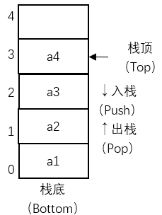
/// caption
顺序栈ADT
///

=== "入栈"
	```cpp title="Push"
	Push(x) {
		if (top == StackSize - 1)throw"上溢：栈已满";
		data[++top] = x;
	}
	```
=== "出栈"
	```cpp title="Pop"
	Pop() {
		if (top == -1)throw"下溢：栈为空";
		return data[top--];
	}
	```
=== "取栈顶元素"
	```cpp title="Peek"
	Peek() {
		if (top == -1)throw"下溢：栈为空";
		return data[top];
	}
	```
=== "完整示例"
	```cpp title="SeqStack.h"
	const int StackSize = 10;
	template<class DataType>
	class SeqStack {
	public:

		/// <summary>
		/// 创建一个空栈
		/// </summary>
		SeqStack();

		/// <summary>
		/// 析构函数：空
		/// </summary>
		~SeqStack();

		/// <summary>
		/// 入栈
		/// </summary>
		/// <param name="x">待入栈元素</param>
		void Push(DataType x);

		/// <summary>
		/// 出栈
		/// </summary>
		/// <returns>已出栈元素</returns>
		DataType Pop();

		/// <summary>
		/// 取栈顶元素
		/// </summary>
		/// <returns>栈顶元素</returns>
		DataType Peek();

		/// <summary>
		/// 判断栈是否为空
		/// </summary>
		/// <returns>空返回1，非空返回0</returns>
		int Empty();

	private:
		DataType data[StackSize];
		int top;
	};
	```
	```cpp title="SeqStack.cpp"
	#include "SeqStack.h"

	template<class DataType>
	SeqStack<DataType>::SeqStack() {
		top = -1;
	}

	template<class DataType>
	SeqStack<DataType>::~SeqStack() {}

	template<class DataType>
	void SeqStack<DataType>::Push(DataType x) {
		if (top == StackSize - 1)throw"上溢：栈已满";
		data[++top] = x;
	}

	template<class DataType>
	DataType SeqStack<DataType>::Pop() {
		if (top == -1)throw"下溢：栈为空";
		DataType x = data[top--];
		return x;
	}

	template<class DataType>
	DataType SeqStack<DataType>::Peek() {
		if (top == -1)throw"下溢：栈为空";
		DataType x = data[top];
		return x;
	}

	template<class DataType>
	int SeqStack<DataType>::Empty() {
		return top == -1 ? 1 : 0;
	}
	```

#### 单调栈

**单调栈（Monotone Stack）**是指具有单调（递增或递减）性质的栈，是对栈加以限定，栈内的元素必须是单调（递增或递减）的，在进行入栈操作时，为了维护栈的单调性，需要在保证将该元素插入到栈顶后整个栈满足单调性的前提下弹出最少的元素。

单调栈是基于顺序栈的，因此只需对顺序栈进行简单修改即可：

=== "入栈（递增）"
	```cpp title="push"
	Push(x) {
		if (top == StackSize - 1)throw"上溢：栈已满";
		while (top != -1) {
			if (x > data[top])Pop();
			else break;
		}
		data[++top] = x;
	}
	```
=== "入栈（递减）"
	```cpp title="push"
	Push(x) {
		if (top == StackSize - 1)throw"上溢：栈已满";
		while (top != -1) {
			if (x < data[top])Pop();
			else break;
		}
		data[++top] = x;
	}
	```

#### 两栈共享空间

在一个栈未满时，往往会有多余的空间，如果两个栈的数据量处于此消彼长或其它需求时可以通过**两栈共享空间（Both Stack）**的办法实现对空间的合理利用。

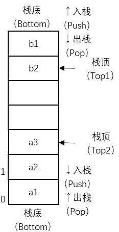
/// caption
两栈共享空间ADT
///

=== "入栈"
	```cpp title="Push"
	Push(int i, x) {
		if (top1 == top2 - 1)throw"上溢：栈已满";
		if (i == 1)data[++top1] = x;
		else if (i == 2)data[--top2] = x;
		else throw"未指定正确的栈：1或2";
	}
	```
=== "出栈"
	```cpp title="Pop"
	Pop(int i) {
		if (i == 1) {
			if (top1 == -1)throw"下溢：栈为空";
			return data[top1--];
		}
		else if (i == 2) {
			if (top2 == StackSize)throw"下溢：栈为空";
			return data[top2++];
		}
		else throw"未指定正确的栈：1或2";
	}
	```
=== "取栈顶元素"
	```cpp title="Peek"
	Peek(int i) {
		if (i == 1) {
			if (top1 == -1)throw"下溢：栈为空";
			return data[top1];
		}
		else if (i == 2) {
			if (top2 == StackSize)throw"下溢：栈为空";
			return data[top2];
		}
		else throw"未指定正确的栈：1或2";
	}
	```
=== "完整示例"
	```cpp title="BothStack.h"
	const int StackSize = 100;
	template<class DataType>
	class BothStack {
	public:

		/// <summary>
		/// 创建一个空栈
		/// </summary>
		BothStack();

		/// <summary>
		/// 析构函数：空
		/// </summary>
		~BothStack();

		/// <summary>
		/// 入栈
		/// </summary>
		/// <param name="i">欲操作栈（1/2）</param>
		/// <param name="x">待入栈元素</param>
		void Push(int i, DataType x);

		/// <summary>
		/// 出栈
		/// </summary>
		/// <param name="i">欲操作栈（1/2）</param>
		/// <returns>已出栈元素</returns>
		DataType Pop(int i);

		/// <summary>
		/// 取栈顶元素
		/// </summary>
		/// <param name="i">欲操作栈（1/2）</param>
		/// <returns>栈顶元素</returns>
		DataType Peek(int i);

		/// <summary>
		/// 判断栈是否为空
		/// </summary>
		/// <param name="i">欲操作栈（1/2）</param>
		/// <returns>空返回1，非空返回0</returns>
		int Empty(int i);

	private:
		DataType data[StackSize];
		int top1, top2;
	};
	```
	```cpp title="BothStack.cpp"
	#include "BothStack.h"

	template<class DataType>
	BothStack<DataType>::BothStack() {
		top1 = -1;
		top2 = StackSize;
	}

	template<class DataType>
	BothStack<DataType>::~BothStack() {}

	template<class DataType>
	void BothStack<DataType>::Push(int i, DataType x) {
		if (top1 == top2 - 1)throw"上溢：栈已满";
		if (i == 1)data[++top1] = x;
		else if (i == 2)data[--top2] = x;
		else throw"未指定正确的栈：1或2";
	}

	template<class DataType>
	DataType BothStack<DataType>::Pop(int i) {
		if (i == 1) {
			if (top1 == -1)throw"下溢：栈为空";
			return data[top1--];
		}
		else if (i == 2) {
			if (top2 == StackSize)throw"下溢：栈为空";
			return data[top2++];
		}
		else throw"未指定正确的栈：1或2";
	}

	template<class DataType>
	DataType BothStack<DataType>::Peek(int i) {
		if (i == 1) {
			if (top1 == -1)throw"下溢：栈为空";
			return data[top1];
		}
		else if (i == 2) {
			if (top2 == StackSize)throw"下溢：栈为空";
			return data[top2];
		}
		else throw"未指定正确的栈：1或2";
	}

	template<class DataType>
	int BothStack<DataType>::Empty(int i) {
		if (i == 1)return top1 == -1 ? 1 : 0;
		else if (i == 2)return top2 == -1 ? 1 : 0;
		else throw"未指定正确的栈：1或2";
	}
	```

#### 链栈

栈的链接存储结构称为**链栈（Linked Stack）**。与顺序栈类似，本质上也是对链栈的简化，操作固定在链表尾部（栈顶），也不需要头指针和头结点的定义。

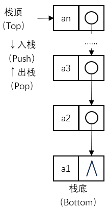
/// caption
链栈ADT
///

=== "元素"
	```cpp title="Struct"
	struct Node {
		data;
		Node* next;
	};
	```
=== "入栈"
	```cpp title="Push"
	Push(x) {
		Node* s = new Node;
		s->data = x;
		s->next = top;
		top = s;
	}
	```
=== "出栈"
	```cpp title="Pop"
	Pop() {
		if (top == NULL)throw"下溢：栈为空";
		x = top->data;
		Node* p = top;
		top = top->next;
		delete p;
		return x;
	}
	```
=== "取栈顶元素"
	```cpp title="Peek"
	Peek() {
		if (top == NULL)throw"下溢：栈为空";
		return top->data;
	}
	```
=== "完整示例"
	```cpp title="LinkStack.h"
	template <class DataType>
	struct Node {
		DataType data;
		Node<DataType>* next;
	};

	template<class DataType>
	class LinkStack {
	public:

		/// <summary>
		/// 创建一个空栈
		/// </summary>
		LinkStack();

		/// <summary>
		/// 析构函数
		/// </summary>
		~LinkStack();

		/// <summary>
		/// 入栈
		/// </summary>
		/// <param name="x">待入栈元素</param>
		void Push(DataType x);

		/// <summary>
		/// 出栈
		/// </summary>
		/// <returns>已出栈元素</returns>
		DataType Pop();

		/// <summary>
		/// 取栈顶元素
		/// </summary>
		/// <returns>栈顶元素</returns>
		DataType Peek();

		/// <summary>
		/// 判断栈是否为空
		/// </summary>
		/// <returns>空返回1，非空返回0</returns>
		int Empty();

	private:
		Node<DataType>* top;
	};
	```
	```cpp title="LinkStack.cpp"
	#include <iostream>
	#include "LinkStack.h"

	template<class DataType>
	LinkStack<DataType>::LinkStack() {
		top = NULL;
	}

	template<class DataType>
	LinkStack<DataType>::~LinkStack() {
		while (top != NULL) {
			Node<DataType>* q = top;
			top = top->next;
			delete q;
		}
	}

	template<class DataType>
	void LinkStack<DataType>::Push(DataType x) {
		Node<DataType>* s = new Node<DataType>;
		s->data = x;
		s->next = top;
		top = s;
	}

	template<class DataType>
	DataType LinkStack<DataType>::Pop() {
		if (top == NULL)throw"下溢：栈为空";
		DataType x = top->data;
		Node<DataType>* p = top;
		top = top->next;
		delete p;
		return x;
	}

	template<class DataType>
	DataType LinkStack<DataType>::Peek() {
		if (top == NULL)throw"下溢：栈为空";
		DataType x = top->data;
		return x;
	}

	template<class DataType>
	int LinkStack<DataType>::Empty() {
		return top == NULL ? 1 : 0;
	}
	```

### 队列

**队列（Queue）**是只允许在一端进行插入操作（**队尾**），在另一端进行删除操作（**队头**）的线性表，不含任何数据元素的队列称为空队列。对于队列而言，把插入操作称为**入队**，把删除操作称为**出队**。队列有着先进入队的元素先出队的原则，称为**先进先出（first in first out，FIFO）**。

#### 顺序队列

队列的顺序存储结构称为**顺序队列（Sequential Queue）**，本质上就是顺序表的简化，对原有的顺序表进行了限定，指定了数组的哪一端表示队头，哪一端表示队尾。需要附设指向队头和队尾的指针。在进行入队和出队的操作时，只需要移动指针即可。

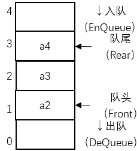
/// caption
顺序队列ADT
///

=== "入队"
	```cpp title="EnQueue"
	EnQueue(x) {
		if (QueueSize - 1 == rear)throw"上溢：队列已满";
		data[rear++] = x;
	}
	```
=== "出队"
	```cpp title="DeQueue"
	DeQueue() {
		if (rear == front)throw"下溢：队列为空";
		return data[front++];
	}
	```
=== "取队头元素"
	```cpp title="GetQueue"
	GetQueue() {
		if (rear == front)throw"下溢：队列为空";
		return data[front];
	}
	```
=== "完整示例"
	```cpp title="SeqQueue.h"
	const int QueueSize = 100;
	template<class DataType>
	class SeqQueue {
	public:

		/// <summary>
		/// 创建一个空队列
		/// </summary>
		SeqQueue();

		/// <summary>
		/// 析构函数：空
		/// </summary>
		~SeqQueue();

		/// <summary>
		/// 入队
		/// </summary>
		/// <param name="x">欲入队元素</param>
		void EnQueue(DataType x);

		/// <summary>
		/// 出队
		/// </summary>
		/// <returns>已出队元素</returns>
		DataType DeQueue();

		/// <summary>
		/// 取队头元素
		/// </summary>
		/// <returns>队头元素</returns>
		DataType GetQueue();

		/// <summary>
		/// 判断队列是否为空
		/// </summary>
		/// <returns></returns>
		int Empty();

	private:
		DataType data[QueueSize];
		int front, rear;
	};
	```
	```cpp title="SeqQueue.cpp"
	#include "SeqQueue.h"

	template<class DataType>
	SeqQueue<DataType>::SeqQueue() {
		front = rear = 0;
	}

	template<class DataType>
	SeqQueue<DataType>::~SeqQueue() {}

	template<class DataType>
	void SeqQueue<DataType>::EnQueue(DataType x) {
		if (QueueSize - 1 == rear)throw"上溢：队列已满";
		data[rear++] = x;
	}

	template<class DataType>
	DataType SeqQueue<DataType>::DeQueue() {
		if (rear == front)throw"下溢：队列为空";
		return data[front++];
	}

	template<class DataType>
	DataType SeqQueue<DataType>::GetQueue() {
		if (rear == front)throw"下溢：队列为空";
		return data[front];
	}

	template<class DataType>
	int SeqQueue<DataType>::Empty() {
		return front == rear ? 1 : 0;
	}
	```

#### 循环队列

顺序队列建立后，随着队列的插入和删除操作的进行，整个队列会逐渐向着数组末尾移动，从而产生了队列的“单向移动性”。当元素被插入到数组中下标最大的位置上之后，队列的空间就用尽了，尽管此时数组的低端还有空闲空间，这种现象称为“假溢出”。为了解决这个问题，把顺序队列的头尾相接，形成**循环队列（Circular Queue）**。

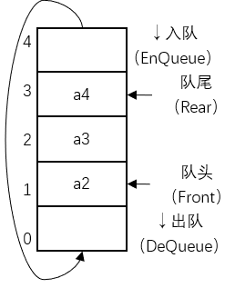
/// caption
循环队列ADT
///

=== "入队"
	```cpp title="EnQueue"
	EnQueue(x) {
		if ((rear + 1) % QueueSize == front)throw"上溢：队列已满";
		rear = (rear + 1) % QueueSize;
		data[rear] = x;
	}
	```
=== "出队"
	```cpp title="DeQueue"
	DeQueue() {
		if (rear == front)throw"下溢：队列为空";
		front = (front + 1) % QueueSize;
		return data[front];
	}
	```
=== "取队头元素"
	```cpp title="GetQueue"
	GetQueue() {
		if (rear == front)throw"下溢：队列为空";
		int i = (front + 1) % QueueSize;
		return data[i];
	}
	```
=== "完整示例"
	```cpp title="CirQueue.h"
	const int QueueSize = 100;
	template<class DataType>
	class CirQueue {
	public:

		/// <summary>
		/// 创建一个空队列
		/// </summary>
		CirQueue();

		/// <summary>
		/// 析构函数：空
		/// </summary>
		~CirQueue();

		/// <summary>
		/// 入队
		/// </summary>
		/// <param name="x">欲入队元素</param>
		void EnQueue(DataType x);

		/// <summary>
		/// 出队
		/// </summary>
		/// <returns>已出队元素</returns>
		DataType DeQueue();

		/// <summary>
		/// 取队头元素
		/// </summary>
		/// <returns>队头元素</returns>
		DataType GetQueue();

		/// <summary>
		/// 判断队列是否为空
		/// </summary>
		/// <returns></returns>
		int Empty();

	private:
		DataType data[QueueSize];
		int front, rear;
	};
	```
	```cpp title="CirQueue.cpp"
	#include "CirQueue.h"

	template<class DataType>
	CirQueue<DataType>::CirQueue() {
		front = rear = QueueSize - 1;
	}

	template<class DataType>
	CirQueue<DataType>::~CirQueue() {}

	template<class DataType>
	void CirQueue<DataType>::EnQueue(DataType x) {
		if ((rear + 1) % QueueSize == front)throw"上溢：队列已满";
		rear = (rear + 1) % QueueSize;
		data[rear] = x;
	}

	template<class DataType>
	DataType CirQueue<DataType>::DeQueue() {
		if (rear == front)throw"下溢：队列为空";
		front = (front + 1) % QueueSize;
		return data[front];
	}

	template<class DataType>
	DataType CirQueue<DataType>::GetQueue() {
		if (rear == front)throw"下溢：队列为空";
		int i = (front + 1) % QueueSize;
		return data[i];
	}

	template<class DataType>
	int CirQueue<DataType>::Empty() {
		return front == rear ? 1 : 0;
	}
	```

#### 两栈模拟队列

**两栈模拟队列（Both Stack Queue）**是一种特殊的顺序队列，通过两个栈来实现一个队列的功能，一个栈称为入队栈，仅用于入队（入栈），另一个栈称为出队栈，仅用于出队（出栈）。当需要入队时，在入队栈进行入栈；当需要出队时，判断出队栈是否为空，如果不为空，则在出队栈进行出栈，如果为空，则将入队栈和出队栈互换位置，再进行出队。如果两栈都为空，则队列为空。


/// caption
两栈模拟队列ADT
///

=== "入队"
	```cpp title="EnQueue"
	EnQueue(x) {
		if (count == QueueSize) throw "上溢：队列已满";
		if (rear == QueueSize - 1) {
			while (rear >= 0) {
				PopStack[++front] = PushStack[rear--];
			}
		}
		PushStack[++rear] = x;
		count++;
	}
	```
=== "出队"
	```cpp title="DeQueue"
	DeQueue() {
		if (count == 0) throw "下溢：队列为空";
		if (front == -1) {
			while (rear >= 0) {
				PopStack[++front] = PushStack[rear--];
			}
		}
		x = PopStack[front--];
		count--;
		return x;
	}
	```
=== "取队头元素"
	```cpp title="GetQueue"
	GetQueue() {
		if (count == 0) throw "下溢：队列为空";
		if (front == -1) {
			while (rear >= 0) {
				PopStack[++front] = PushStack[rear--];
			}
		}
		return PopStack[front];
	}
	```
=== "完整示例"
	```cpp title="BSQueue.h"
	const int QueueSize = 100;
	template<class DataType>
	class BSQueue {
	public:

		/// <summary>
		/// 创建一个空队列
		/// </summary>
		BSQueue();

		/// <summary>
		/// 析构函数：空
		/// </summary>
		~BSQueue();

		/// <summary>
		/// 入队
		/// </summary>
		/// <param name="x">欲入队元素</param>
		void EnQueue(DataType x);

		/// <summary>
		/// 出队
		/// </summary>
		/// <returns>已出队元素</returns>
		DataType DeQueue();

		/// <summary>
		/// 取队头元素
		/// </summary>
		/// <returns>队头元素</returns>
		DataType GetQueue();

		/// <summary>
		/// 判断队列是否为空
		/// </summary>
		/// <returns></returns>
		int Empty();

	private:
		DataType PushStack[QueueSize], PopStack[QueueSize];
		int rear, front, count;
	};
	```
	```cpp title="BSQueue.cpp"
	#include "BSQueue.h"

	template<class DataType>
	BSQueue<DataType>::BSQueue() {
		rear = front = -1;
		count = 0;
	}

	template<class DataType>
	BSQueue<DataType>::~BSQueue() {}

	template<class DataType>
	void BSQueue<DataType>::EnQueue(DataType x) {
		if (count == QueueSize) throw "上溢：队列已满";
		if (rear == QueueSize - 1) {
			while (rear >= 0) {
				PopStack[++front] = PushStack[rear--];
			}
		}
		PushStack[++rear] = x;
		count++;
	}

	template<class DataType>
	DataType BSQueue<DataType>::DeQueue() {
		if (count == 0) throw "下溢：队列为空";
		if (front == -1) {
			while (rear >= 0) {
				PopStack[++front] = PushStack[rear--];
			}
		}
		DataType x = PopStack[front--];
		count--;
		return x;
	}

	template<class DataType>
	DataType BSQueue<DataType>::GetQueue() {
		if (count == 0) throw "下溢：队列为空";
		if (front == -1) {
			while (rear >= 0) {
				PopStack[++front] = PushStack[rear--];
			}
		}
		return PopStack[front];
	}

	template<class DataType>
	int BSQueue<DataType>::Empty() {
		return count == 0 ? 1 : 0;
	}
	```

#### 双端队列

**双端队列（Double-Ended Queue，Deque）**也是一种特殊的队列，双端队列是指一个可以在队首和队尾都可以插入或删除元素的队列，相当于是栈与队列功能的结合。类似的，也可以用两栈来模拟双端队列。

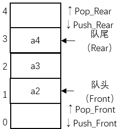
/// caption
双端队列ADT
///

=== "在队头入队"
	```cpp title="Push_Front"
	Push_Front(x) {
		if ((rear + 1) % QueueSize == front) throw "上溢：队列已满";
		data[front] = x;
		front = (front - 1 + QueueSize) % QueueSize;
	}
	```
=== "在队尾入队"
	```cpp title="Push_Rear"
	Push_Rear(x) {
		if ((rear + 1) % QueueSize == front) throw "上溢：队列已满";
		rear = (rear + 1) % QueueSize;
		data[rear] = x;
	}
	```
=== "在队头出队"
	```cpp title="Pop_Front"
	Pop_Front() {
		if (rear == front) throw "下溢：队列为空";
		front = (front + 1) % QueueSize;
		return data[front];
	}
	```
=== "在队尾出队"
	```cpp title="Pop_Rear"
	Pop_Rear() {
		if (rear == front) throw "下溢：队列为空";
		temp = data[rear];
		rear = (rear - 1 + QueueSize) % QueueSize;
		return temp;
	}
	```
=== "取队头元素"
	```cpp title="Peek_Front"
	Peek_Front() {
		if (rear == front) throw "下溢：队列为空";
		int i = (front + 1) % QueueSize;
		return data[i];
	}
	```
=== "取队尾元素"
	```cpp title="Peek_Rear"
	Peek_Rear() {
		if (rear == front) throw "下溢：队列为空";
		int i = rear % QueueSize;
		return data[i];
	}
	```
=== "完整示例"
	```cpp title="Deque.h"
	const int QueueSize = 100;
	template<class DataType>
	class Deque {
	public:

		/// <summary>
		/// 创建一个空队列
		/// </summary>
		Deque();

		/// <summary>
		/// 析构函数：空
		/// </summary>
		~Deque();

		/// <summary>
		/// 在队头入队
		/// </summary>
		/// <param name="x">欲入队元素</param>
		void Push_Front(DataType x);

		/// <summary>
		/// 在队尾入队
		/// </summary>
		/// <param name="x">欲入队元素</param>
		void Push_Rear(DataType x);

		/// <summary>
		/// 在队头出队
		/// </summary>
		/// <returns>已出队元素</returns>
		DataType Pop_Front();

		/// <summary>
		/// 在队尾出队
		/// </summary>
		/// <returns>已出队元素</returns>
		DataType Pop_Rear();

		/// <summary>
		/// 取队头元素
		/// </summary>
		/// <returns>队头元素</returns>
		DataType Peek_Front();

		/// <summary>
		/// 取队尾元素
		/// </summary>
		/// <returns>队尾元素</returns>
		DataType Peek_Rear();

		/// <summary>
		/// 判断队列是否为空
		/// </summary>
		/// <returns></returns>
		int Empty();

	private:
		DataType data[QueueSize];
		int front, rear;
	};
	```
	```cpp title="Deque.cpp"
	#include "Deque.cpp"

	template<class DataType>
	Deque<DataType>::Deque() {
		front = rear = QueueSize - 1;
	}

	template<class DataType>
	Deque<DataType>::~Deque() {}

	template<class DataType>
	void Deque<DataType>::Push_Rear(DataType x) {
		if ((rear + 1) % QueueSize == front) throw "上溢：队列已满";
		rear = (rear + 1) % QueueSize;
		data[rear] = x;
	}

	template<class DataType>
	void Deque<DataType>::Push_Front(DataType x) {
		if ((rear + 1) % QueueSize == front) throw "上溢：队列已满";
		data[front] = x;
		front = (front - 1 + QueueSize) % QueueSize;
	}

	template<class DataType>
	DataType Deque<DataType>::Pop_Front() {
		if (rear == front) throw "下溢：队列为空";
		front = (front + 1) % QueueSize;
		return data[front];
	}

	template<class DataType>
	DataType Deque<DataType>::Pop_Rear() {
		if (rear == front) throw "下溢：队列为空";
		DataType temp = data[rear];
		rear = (rear - 1 + QueueSize) % QueueSize;
		return temp;
	}

	template<class DataType>
	DataType Deque<DataType>::Peek_Front() {
		if (rear == front) throw "下溢：队列为空";
		int i = (front + 1) % QueueSize;
		return data[i];
	}

	template<class DataType>
	DataType Deque<DataType>::Peek_Rear() {
		if (rear == front) throw "下溢：队列为空";
		int i = rear % QueueSize;
		return data[i];
	}

	template<class DataType>
	int Deque<DataType>::Empty() {
		return front == rear ? 1 : 0;
	}
	```

#### 单调队列

**单调队列（Monotone Queue）**是指具有单调（递增或递减）性质的双端队列，是对双端队列加以限定，队列内的元素必须是单调（递增或递减）的，在进行入队操作时，为了维护队列的单调性，需要在保证将该元素插入到队尾后整个队列满足单调性的前提下移出最少的元素。

单调队列是基于双端队列的，因此只需要对双端队列进行修改即可：

=== "在队头入队（递增）"
	```cpp title="Push_Front"
	Push_Front(x) {
		if ((rear + 1) % QueueSize == front) throw "上溢：队列已满";
		while (rear != front) {
			if (x < data[(front + 1) % QueueSize])Pop_Front();
			else break;
		}
		data[front] = x;
		front = (front - 1 + QueueSize) % QueueSize;
	}
	```
=== "在队尾入队（递增）"
	```cpp title="Push_Rear"
	Push_Rear(x) {
		if ((rear + 1) % QueueSize == front) throw "上溢：队列已满";
		while (rear != front) {
			if (x > data[rear % QueueSize])Pop_Rear();
			else break;
		}
		rear = (rear + 1) % QueueSize;
		data[rear] = x;
	}
	```
=== "在队头入队（递减）"
	```cpp title="Push_Front"
	Push_Front(x) {
		if ((rear + 1) % QueueSize == front) throw "上溢：队列已满";
		while (rear != front) {
			if (x > data[(front + 1) % QueueSize])Pop_Front();
			else break;
		}
		data[front] = x;
		front = (front - 1 + QueueSize) % QueueSize;
	}
	```
=== "在队尾入队（递减）"
	```cpp title="Push_Rear"
	Push_Rear(x) {
		if ((rear + 1) % QueueSize == front) throw "上溢：队列已满";
		while (rear != front) {
			if (x < data[rear % QueueSize])Pop_Rear();
			else break;
		}
		rear = (rear + 1) % QueueSize;
		data[rear] = x;
	}
	```

#### 链队列

队列的链接存储结构称为**链队列（Linked Queue）**，链队列是对单链表的基础上进行了简单的修改，拥有头指针（指向头结点）和尾指针（指向终端结点）。

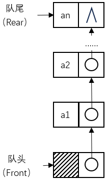
/// caption
链队列ADT
///

=== "元素"
	```cpp title="Struct"
	struct Node {
		data;
		Node* next;
	};
	```
=== "入队"
	```cpp title="EnQueue"
	EnQueue(x) {
		Node* s = new Node;
		s->data = x;
		s->next = NULL;
		rear->next = s;
		rear = s;
	}
	```
=== "出队"
	```cpp title="DeQueue"
	DeQueue() {
		if (rear == front)throw"下溢：队列为空";
		Node* p = front->next;
		x = p->data;
		front->next = p->next;
		if (p->next == NULL)rear = front;
		delete p;
		return x;
	}
	```
=== "取队头元素"
	```cpp title="GetQueue"
	GetQueue() {
		if (rear == front)throw"下溢：队列为空";
		return front->next->data;
	}
	```
=== "完整示例"
	```cpp title="LinkQueue.h"
	template <class DataType>
	struct Node {
		DataType data;
		Node<DataType>* next;
	};

	template<class DataType>
	class LinkQueue {
	public:

		/// <summary>
		/// 创建一个空队列
		/// </summary>
		LinkQueue();

		/// <summary>
		/// 析构函数
		/// </summary>
		~LinkQueue();

		/// <summary>
		/// 入队
		/// </summary>
		/// <param name="x">欲入队元素</param>
		void EnQueue(DataType x);

		/// <summary>
		/// 出队
		/// </summary>
		/// <returns>已出队元素</returns>
		DataType DeQueue();

		/// <summary>
		/// 取队头元素
		/// </summary>
		/// <returns>队头元素</returns>
		DataType GetQueue();

		/// <summary>
		/// 判断队列是否为空
		/// </summary>
		/// <returns></returns>
		int Empty();

	private:
		Node<DataType>* front, * rear;
	};
	```
	```cpp title="LinkQueue.cpp"
	#include<iostream>
	#include "LinkQueue.h"

	template<class DataType>
	LinkQueue<DataType>::LinkQueue() {
		Node<DataType>* s = new Node<DataType>;
		s->next = NULL;
		front = rear = s;
	}

	template<class DataType>
	LinkQueue<DataType>::~LinkQueue() {
		while (front != rear) {
			Node<DataType>* q = front;
			front = front->next;
			delete q;
		}
	}

	template<class DataType>
	void LinkQueue<DataType>::EnQueue(DataType x) {
		Node<DataType>* s = new Node<DataType>;
		s->data = x;
		s->next = NULL;
		rear->next = s;
		rear = s;
	}

	template<class DataType>
	DataType LinkQueue<DataType>::DeQueue() {
		if (rear == front)throw"下溢：队列为空";
		Node<DataType>* p = front->next;
		DataType x = p->data;
		front->next = p->next;
		if (p->next == NULL)rear = front;
		delete p;
		return x;
	}

	template<class DataType>
	DataType LinkQueue<DataType>::GetQueue() {
		if (rear == front)throw"下溢：队列为空";
		return front->next->data;
	}

	template<class DataType>
	int LinkQueue<DataType>::Empty() {
		return front == rear ? 1 : 0;
	}
	```