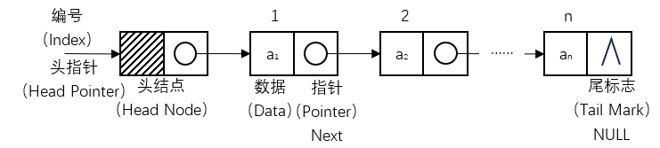
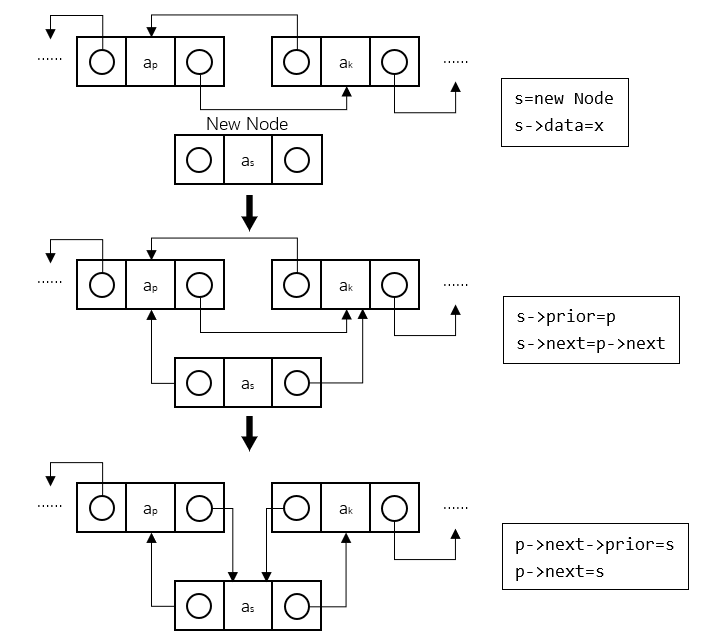
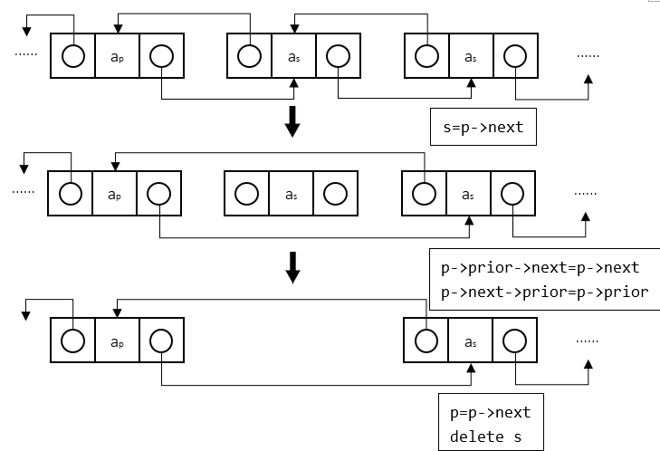
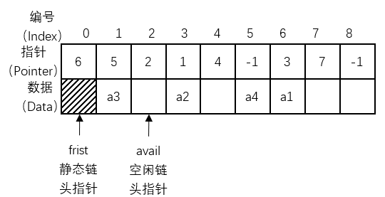
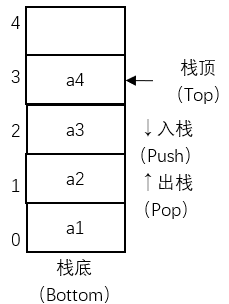
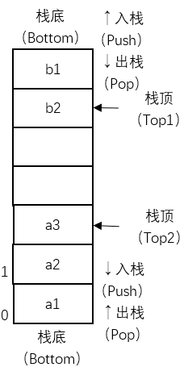
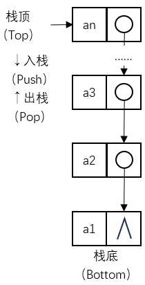

# 集合与线性结构

## 散列表

## 线性表

**线性表（Linear List）**简称表，是具有相同类型的数据元素的有限序列，线性表中数据元素的个数称为线性表的长度。长度等于0时称为空表，线性表每个元素按顺序编号（从1开始），称为位置或序号。一个元素的前一个元素称为该元素的前驱，后一个元素称为该元素的后继，第一个元素没有前驱，最后一个元素没有后继，其它元素只有一个前驱和一个后继。

### 顺序表

线性表的顺序存储结构称为**顺序表（Sequential List）**，有些地方把顺序表简单称为数组，这是由于顺序表采用数组存储，因此其在删除和插入等操作较为麻烦，而查询和更新等操作却方便。顺序表中数据元素的存储地址是其序号的线性函数，只要确定了存储顺序的起始地址（基地址），计算任意一个元素的存储地址的时间是想等的，具有这一特点的存储结构称为**随机存取结构**。**顺序存取结构**是一种按地址的逻辑顺序进行读、写操作的存取方法。其特点是存取时间与数据所在的物理地址有关，在存取第N个数据时，必须先访问前N-1个数据。

/// caption
顺序表ADT
///

顺序表本质上还是在对一个数组操作，使用的是静态存储分配。**静态存储分配**是指在编译时为变量分配内存，并且一经分配就始终占有固定的存储单元，直到该变量退出其作用域。**动态存储分配**是指在程序运行期间根据实际需要随时申请内存，并在不需要时释放。为了克服顺序表的缺点，采用动态存储分配来存储线性表，即使用链接存储结构。

### 链表

**链表（Linked List）**是用一组任意的存储单元存放线性表的元素，这组存储单元可以连续也可以不连续，为了能正确表示元素之间的逻辑关系，每个存储单元在存储数据的同时，还必须存储其后继元素所在的地址信息，这个地址信息称为指针，这两部分组成了数据元素的存储映像，称为结点。

#### 单链表

**单链表（Singly Linked List）**中包含数据域和指针域，数据域用于存放数据，指针域中含有一个next指针，用于链接当前结点和下一个结点。

/// caption
单链表ADT
///

/// caption
单链表插入算法
///

/// caption
单链表删除算法
///

#### 循环链表

在单链表中，如果将终端结点的指针域由空指针改为指向头结点，就使整个单链表形成一个环，这种头尾相接的单链表称为循环单链表，简称**循环链表（Circular Linked List）**。循环链表的操作方式和单链表相差无几。

/// caption
循环链表ADT
///

#### 双链表

在循环链表中，虽然从任一结点出发可以扫描到其它结点，但要找到其前驱结点，则需要遍历整个循环列表。如果希望快速确定表中任一结点的前驱结点，可以在单链表的每个结点中再设置一个指向其前驱结点的指针域，这样就形成了双向循环链表，简称**双链表（Doubly Linked List）**。

/// caption
双链表ADT
///

/// caption
双链表插入算法
///

/// caption
双链表删除算法
///

#### 异或链表

在双链表中，指针域需要两个指针的空间来存储，可以通过利用按位异或的值，仅使用一个指针的内存大小便可以实现双链表的功能，这种链表就是**异或链表（XOR Linked List）**。异或链表本质上还是双链表，操作方式也相差无几，只是获取前驱或者后继指针时需要进行异或运算。

/// caption
异或链表ADT
///

在异或链表中满足：

$$
\begin{cases}
Prior(k-1)=a_{k}->XOR(k)\oplus Next(k+1) \\
Next(k+1)=a_{k}->XOR(k)\oplus Prior(k-1) & 
\end{cases}
$$

#### 静态链表

**静态链表（Static Linked List）**是用数组来表示单链表，用数组元素的下标来模拟单链表的指针。由于它是利用数组定义的，属于静态存储分配，因此称为静态链表。

/// caption
静态链表ADT
///

|线性表|存储结构|结点指针|公共指针|
|-|-|-|-|
|顺序表|顺序|无|无|
|单链表|链接|Next（后继指针）|First（头指针）|
|循环链表|链接|Next（后继指针）|First（头指针） Rear（尾指针）（可选）|
|双链表|链接|Prior（前驱指针） Next（后继指针）|First（头指针） Rear（尾指针）（可选）|
|异或链表|链接|XOR（异或指针）|First（头指针） Rear（尾指针）（可选）|
|静态链表|顺序|无|First（静态链头指针） avail（空闲链头指针）|
/// caption
常用线性表对比
///

## 栈与队列

### 栈

**栈（Stack）**是限定仅在表尾进行插入和删除操作的线性表，允许插入和删除的一端称为**栈顶**，另一端称为**栈底**，不含任何数据元素的栈称为空栈。对于栈而言，把插入操作称为**入栈**或**压栈（Push）**，把删除操作称为**出栈**或**弹栈（Pop）**。栈有着后进入栈的元素先出栈的原则，称为**后进先出（last in first out，LIFO）**。

#### 顺序栈

栈的顺序存储结构称为**顺序栈（Sequential Stack）**，本质上就是顺序表的简化，对原有的顺序表进行了限定，指定了数组的哪一端表示栈底，通常把数组下标为0的一端作为栈底，同时附设一个栈顶指针指定栈顶元素。

/// caption
顺序栈ADT
///

#### 两栈共享空间

在一个栈未满时，往往会有多余的空间，如果两个栈的数据量处于此消彼长或其它需求时可以通过**两栈共享空间（Both Stack）**的办法实现对空间的合理利用。

/// caption
两栈共享空间ADT
///

#### 链栈

栈的链接存储结构称为**链栈（Linked Stack）**。与顺序栈类似，本质上也是对链栈的简化，操作固定在链表尾部（栈顶），也不需要头指针和头结点的定义。

/// caption
链栈ADT
///

### 队列

**队列（Queue）**是只允许在一端进行插入操作（**队尾**），在另一端进行删除操作（**队头**）的线性表，不含任何数据元素的队列称为空队列。对于队列而言，把插入操作称为**入队**，把删除操作称为**出队**。队列有着先进入队的元素先出队的原则，称为**先进先出（first in first out，FIFO）**。

#### 顺序队列

队列的顺序存储结构称为**顺序队列（Sequential Stack）**，本质上就是顺序表的简化，对原有的顺序表进行了限定，指定了数组的哪一端表示队头，哪一端表示队尾。需要附设指向队头和队尾的指针。在进行入队和出队的操作时，只需要移动指针即可。

/// caption
顺序队列ADT
///

#### 循环队列

顺序队列建立后，随着队列的插入和删除操作的进行，整个队列会逐渐向着数组末尾移动，从而产生了队列的“单向移动性”。当元素被插入到数组中下标最大的位置上之后，队列的空间就用尽了，尽管此时数组的低端还有空闲空间，这种现象称为“假溢出”。为了解决这个问题，把顺序队列的头尾相接，形成**循环队列（Circular Stack）**。

/// caption
循环队列ADT
///

#### 两栈模拟队列

**两栈模拟队列（Both Stack Queue）**是一种特殊的顺序队列，通过两个栈来实现一个队列的功能，一个栈称为入队栈，仅用于入队（入栈），另一个栈称为出队栈，仅用于出队（出栈）。当需要入队时，在入队栈进行入栈；当需要出队时，判断出队栈是否为空，如果不为空，则在出队栈进行出栈，如果为空，则将入队栈和出队栈互换位置，再进行出队。如果两栈都为空，则队列为空。

/// caption
两栈模拟队列ADT
///

#### 双端队列

**双端队列（Double-Ended Queue，Deque）**也是一种特殊的队列，双端队列是指一个可以在队首和队尾都可以插入或删除元素的队列，相当于是栈与队列功能的结合。类似的，也可以用两栈来模拟双端队列。

/// caption
双端队列ADT
///

#### 链队列

队列的链接存储结构称为**链队列（Linked Stack）**，链队列是对单链表的基础上进行了简单的修改，拥有头指针（指向头结点）和尾指针（指向终端结点）。

/// caption
链队列ADT
///