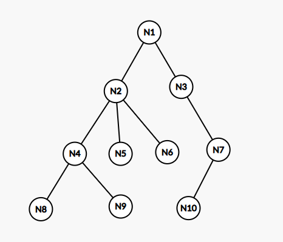
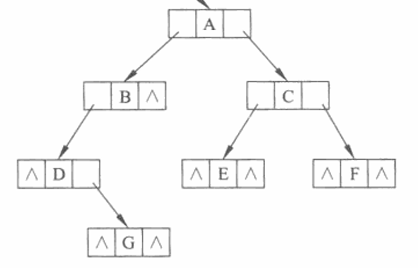

# 树

**树（Tree，T）**是一个有限集合，有如下定义：

$$
T=\{N,TE\}
$$

其中$N$是**结点（Node，N）**集合，即

$$
N=\{N_1,N_2,...,N_n\}
$$

而$TE$是**边（Edge，E）**的集合，为了和图的边$E$区分，树的边用$TE$表示，即

$$
TE=\{(N_1,N_2),...,(N_m,N_n)\}
$$

当$N=\varnothing$且$TE=\varnothing$时，称$T=\{N,TE\}$为**空树**。一棵非空树满足：

1. 有且仅有一个特定的称为**根（Root）**的结点
2. 当结点数大于1时，其余结点可分为若干个互不相交的有限集，其中每一个集合本身又是一颗树，并且称为根的**子树（SubTree）**

因此，树的定义是递归的。

某结点$N$拥有的子树的个数称为该结点的**度（Degree，Deg）**，记为$Deg(N_i)$，树中各结点度的最大值称为该树的度，即：

$$
Deg(T)=\{Deg(N_1),Deg(N_2),...,Deg(N_n)\}_{max}
$$

度为0的结点称为**叶子结点（Leaf Node）**，也称为终端结点，即$Deg(N_i)=0$；度不为0的结点称为**分支结点（Branch Node）**，也称为非终端结点，即$Deg(N_i)\neq0$。

某结点的子树的根结点称为该结点的**孩子结点（Children Node）**，反之，该结点称为其孩子结点的**双亲结点（Parent Node）**，具有同一个双亲的孩子结点互称为**兄弟结点（Brother Node）**。

结点之间的连线称为边，非根结点$N$所相连的边数显然为$Deg(N_i)+1$条，其中$Deg(N_i)$条是与其子树（孩子结点）相连的边，另$1$条是与其双亲结点相连的边。

如果结点序列$N_1,N_2,...,N_n$满足结点$N_{i}$是结点$N_{i+1}$的双亲结点$(1 \leq i<n)$，则称该序列为一条由$N_1$至$N_n$的**路径（Path，P）**，记为$P(N_1,N_n)$；路径上经过的边数称为**路径长度（Path Length）**，记为$P(N_1,N_n)=n-1$；$N_1$称为$N_n$的**祖先（Ancestor）**，$N_n$称为$N_1$的**子孙（Descendant）**。

对于$P(N_1,N_2)$，$P(N_1,N_3)$，$N_2$和$N_3$是$N_1$的孩子结点，$N_1$是$N_2$和$N_3$的双亲结点，$N_2$和$N_3$互称为兄弟结点。孩子结点是特殊的子孙，即路径长度为1的子孙；双亲结点是特殊的祖先，即路径长度为1的祖先。

对于根结点，有以下规定：

1. 没有双亲（祖先）和兄弟，可以有孩子，如果一颗树只有一个结点，那么这个结点就是根结点
2. 树的绘制从在顶部的根结点开始绘制，往下延申
3. 根结点的度和边数相等，因为它是树中唯一一个没有双亲（祖先）的结点
4. 根结点的**层数**为1，简称层，其它结点的层数为其双亲结点的层数加1，即：

$$
P(N_a,N_b) \Rightarrow Dep(N_a)+1=Dep(N_b)
$$

处于同一层的结点称为**堂兄弟结点（Cousins Node）**，显然，堂兄弟结点的双亲结点也处于同一层。

树中所有结点的最大层数称为树的**深度（Depth，Dep）**，也称为树的高度，即：

$$
Dep(T)=\{Dep(N_1),Dep(N_2),...,Dep(N_n)\}_{max}
$$

一个树的最长路径长度为该树的深度减1，即：

$$
T=\{N,TE\},\{P(N_i,N_j),i<j \leq |N|\}_{max} = Dep(T)-1
$$

将树中的结点按照从上层到下层、同层从左到右的次序依次从1开始编号，这种编号称为**层序编号（Level，L）**，记为$L(N)$，因此，可以将树中的结点用其层序编号为下标表示，即：

$$
N=\{N_1,N_2,...,N_n\},L(N_i)=i
$$

则可以确定，$N_1$为该树的根结点。

如果一颗树中结点的各子树从左到右是有次序的，即交换了结点各子树的相对位置，则构成不同的树，称这棵树为**有序树（Ordered Tree）**，反之，称为**无序树（Unordered Tree）**。除特殊说明，数据结构与算法中，一般都讨论有序树。

互不相交的若干树的集合构成**森林（Forest）**，记为$F=\{T_1,T_2,...,T_n\}$任何一颗非空树，删去根结点或者删除任意边，都会变成两颗树构成的森林。

树的遍历方法：

=== "前序遍历"
	若树为空，则空操作返回，否则
	
	（1）访问根结点
	
	（2）按照从左到右的顺序前序遍历根结点的每一棵子树
=== "后序遍历"
	若树为空，则空操作返回，否则
	
	（1）按照从左到右的顺序后序遍历根结点的每一棵子树
	
	（2）访问根结点
=== "层序遍历（广度遍历）"
	按照层序编号遍历

/// caption
$T_1$
///

我们以树$T_1$为例，说明之前的内容：

+ 度： $Deg(N_4)=2,Deg(N_2)=3,Deg(N_7)=1,Deg(N_{10})=0,...,Deg(T_1)=3$
+ 层： $Dep(N_1)=1,Dep(N_3)=2,Dep(N_5)=3,Dep(N_8)=4,...,Dep(T_1)=4$
+ 路径： $P(N_2,N_9),P(N_1,N_6)...$
+ 路径长度： $P(N_1,N_{10})=3,P(N_2,N_8)=2)...$
+ 根结点：$N_1$
+ 叶子结点： $N_8,N_9,N_5,N_6,N_{10}$
+ 分支结点： $N_1,N_2,N_3,N_4,N_7$
+ 孩子结点： $N_8$是$N_4$的孩子结点，$N_6$是$N_2$的孩子结点，...
+ 双亲结点： $N_4$是$N_8$的双亲结点，$N_1$是$N_2$的孩子结点，...
+ 兄弟结点： $N_4$是$N_5$的兄弟结点，$N_2$是$N_5$的兄弟结点，...
+ 堂兄弟结点： $N_4$是$N_7$的堂兄弟结点，$N_9$是$N_{10}$的堂兄弟结点，...
+ 祖先： $N_2$是$N_8$的祖先，$N_1$是$N_{10}$的祖先，...
+ 子孙： $N_8$是$N_2$的子孙，$N_7$是$N_1$的子孙，...

树的存储结构：

=== "顺序存储结构"
	**双亲表示法**是树的顺序存储结构，其本质是一个静态链表，在每一个结点中存储该结点的数据信息和该结点双亲在数组中的下标。
=== "链接存储结构"
	**孩子表示法**是树的一种链接存储结构，分为**多重链表表示法**和**孩子链表表示法**，多重链表表示法是在每一个结点存储该结点数据和指向该结点的孩子结点的指针，孩子链表表示法是把每个结点的孩子排列起来，看成是一个线性表，且以单链表存储，称为该结点的孩子链表。
	
	**孩子兄弟表示法**是树的另一种链接存储结构，也称为**二叉链表表示法**，是在链表中的每个结点除了存储该结点的数据信息外，还设置两个指针分别指向该结点的第一个孩子和右兄弟。
=== "复合存储结构"
	**双亲孩子表示法**将双亲表示法和孩子链表表示法结合起来使用。

## 二叉树

**二叉树（Binary Tree）**是最常用的一种树，其定义为树的度不能大于2（$Deg(T) \leq 2$）且二叉树有序。由于二叉树有序，因此可以定义其左子树和右子树（左孩子$(N_a,N_b)_l$和右孩子$(N_a,N_b)_r$）。

所有结点都只有左子树的二叉树称为**左斜树**，即：

$$
\forall i,(N_i,N_{i+1})_l
$$

所有结点都只有右子树的二叉树称为**右斜树**，即：

$$
\forall i,(N_i,N_{i+1})_r
$$

左斜树和右斜树统称为**斜树**。

在一颗二叉树中，如果所有分支结点都存在左子树和右子树，并且所有叶子都在同一层上，则称为**满二叉树（Full Binary Tree）**，表示为$T_F$，即：

$$
T_F
\begin{cases}
Deg(N_i)=2或0 \\
Deg(N_i)=0 \Rightarrow Dep(T)=Dep(N_i)
\end{cases}
$$

如果有一颗二叉树的任一结点在与相同深度的满二叉树对应的相同编号的结点的层数相同，则称该二叉树为**完全二叉树（Complete Binary Tree）**，表示为$T_C$，即：

$$
T_C
\begin{cases}
Deg(T) \leq 2 \\
Deg(N_i)=0 \Rightarrow Dep(T)=Dep(N_i)或Dep(T)-1=Dep(N_i) \\
\forall i,j, 1<i<j,Dep(N_i)=Dep(N_j) \Rightarrow Deg(N_i) \leq Deg(N_j) \\
(N_{\lfloor |N|/2 \rfloor},N_{|N|})_l
\end{cases}
$$

二叉树的基本性质：

1. $Deg(T) \leq 2,|\{Dep(N_i)=k,N_i \in T|N_1,N_2,...,N_n\}|_{max}=2^{k-1},k \leq 1$
2. $Deg(T) \leq 2,Dep(T)=k,T=\{N,TE\} \Rightarrow |N|_{max}=2^k-1,|N|_{min}=k$
3. $Deg(T) \leq 2,|\{Deg(N_i)=0,N_i \in T|N_1,N_2,...,N_n\}|=|\{Deg(N_i)=2,N_i \in T|N_1,N_2,...,N_n\}|+1$
4. $Deg(T_C) \leq 2,T_C=\{N,TE\},Dep(T_C)= \lfloor \log_{2}{|N|} \rfloor +1$
5. $$
Deg(T_C) \leq 2,T_C=\{N,TE\},\forall N_i \in T_C \Rightarrow \\
\begin{cases}
i>1,(N_{\lfloor i/2 \rfloor},N_i) \\
2i \leq |N|,(N_i,N_{2i})_l \\
2i+1 \leq |N|,(N_i,N_{2i+1})_r
\end{cases}
$$

??? info "x叉树的基本性质"
	1. $Deg(T) \leq x,|\{Dep(N_i)=k,N_i \in T|N_1,N_2,...,N_n\}|_{max}=x^{k-1},k \leq 1$
	2. $Deg(T) \leq x,Dep(T)=k,T=\{N,TE\} \Rightarrow |N|_{max}=x^k-1,|N|_{min}=k$
	3. $Deg(T) \leq x,|\{Deg(N_i)=0,N_i \in T|N_1,N_2,...,N_n\}|=|\{Deg(N_i)=x,N_i \in T|N_1,N_2,...,N_n\}|+1$
	4. $Deg(T_C) \leq x,T_C=\{N,TE\},Dep(T_C)= \lfloor \log_{x}{|N|} \rfloor +1$

二叉树的遍历操作：

=== "前序遍历"
	若二叉树为空，则空操作返回，否则：
	
	1. 访问根结点
	2. 前序遍历根结点的左子树
	3. 前序遍历根结点的右子树
=== "中序遍历"
	若二叉树为空，则空操作返回，否则：
	
	1. 前序遍历根结点的左子树
	2. 访问根结点
	3. 前序遍历根结点的右子树
=== "后序遍历"
	若二叉树为空，则空操作返回，否则：
	
	1. 前序遍历根结点的左子树
	2. 前序遍历根结点的右子树
	3. 访问根结点
=== "层序遍历"
	按照层序编号遍历

### 二叉链表

由于顺序存储结构只适合存储完全二叉树，因此，我们使用链接存储结构存储二叉树，称为**二叉链表（Binary Linked List）**，其链表结点除了存储结点数据外，还存储左孩子和右孩子的指针。

/// caption
二叉链表ADT
///

### 三叉链表

二叉链表可以从某结点出发直接访问到它的孩子结点，但要找到它的双亲结点，则需要从根结点开始搜索，最坏的情况下，需要遍历整个二叉链表，此时可以使用**三叉链表（Trident Linked List）**存储二叉树，三叉链表中，比二叉链表多了一个指向双亲结点的指针。

### 线索链表

在二叉链表中，并非每一个结点都有左孩子和右孩子，可以将缺少的那个空指针存储其它信息，利用这些空指针存储指向该结点在某种遍历序列中的前驱和后继结点的指针，这些指向前驱和后继结点的指针称为**线索**，加上线索的二叉树称为**线索二叉树（Thread Binary Tree）**，加上线索的二叉链表称为**线索链表（Thread Linked List）**。为了区分某个结点的两个指针是指向孩子还是指向前驱或后继的线索，在每个结点再设两个标志位（通常用整型或布尔型）。

由于二叉树的遍历顺序有四种，则线索链表也有四种：前序线索链表、中序线索链表、后序线索链表、层序线索链表。

### 哈夫曼树

**带权树（Weight Binary Tree，$T_W$）**是一种特殊的二叉树，其于二叉树不同之处是每个叶子结点都赋予有一个有意义的数值量，称为**权值（Weight，W）**。

带权树$T_W=\{N,TE\}$具有$|\{Deg(N_i)=0|N_i\}|$个带权值为$W_i$的叶子结点，从根结点到各个叶子结点的路径长度与相应叶子结点权值的乘积之和叫做带权树的**带权路径长度（Weighted Path Length，WPL）**，记为：

$$
WPL=\sum_{i}^nP(N_1,|\{Deg(N_i)=0|N_i\}|)W_i
$$

给定一组具有确定权值的叶子结点，可以构造出不同的带权树，将其中带权路径长度最小的带权树称为** 哈夫曼 树（Huffman Tree，$T_H$）**，也称为**最优二叉树**（最优带权树）、最优前缀编码树。

给定一组权值，构造其哈夫曼树的算法称为**哈夫曼算法**：

1. 初始化：由给定的$n$个权值{W_1,W_2,...,W_n}构造$n$棵只有一个根结点的二叉树，从而得到一个二叉树集合$F={T_1,T_2,...,T_n}$
2. 选取与合并：将$F$中选取根节点的权值最小的两颗二叉树分别作为左、右子树构造一颗新的二叉树，这颗新二叉树的根结点的权值为其左、右子树根结点的权值之和。
3. 删除与加入：在$F$中删除作为左、右子树的两颗二叉树，并将新建立的二叉树加入到$F$中
4. 重复2、3步，当集合$F$中只剩下一颗二叉树时，这颗二叉树就是哈夫曼树

哈夫曼树的性质：

1. $Deg(T_H)=2或0$
2. $T_H=\{N,TE\},|N|=2|\{Deg(N_i)=0|N_i\}|-1,|N|=|\{Deg(N_i) \neq 0|N_i\}|-1$

在进行程序设计时，通常给每一个字符标记一个单独的代码来表示一组字符，即**编码**。
在进行二进制编码时，假设所有的代码都等长，那么表示$n$个不同的字符需要$\left \lceil \log_2 n \right \rceil$位，称为**等长编码**。

如果每个字符的使用频率相等，那么等长编码无疑是空间效率最高的编码方法，而如果字符出现的频率不同，则可以让频率高的字符采用尽可能短的编码，频率低的字符采用尽可能长的编码，来构造出一种**不等长编码**，从而获得更好的空间效率，这也是文件压缩的核心思想。

在设计不等长编码时，要考虑解码的唯一性，如果一组编码中任一编码都不是其他任何一个编码的前缀，那么称这组编码为**前缀编码**，其保证了编码被解码时的唯一性。

哈夫曼树可用于构造**最短的前缀编码**，即**哈夫曼编码（Huffman Code）**，其构造步骤如下：

1.  设需要编码的字符集为：$N_1,N_2,...,N_n$，他们在字符串中出现的频率为：$W_1,W_2,...,W_n$。
2.  以$N_1,N_2,...,N_n$ 作为叶结点，$W_1,W_2,...,W_n$ 作为叶结点的权值，构造一棵哈夫曼树。
3.  规定哈夫曼编码树的左分支代表0，右分支代表1，则从根结点到每个叶结点所经过的路径组成的0、1序列即为该叶结点对应字符的编码。

### 二叉判定树

## 二叉搜索树与平衡树[^1]

[^1]:该节的大部分内容选取自[OI Wiki](https://oi-wiki.org/ds/sbt/)，感谢OI Wiki！

### 二叉搜索树

### 平衡树

### 树堆

### 伸展树

### 宗法树
WBLT

### 替罪羊树

### 笛卡尔树

### 自平衡二叉搜索树

### 平衡二叉搜索树

### B树

### B+树

### 红黑树

### 左偏红黑树

### AA树

### 2-3树

### 2-3-4树

## 堆

### 二叉堆

### 配对堆

#### 对顶堆

### 左偏树

### 二项堆

### 斐波那契堆

## K-D树

## 动态树

### 链剖树

### 全局平衡二叉树

### 欧拉回路树

### 顶部树

## 析合树

## PQ树

## 手指树

## 竞赛树

### 赢者树

### 败者树

## 决策树

## 应用树

### 家谱树