# ESP32-MicroPython

## 简介

ESP32是一系列低成本，低功耗的单片机微控制器，集成了Wi-Fi和双模蓝牙。 ESP32系列采用Tensilica Xtensa LX6微处理器，包括双核心和单核版本，内置天线开关，RF射频模块，功率放大器，低噪声接收放大器，滤波器和电源管理模块。

ESP32由总部位于上海的中国公司乐鑫信息科技创建和开发，由台积电采用40纳米工艺制造，具有超高的射频性能、稳定性、通用性和可靠性，以及超低的功耗，满足不同的功耗需求，适用于各种应用场景。它是ESP8266微控制器的后继产品。

|系列名称|处理器（主频）|内置存储|GPIO|特色功能|
|-|-|-|-|-|
|ESP32-S3|Xtensa® 32位 LX7双核(240MHz)|512KB SRAM 384KB ROM|45|2.4GHz Wi-Fi Bluetooth 5(LE)|
|ESP32-S2|Xtensa® 32位 LX7单核(240MHz)|-|43|2.4GHz Wi-Fi|
|ESP32-C6|RISC-V 32位单核(160 MHz)|512KB SRAM 320KB ROM|30/22|2.4GHz Wi-Fi6  Bluetooth 5(LE) IEEE 802.15.4|
|ESP32-C3|RISC-V 32位单核(160 MHz)|400KB SRAM 384KB ROM|-|2.4GHz Wi-Fi Bluetooth 5(LE)|
|ESP32-C2|RISC-V 32位单核(120 MHz)|272KB SRAM 576KB ROM|14|2.4GHz Wi-Fi Bluetooth 5(LE)|
|ESP32-H2|RISC-V 32位单核(96 MHz)|320KB SRAM 128KB ROM|19|Bluetooth 5(LE) IEEE 802.15.4|
|ESP32|Xtensa® 32位 LX6单核/双核 (80 MHz ~240 MHz)|-|-|2.4GHz Wi-Fi Bluetooth/Bluetooth LE|
|ESP8266|Xtensa® 32位 LX6 单核(160 MHz)|-|-|2.4GHz Wi-Fi|

在本教程中，主要以ESP32-S3-WROOM-1-N16R8为例， N16R8表示该单片机由16MB的Flash和8MB的PSRAM存储。Flash（闪存）是一种可以快速读写、擦除的存储器，常用于存储用户程序和需要永久保存的数据，相当于微机上的外存。PSRAM是“伪静态RAM”（Pseudo Static Random Access Memory），它是一种用于存储数据的内存类型。PSRAM结合了静态RAM（SRAM）和动态RAM（DRAM）的特点，具有快速的访问速度和相对较低的功耗，相当于微机上的内存，用于临时存储数据和程序。

ESP32是一款功能强大的低功耗Wi-Fi和蓝牙双模片上系统，常见于物联网（IoT）和嵌入式系统中。其应用场景广泛，包括智能家居（如智能灯泡、智能插座、智能门锁）、工业自动化（如传感器监测、远程控制）、健康监测（如智能手环、健康追踪器）、智能农业（如环境监测、灌溉控制）、智能交通（如智能停车系统、交通监控）等领域。ESP32具有丰富的外设接口和灵活的编程能力，可以满足不同应用的需求，并且其开源的特性也吸引了众多开发者加入到其生态系统中。

“纸上得来终觉浅，绝知此事要躬行”，学习一门技术，实践是必不可缺的一部分，在本节内容中，将介绍实验用品的准备和开发环境的部署。在学习此内容前，您必须掌握或了解以下知识：

1. 计算机基础和Python编程语言
2. 基本的电路知识和数学知识

## 开发环境部署

现如今大部分计算机操作系统（如Windows11）都是预先安装了串口驱动的，所以可以直接使用开发板，但不排除没有安装的情况，读者可自行去搜索CH340/CP210x（由开发板决定）驱动进行安装。

MicroPython是一个完整的Python编译器和运行时，在裸机上运行。它提供了一个交互式提示（REPL）来执行命令，并拥有从内置文件系统中运行和导入脚本的能力。其语法上和Python几乎完全一样。是本书中着重介绍的ESP32开发语言。

1.下载esptool工具

[GitHub EspTool](https://github.com/espressif/esptool/releases)

2.下载烧录使用的固件

[esp32s3n16r8 firmware](../file/lv_micropython_esps3n16r8_color16.bin)

!!! note "说明"
	如果你的ESP32单片机不是ESP32-S3-WROOM-1-N16R8，那么这个固件是不适用的，对于不同型号的ESP32单片机，使用不同的固件，你可以去MicroPython官网下载你ESP32对应的固件。

	[MicroPython](https://micropython.org/)

3.将esptool工具压缩文件解压，进入esptool文件夹后，将固件移动到当前位置，在资源管理器的地址栏输入cmd打开终端。使用数据线将开发板连接到电脑上，按住开发板上的BOOT键后按一下RST键即可进入下载模式，使用设备管理器查看连接的端口号（这里以COM5为例）。

4.在终端输入擦除命令后回车，稍作等待。

```bash
esptool --chip esp32s3 --port COM5 erase_flash
```

运行完成后，再输入下载命令后回车，等待一段时间完成下载。

```bash
esptool --chip esp32s3 --port COM5 write_flash -z 0x0000 esps3n16r8_color16.bin
```

运行完成后，即可关闭终端，结束固件烧录。

5.安装开发工具Thonny

Thonny是一个简单的Python IDE，旨在使学习编程变得更容易。使用Thonny，您不需要担心安装Python，因为它内置了Python 3.10。并且Thonny支持对硬件进行编程（即MicroPython），直接下载按步骤安装即可。

[Thonny](https://thonny.org/)

6.打开Thonny

在Thonny右下角可以看到选择型号的选项，如果只显示本地Python3，则说明开发板未连接、连接出现问题或者固件烧录未成功。请重新检查烧录步骤是否出现问题或连接是否正常。

对于新安装固件的ESP32，其文件只有boot.py文件，其作用是开机自动运行的程序，对于调试中的程序，不建议将代码写到boot.py文件中。如果需要创建一个新的程序，我们需要在MicroPython设备文件区右键点击创建新的文件，写入代码运行即可。

Python是一种解释型语言，有脚本式和交互式两种，交互式代码可以写在下面的Shell窗口中，同时，Shell窗口在调试中起到重要作用，可以用于与开发板进行交互以及串口应用等。

在交互区输入：

```py
print("Hello,Micropython!")
```

即可观察到在交互区打印“Hello,Micropython!”。也可以新建一个文件，在代码编辑区输入后，点击保存（选择保存到MicroPython设备，即ESP32开发板），起名为“test.py”（或其它合适的名字也可以），然后点击运行也可以看到同样的结果。

查询开发板的内存情况：

```py
import micropython
print(micropython.mem_info())
```

查询开发板的外存情况：

```py
import esp
print(esp.flash_size()/1024/1024,"MB")
```

可以看到Shell窗口上显示：16.0 MB

micropython和esp是MicroPython语言较为少用的两个模块，一般和开发板的属性等相关。在Shell使用help()指令，可以了解到其它该模块的内置的函数：

=== "micropython"
	```py
	>>> import micropython
	>>> help(micropython)
	object <module 'micropython'> is of type module
	  __name__ -- micropython
	  const -- <function>
	  opt_level -- <function>
	  mem_info -- <function>
	  qstr_info -- <function>
	  stack_use -- <function>
	  alloc_emergency_exception_buf -- <function>
	  heap_lock -- <function>
	  heap_unlock -- <function>
	  kbd_intr -- <function>
	  schedule -- <function>
	```
=== "esp"
	```py
	>>> import esp
	>>> help(esp)
	object <module 'esp'> is of type module
	__name__ -- esp
	osdebug -- <function>
	flash_read -- <function>
	flash_write -- <function>
	flash_erase -- <function>
	flash_size -- <function>
	flash_user_start -- <function>
	gpio_matrix_in -- <function>
	gpio_matrix_out -- <function>
	dht_readinto -- <function>
	LOG_NONE -- 0
	LOG_ERROR -- 1
	LOG_WARNING -- 2
	LOG_INFO -- 3
	LOG_DEBUG -- 4
	LOG_VERBOSE -- 5
	```

## LED

### LED简介

LED（light-emitting diode） 即发光二极管。它具有单向导电性，通过 5mA 左右电流即可发光，电流越大，其亮度越强，但若电流过大，会烧毁二极管，一般我们控制在 3mA-20mA 之间，通常我们会在 LED 管脚上串联一个电阻，目的就是为了限制通过发光二极管的电流不要太大，因此这些电阻又可以称为限流电阻。当发光二极管发光时，测量它两端电压约为 1.7V，这个电压又叫做发光二极管的导通压降。发光二极管正极又称阳极，负极又称阴极，电流只能从阳极流向阴极。直插式发光二极管长脚为阳极，短脚为阴极。

### LED简单控制

GPIO引脚又叫管脚，英文叫Pin, 就是从集成电路（芯片以及一些电子元件）内部电路引出与外围电路的接线的接口。在我们的 ESP32 开发板上, 我们可以把这些称为引脚, 这些引脚其实是从ESP32芯片内部引出来的, 我们可以看到每个引脚都标了自己独特的名字。其中有一类引脚叫GPIO引脚, 负责输入/输出电压。一般在开发板上使用数字表示（或者D或P加数字表示）。通过控制GPIO引脚上的输出电平，可以实现对LED的控制。

电平是指电路上某点的电压（对公共参考点）或电位是高还是低。比如在逻辑电路中，高于某个数值的电位称其为高电位或高电平，值为1；低于某个数值的，为低电位或低电平，值为0。比如 ESP32 中，高电平的数值大于2.5V，低电平的数值小于0.5V。GPIO引脚的默认电位一般是低电位。

接下来进行控制代码的编写，用于GPIO的Pin类在machine模块中，因此，需提前导入该模块。

```py
Pin(id, mode, pull, value, drive, alt)
```

这是Pin类的构造函数，其有六个参数，其中：

+ id：必选参数，用于指定是哪一个引脚，使用引脚ID，即开发板上标识的GPIO引脚上的数字，注意引脚ID不一定连续。
+ mode:可选参数，用于指定引脚模式，选项有Pin.IN输入引脚模式和Pin.OUT输出引脚模式，默认是输入输出均可。
+ pull:可选参数，用于指定引脚是否连接了上/下拉电阻，选项有Pin.PULL_UP上拉电阻和Pin.PULL_DOWN下拉电阻，默认为无上下拉电阻None
+ value：可选参数，用于指定输出电平，0为低电平，1为高电平，默认无电平。
+ drive：可选参数，用于指定输出强度，选项有Pin.DRIVE_0至Pin.DRIVE_3，输出电流依次为5、10、20、40mA，默认为Pin.DRIVE_2
+ alt：可选参数，不常用，使用方法较为复杂，此处省略。

Pin类中有四个成员函数：

+ value()：和Pin参数中的value类似，可传递的参数有0或1，如果省略参数，则返回当前的引脚状态
+ off()：无参函数，输出高电平，等价于value(1)
+ on()：无参函数，输出低电平，等价于value(0)
+ irq()：中断函数，在后面章节具体介绍，此处省略

下面是简单的示例：

```py
from machine import Pin
# 创建一个输出引脚在 0 引脚
p0 = Pin(0, Pin.OUT)
# 给 P0 引脚先输出低电平，再输出高电平
p0.value(0)
p0.value(1)
# 给 P0 引脚先输出低电平，再输出高电平，等同于 p0.value(0)，p0.value(1)
p0.on()
p0.off()
# 在 P2 创建一个输入引脚，并设置上拉电阻
p2 = Pin(2, Pin.IN, Pin.PULL_UP)
# 打印 P2 的值
print(p2.value())
```

=== "实验：LED常亮"
	要求：使LED常亮。
	```py
	from machine import Pin
	LED = Pin(12, Pin.OUT)
	LED.value(1)
	```
=== "实验：LED控制"
	要求：在Shell窗口中输入1使LED亮起，输入0使LED熄灭

	```py
	from machine import Pin
	LED = Pin(12, Pin.OUT)
	while True:
	  code=int(input("请输入0或1："))
	  LED.value(code)
	  print("操作成功！")
	```

### LED闪烁

我们讨论如何使LED灯闪烁，可以想到，只需让LED亮一段时间熄一段时间就可以了，需要使用到time模块，以下是time模块的函数：

|函数|说明|
|-|-|
|gmtime()|将秒数转换为UTC（世界标准时间）时间，如果省略参数，输出当前UTC时间|
|localtime()|将秒数转换为本地（时区）时间，如果省略参数，输出当前本地时间|
|mktime()|将格式化时间转换为秒数，是前两个函数的逆操作|
|sleep()|延时函数，参数单位为秒（s）|
|sleep_ms()|延时函数，参数单位为毫秒（ms）|
|sleep_us()|延时函数，参数单位为微秒（us）|
|ticks_ms()|获取定时器当前刻度值，返回值单位为毫秒（ms）|
|ticks_us()|获取定时器当前刻度值，返回值单位为微秒（us）|
|ticks_cpu()|获取高精度定时源（通常时CPU时钟）当前刻度值|
|ticks_add()|偏移定时器刻度值时间，第一个参数为刻度值，第二个单位为偏移时间|
|ticks_diff()|测量两个刻度值之差，即前者减后者|
|time()|获取当前时间戳，返回值单位为秒（s）|
|time_ns()|获取当前时间戳，返回值单位为纳秒（ns）|

前三个函数涉及的UTC、本地时间格式为(year, month, mday, hour, minute, second, weekday, yearday)

实验：LED闪烁

要求：使LED闪烁。

```py
from machine import Pin
import time
LED = Pin(12, Pin.OUT)
while True:
    LED.on()
    time.sleep(0.5)
    LED.off()
    time.sleep(0.5)
```

### LED流水灯

在前面的内容中，我们只点亮了一个LED灯，如果需要对一列LED进行操作，又该如何进行？

使用八个LED并联，正极与开发板的GPIO口相连，负极串联一个降压电阻（建议阻止1kΩ），再接到开发板的GND（负极接地）。

=== "实验：单向流水灯"
	要求：使一列LED依次点亮后依次熄灭，实现流水灯的效果。
	```py
	from machine import Pin
	import time
	# 定义LED引脚
	LED_index = [4,5,6,7,15,16,17,18]
	# 定义LED列表
	LEDs = []
	for LED in LED_index:
		#定义每个LED的对象
		LEDs.append(Pin(LED, Pin.OUT))
		#初始化每个LED
		LEDs[-1].value(0)

	while True:
		#逐个改变LED状态
		for LED in LEDs:
			LED.value(not LED.value())
			time.sleep(0.05)
	```
=== "实验：LED往复流水灯"
	要求：使一列LED往复依次点亮熄灭，实现往复流水灯的效果。
	```py
	from machine import Pin
	import time
	# 定义LED引脚
	LED_index = [4,5,6,7,15,16,17,18]
	# 定义LED列表
	LEDs = []
	for LED in LED_index:
		#定义每个LED的对象
		LEDs.append(Pin(LED, Pin.OUT))
		#初始化每个LED
		LEDs[-1].value(0)

	while True:
		# LED逐个点亮
		for LED in LEDs:
			LED.value(1)
			time.sleep(0.1)

		for LED in reversed(LEDs):
			LED.value(0)
			time.sleep(0.1)
	```
=== "实验：LED平移流水灯"
	要求：让LED平移，即点亮这一个LED时，熄灭上一个LED。
	```py
	from machine import Pin
	import time
	LED_index = [4,5,6,7,15,16,17,18]
	LEDs = []
	for LED in LED_index:
		LEDs.append(Pin(LED, Pin.OUT))
		LEDs[-1].value(0)

	lednum = len(LEDs)
	while True:
		for LED in range(lednum):
			LEDs[LED].value(1)
			if LED == 0:
				LEDs[lednum - 1].value(0)
			else:
				LEDs[LED - 1].value(0)
			time.sleep(0.1)
	```

### LED呼吸灯

呼吸灯是指灯光在单片机的控制之下完成由亮到暗的逐渐变化，感觉好像是人在呼吸。呼吸灯通过PWM实现。脉冲宽度调制（PWM），是英文Pulse Width Modulation的缩写，简称脉宽调制，是利用微处理器的数字输出来对模拟电路进行控制的一种非常有效的技术，广泛应用在测量、通信到功率控制与变换的许多领域中。

PWM通过调节输出不同频率（频率是指1秒钟内信号从高电平到低电平再回到高电平的次数（一个周期））、占空比（一个周期内高电平出现时间占总时间比例）的方波。以实现固定频率或平均电压输出。频率固定，改变占空比可改变输出电压。

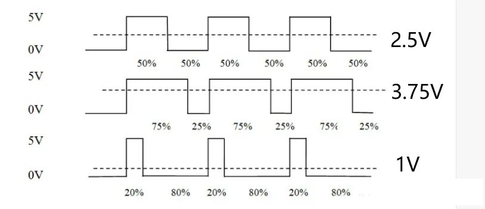

可以认为，PWM是将数字信号转换为模拟信号的一种方法，即数模转换（DAC），在后面的内容中，还会讲到模数转换（ADC）。

PWM 可以通过 ESP32 所有 GPIO 引脚输出。所有通道都有 1 个特定的频率，从 1 到 40M 之间（单位是 Hz）。占空比的值为 0 至 1023 之间。PWM也在machine模块中，我们也是只需要了解其构造对象函数和使用方法：

```py
PWM(dest, freq, duty, duty_u16, duty_ns)
```

+ dest：必选参数，PWM的实体，通常是machine.Pin对象
+ freq：可选参数，设置 PWM 周期的频率（Hz）
+ duty：可选参数，设置占空比，范围是 0 - 1023
+ duty_u16：可选参数，设置占空比，范围是 0 - 65535，2 的 16 次方
+ duty_ns：可选参数，以纳秒为单位设置脉冲宽度，范围是 0 - 50000

PWM类中有的成员函数和参数类似，除此外，还有一个关闭PWM的函数deinit()。

=== "实验：LED呼吸灯"
	要求：控制LED产生呼吸灯的效果。
	```py
	from machine import Pin, PWM
	import time

	led = PWM(Pin(2))
	led.freq(1000)
	while True:
		for i in range(0, 1024):
			led.duty(i)
			time.sleep_ms(1)

		for i in range(1023, -1, -1):
			led.duty(i)
			time.sleep_ms(1)
	```

### RGB LED

RGB LED灯是以红绿蓝三色混光而成。以三原色共同交集成像。在ESP32中，使用库neopixel建立对象，通过传递RGB三个参数实现对LED颜色的控制。你可以设置他它们的红色，绿色和蓝色值， 在0到255之间。neopixel模块可通过精确的时间控制，生成控制信号。

```py
classNeoPixel(pin, n, bpp=3, timing=0, brightness=1.0)
```

+ pin :输出引脚
+ n :LED灯的个数
+ bpp:3:默认为3元组RGB 4:对于具有3种以上颜色的LED，例如RGBW像素或RGBY像素,采用4元组RGBY或RGBY像素
+ timing:默认等于0,为400KHz速率；等于1，为800KHz速率
+ brightness:亮度调节,范围0~1,默认为1.0

|方法|说明|
|-|-|
|NeoPixel.write()|把数据写入LED中|
|NeoPixel.fill(rgb_buf)|填充所有LED像素|
|NeoPixel.brightness(brightness)|亮度调节,范围0~1.0|

=== "实验：LED彩色灯"
	要求：使LED彩色灯亮起，并一直切换随机颜色。
	```py
	import neopixel
	from machine import Pin
	import time
	import urandom

	GBIO_IN = Pin(48)  # 控制信号输入引脚
	LED_NUM = 1  # LED灯的数量

	LED = neopixel.NeoPixel(pin=GBIO_IN, n=LED_NUM, timing=1)  # 创建控制对象

	LED.fill((255, 0, 0))  # GRB填充数据(RGB顺序, 0为不亮，255为全亮)
	LED.write()  # 写入数据
	time.sleep(1)
	LED.fill((0, 255, 0))  # GRB填充数据(RGB顺序, 0为不亮，255为全亮)
	LED.write()  # 写入数据
	time.sleep(1)
	LED.fill((0, 0, 255))  # GRB填充数据(RGB顺序, 0为不亮，255为全亮)
	LED.write()  # 写入数据
	time.sleep(1)

	while True:
		r = urandom.randint(0, 255)
		g = urandom.randint(0, 255)
		b = urandom.randint(0, 255)
		for i in range(LED_NUM):
			LED[i] = (r, g, b)  # 依次设置LED灯珠的颜色
			LED.write()  # 写入数据
			time.sleep_ms(500)

		r = urandom.randint(0, 255)
		g = urandom.randint(0, 255)
		b = urandom.randint(0, 255)
		for i in range(LED_NUM-1, -1, -1):
			LED[i] = (r, g, b)  # 依次设置LED灯珠的颜色
			LED.write()  # 写入数据
			time.sleep_ms(500)
	```

### LED点阵

LED点阵屏模块是一种常见的LED屏幕，常见的LED点阵有8\*8、16\*16、32\*32等，根据需求的不同而不同。每个LED点可以控制亮灭，通过对每个点的亮灭状态的控制，可以在屏幕上显示出各种图案和文字等信息。下面是8\*8点阵的原理。

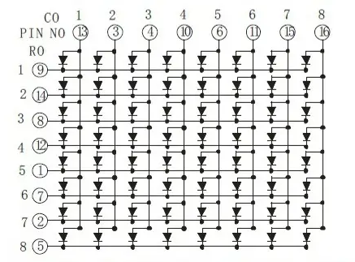

从图中可以看出，LED 点阵屏由 64 个发光二极管组成，且每个发光二极管是放置在行线和列线的交叉点上，当对应的某一列置 1 电平，某一行置 0 电平，则相应的二极管就亮，我们这款点阵屏是共阴型的，共阳型则相反，给列置 0 电平，给行置 1 电平。

直接使用 I/O 口驱动，占用较多的 I/O 口资源，特别是随着点阵屏的数量增加，所以一般的应用，会选择专用的驱动芯片，例如 74HC595，MAX7219 等等。包括上节的4位数码管，占用了12个I/O口，选择74HC138也能减少I/O资料的占用。但这里我们还是按照直接使用I/O口驱动的方式，在后续的章节中会具体讲解使用驱动芯片的方法。

[LED（8*8）驱动模块](../bin/esp32/mpy/led_mat.py)

=== "实验：LED点阵"
	要求：控制LED点阵，使其显示从左到右一直移动的箭头
	```py
	import machine
	import time
	import led_mat

	img_list = [
			(1, 4),
			(2, 5),
			(3, 6),
			(4, 0), (4, 1), (4, 2), (4, 3), (4, 4), (4, 5), (4, 6), (4, 7),
			(5, 6),
			(6, 5),
			(7, 4)
		]

		# 让箭头从左向右移动
	while True:
		for i in range(-7, 8):
			for j in range(5):
				for x, y in img_list:
					led_mat.set_power_row(x)
					led_mat.set_earth_col(y + i)
					time.sleep_ms(1)
	```

### LED数码管

数码管是一种半导体发光器件，其基本单元依然是 LED。 数码管按段数可分为七段数码管和八段数码管，八段数码管比七段数码管多一个发光二极管单元，也就是多一个小数点（DP），这个小数点可以更精确的表示数码管想要显示的内容。除此外，还有米字数码管等特殊的数码管，但原理基本相同。按照能显示的位数可分为 1 位、2 位、3 位、4 位、5 位、6 位、7 位等数码管。

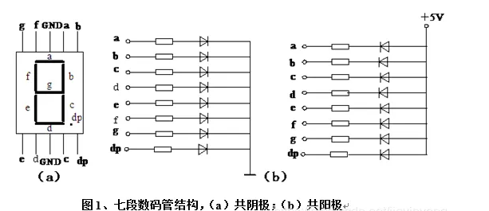

按发光二极管单元连接方式可分为共阳极数码管和共阴极数码管：

共阳数码管是指将所有发光二极管的阳极接到一起形成公共阳极（COM）的数码管，共阳数码管在应用时应将公共极 COM 接到 +5V ，当某一字段发光二极管的阴极为低电平时，相应字段就点亮，当某一字段的阴极为高电平时，相应字段就不亮。

共阴数码管是指将所有发光二极管的阴极接到一起形成公共阴极（COM）的数码管，共阴数码管在应用时应将公共极 COM 接到地线 GND 上，当某一字段发光二极管的阳极为高电平时，相应字段就点亮，当某一字段的阳极为低电平时，相应字段就不亮。

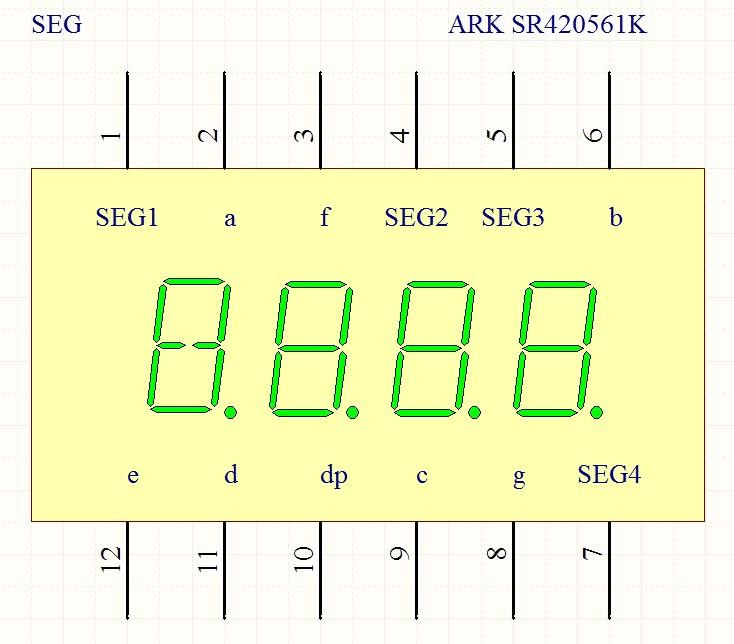

对于一个未知共阴极还是共阳极的数码管，使用万用表的二极管档，红表笔接公共端，黑表笔接任一引脚，亮了说明是共阳级数码管，反之，则说明是共阴级数码管。把所有引脚测试一遍，也可以检查出是否有坏了的 LED。

如果需要在数码管显示一个数字，我们需要使用段码将对应的段亮起，从而实现数的显示。

当多位数码管一体时，它们内部的公共端是独立的，而负责显示什么数字的段线（a-dp）全部是连接在一起的，独立的公共端可以控制多位一体中的哪一位数码管点亮，而连接在一起的段线可以控制这个能点亮数码管亮什么数字，通常我们把公共端叫做位选线，连接在一起的段线叫做段选线，有了这两个线后，通过单片机及外部驱动电路就可以控制任意的数码管显示任意的数字了。

我们选择多位数码管，肯定是要在不同位置显示不同数字的，这时候，我们需要用到动态扫描。动态扫描是对位选端扫描，8 个引脚控制每个数码管的段选线，通过刷新位选端和 8 个引脚的状态，来实现显示不同的数字。编写代码的原理自行探究，这里给出写好的驱动模块（seg.py）。

[LED数码管驱动模块](../bin/esp32/mpy/seg.py)

=== "实验：LED数码管"
	要求：驱动数码管，在四位数码管上显示“1234”。
	```py
	from machine import Pin
	import time
	from seg import seg_8

	segs = seg_8(0,[5,16,9,18,17,6,46,8],[4,7,15,3])
	while True:
	  segs.show('1234')
	```

## 蜂鸣器

蜂鸣器是一种一体化结构的电子讯响器，采用直流电压供电，广泛应用于计算机、打印机、复印机、报警器、电子玩具、汽车电子设备、电话机、定时器等电子产品中作发声器件。蜂鸣器主要分为压电式蜂鸣器和电磁式蜂鸣器两种类型。蜂鸣器在电路中用字母“H”或“HA”（旧标准用“FM”、“ZZG”、“LB”、“JD”等）表示。

按其驱动方式的原理分，可分为：有源蜂鸣器（内含驱动线路，也叫自激式蜂鸣器）和无源蜂鸣器（外部驱动，也叫他激式蜂鸣器）；这里的“源”不是指电源，而是指震荡源。也就是说，有源蜂鸣器内部带震荡源，所以只要一通电就会发声；而无源内部不带震荡源，所以如果用直流信号无法令其鸣叫。必须用2K-5K的方波去驱动它。有源蜂鸣器往往比无源的贵，就是因为里面多个震荡电路。

有源蜂鸣器使用程序控制方便，只需要使用简单的数字信号（低电平）即可使其发声。无源蜂鸣器便宜、声音频率可控，可以做出多种音效，甚至在一些特例中，可以和LED复用一个控制口。

=== "实验：有源蜂鸣器"
	要求：控制有源蜂鸣器间歇发出响声。
	```py
	from machine import Pin
	import time

	buzzer = Pin(15, Pin.OUT)

	for i in range(10):
		buzzer.value(1)
		time.sleep(0.2)
		buzzer.value(0)
		time.sleep(0.2)

	buzzer.value(1)
	```
=== "实验：无源蜂鸣器"
	要求：控制无源蜂鸣器演奏音乐。
	```py
	from machine import Pin,PWM
	from time import sleep_ms

	class BUZZER:
		def __init__(self, sig_pin):
			self.pwm = PWM(Pin(sig_pin, Pin.OUT))

		def play(self, melodies, wait, duty):
			for note in melodies:
				print("note:{}".format(note))
				if note:
					self.pwm.freq(note)
				self.pwm.duty(duty)
				sleep_ms(wait)
			# 暂停PWM，将占空比设置为0
			self.pwm.duty(0)


	# 音符与对应的的频率
	B0 = 31
	C1 = 33
	CS1 = 35
	D1 = 37
	DS1 = 39
	E1 = 41
	F1 = 44
	FS1 = 46
	G1 = 49
	GS1 = 52
	A1 = 55
	AS1 = 58
	B1 = 62
	C2 = 65
	CS2 = 69
	D2 = 73
	DS2 = 78
	E2 = 82
	F2 = 87
	FS2 = 93
	G2 = 98
	GS2 = 104
	A2 = 110
	AS2 = 117
	B2 = 123
	C3 = 131
	CS3 = 139
	D3 = 147
	DS3 = 156
	E3 = 165
	F3 = 175
	FS3 = 185
	G3 = 196
	GS3 = 208
	A3 = 220
	AS3 = 233
	B3 = 247
	C4 = 262
	CS4 = 277
	D4 = 294
	DS4 = 311
	E4 = 330
	F4 = 349
	FS4 = 370
	G4 = 392
	GS4 = 415
	A4 = 440
	AS4 = 466
	B4 = 494
	C5 = 523
	CS5 = 554
	D5 = 587
	DS5 = 622
	E5 = 659
	F5 = 698
	FS5 = 740
	G5 = 784
	GS5 = 831
	A5 = 880
	AS5 = 932
	B5 = 988
	C6 = 1047
	CS6 = 1109
	D6 = 1175
	DS6 = 1245
	E6 = 1319
	F6 = 1397
	FS6 = 1480
	G6 = 1568
	GS6 = 1661
	A6 = 1760
	AS6 = 1865
	B6 = 1976
	C7 = 2093
	CS7 = 2217
	D7 = 2349
	DS7 = 2489
	E7 = 2637
	F7 = 2794
	FS7 = 2960
	G7 = 3136
	GS7 = 3322
	A7 = 3520
	AS7 = 3729
	B7 = 3951
	C8 = 4186
	CS8 = 4435
	D8 = 4699
	DS8 = 4978

	# 第一首，超级马里奥乐谱
	mario = [
		E7, E7, 0, E7, 0, C7, E7, 0,
		G7, 0, 0, 0, G6, 0, 0, 0,
		C7, 0, 0, G6, 0, 0, E6, 0,
		0, A6, 0, B6, 0, AS6, A6, 0,
		G6, E7, 0, G7, A7, 0, F7, G7,
		0, E7, 0, C7, D7, B6, 0, 0,
		C7, 0, 0, G6, 0, 0, E6, 0,
		0, A6, 0, B6, 0, AS6, A6, 0,
		G6, E7, 0, G7, A7, 0, F7, G7,
		0, E7, 0, C7, D7, B6, 0, 0,
	]

	# 第二首，jingle bells
	jingle = [
		E7, E7, E7, 0,
		E7, E7, E7, 0,
		E7, G7, C7, D7, E7, 0,
		F7, F7, F7, F7, F7, E7, E7, E7, E7, D7, D7, E7, D7, 0, G7, 0,
		E7, E7, E7, 0,
		E7, E7, E7, 0,
		E7, G7, C7, D7, E7, 0,
		F7, F7, F7, F7, F7, E7, E7, E7, G7, G7, F7, D7, C7, 0
	]

	# 初始化蜂鸣器对象
	buzzer = BUZZER(15)

	print("播放 超级马里奥")
	buzzer.play(mario, 150, 512)
	sleep_ms(1000)

	print("播放 jingle bells.")
	buzzer.play(jingle, 250, 512)
	sleep_ms(1000)
	```

## 按键

### 独立按键

在前面的内容中，我们使用ESP32对LED和蜂鸣器进行了控制，以GPIO输出的方式实现，其中还涉及了PWM输出方式。这一章内容则以GPIO输入为主，在硬件方面，最常见的输入设备是按键输入，应用非常广泛，其有着开发时间短，实现容易，难度低的优点。

按键是一种电子开关，使用时轻轻按开关按钮就可使开关接通，当松开手时，开关断开。按钮有两组引脚（触点）。当按下按钮时，它会连接这两个触点，从而关闭电路。一般来说 4 脚开关（轻触按键）相距较远的是相通的，离得较近的是一组开关。

下图说明了按钮内部的连接：

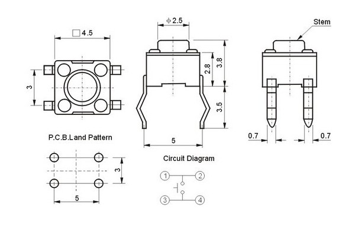

使用按键的时候，通常情况下需要进行消抖。该实验中所用开关为机械弹性开关，当机械触点断开、闭合时，由于机械触点的弹性作用，一个按键开关在闭合时不会马上稳定地接通，在断开时也不会一下子断开。因而在闭合及断开的瞬间均伴随有一连串的抖动，为了不产生这种现象而作的措施就是按键消抖。

按键的抖动对于人类来说是感觉不到的，但对单片机来说，则是完全可以感应到的，而且还是一个很漫长的过程，因为单片机处理的速度在微秒级，而按键抖动的时间至少在毫秒级。

一次按键动作的电平波形如下图。存在抖动现象，其前后沿抖动时间一般在 5ms~10ms 之间。由于单片机运行速度非常快，刚按下的时候会检测到低电平判断按键被按下。但是由于按键存在抖动，单片机在此时也会检测到高电平，误以为松开按键，紧接着又检测到低电平，判断到按键被按下。周而复始，在 5-10ms 内可能会出现很多次按下的动作，每一次按键的动作判断的次数都不相同。

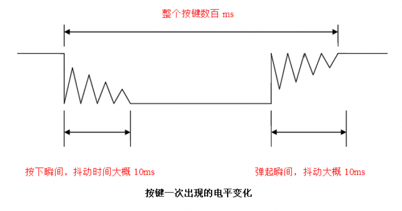

这种抖动可能会影响程序误判，造成严重后果，一般我们采用两种方式对按键进行消抖：

1. 硬件消抖，硬件消抖的典型做法是：采用 R-S 触发器或 RC 积分电路。
2. 软件消抖，通常我们会使用软件延时 10ms 来消抖。例如，当按键按下后，引脚为低电平；所以首先读取引脚电平，若引脚为低电平，则延时 10ms 后再次读取引脚电平，若为低电平，则证明按键已按下.

硬件方法一般用在对按键操作过程比较严格，且按键数量较少的场合，而按键数量较多时，通常采用软件消抖。值得一提的是，对于复杂且多任务的单片机系统来说，若简单地采用循环指令来实现软件延时，则会浪费CPU宝贵的时间资源，大大降低系统的实时性，所以，更好的做法是利用定时中断服务程序或利用标志位的方法来实现软件消抖。

与输出不同的是，设置输入引脚时，我们需要配置上拉或下拉电阻，目的是确定某个状态电路中的高电平或低电平。上、下拉电阻的作用是提高电路稳定性，避免引起误动作。按键如果不通过电阻上拉到高电平，那么在上电瞬间可能就发生误动作，因为在上电瞬间单片机的引脚电平是不确定的，上拉电阻的存在保证了其引脚处于高电平状态，而不会发生误动作。如果引脚的一端接 Vcc，则设置下拉电阻；如果一端接的是 GND，则配置上拉电阻。

=== "按键控制LED"
	要求：按下按键，LED亮起，再按下按键，LED熄灭，实现按键对LED的控制。
	```py
	import time
	from machine import Pin

	pin_button = Pin(14, Pin.IN, Pin.PULL_DOWN)
	pin_led = Pin(2, Pin.OUT)

	status = 0
	while True:
		if pin_button.value() == 1:
			time.sleep_ms(10)
			if pin_button.value() == 1 and status == 0:
				pin_led.value(not pin_led.value())
				status = 1
			elif pin_button.value() == 0:
				status = 0
	```

### 矩阵键盘

薄膜按键，是一块带触点的 PET 薄片，用在 PCB、FPC 等线路上作为开关使用，在使用者与仪器之间起到一个重要的触感型开关的作用。与传统的硅胶按键相比，薄膜按键具有更好的手感、更长的寿命，可以间接的提高使用导电膜的各类型开关的生产效率。

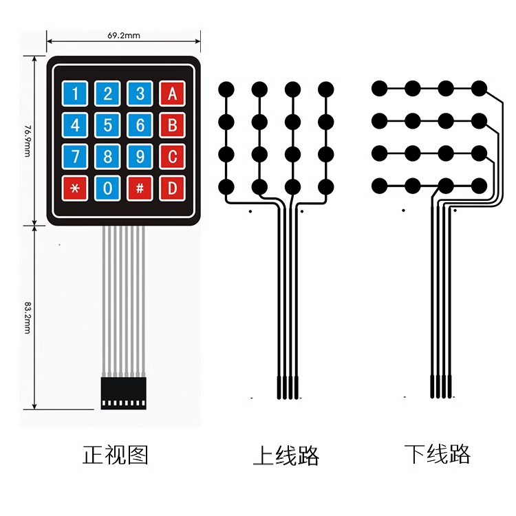

薄膜按键的工作原理很好理解，薄膜上的触点位于 PCB 板上的导电部位，当按键受到外力按压时，触点的中心点下凹，接触到 PCB 上的线路，从而形成回路，电流通过，整个产品就得正常工作。

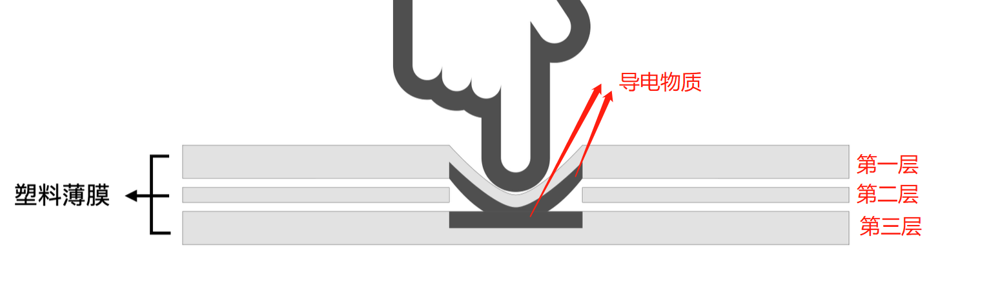

矩阵键盘有 16 个按键，如果 16 个按键均为独立按键的话，需要占用 16 个 IO 口，对于我们的开发板来说还是可以接受的，但是如果有 64 个按键，那单片机的 IO 口就完全不能能满足我们的需求，因此，就出现了矩阵键盘将这 8 根线连接到单片机的 8 个 IO 口上，通过程序扫描键盘就可检测 16 个键，如果我们想实现 64 个按键的话就只需要用到 16 个 IO口，可以参考LED点阵屏。

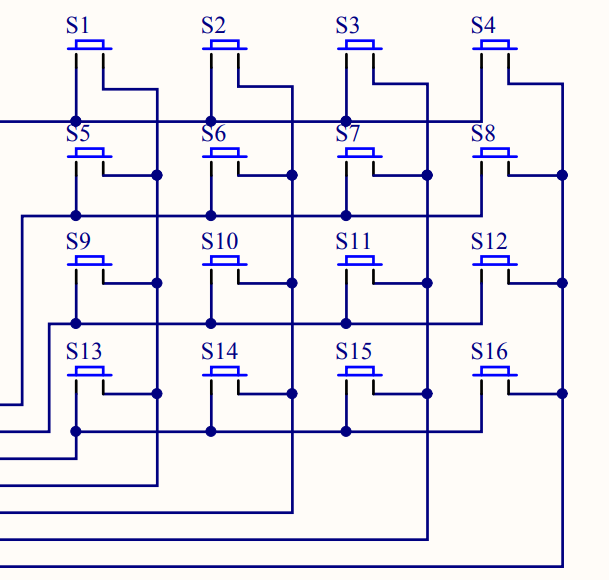

无论是独立键盘还是矩阵键盘，单片机检测其是否被按下的依据都一样，即检测与该键对应的 IO 口是否为低电平，独立键盘有一端固定为低电平，此种方式编程比较简单。而矩阵键盘两端都与单片机 IO 口相连，因此在检测时需编程通过单片机1/0口送出低电平，检测方法有多种，最常用的是行列扫描和线翻转法。

1. 行列扫描法：检测时，先送一列为低电平，其余几列全为高电平（确定列数），然后立即轮流检测一次各行是否有低电平，若检测到某一行为低电平（确定行数），则便可确认当前被按下的键是哪一行哪一列的，用同样方法轮流送各列一次低电平，再轮流检测一次各行是否变为低电平，这样即可检测完所有的按键，当有键被按下时便可判断出按下的键是哪一个键。当然，也可以将行线置低电平，扫描列是否有低电平，从而达到整个键盘的检测；

2. 线翻转法：使所有行线为低电平时，检测所有列线是否有低电平，如果有，就记录列线值：然后再翻转，使所有列线都为低电平，检测所有行线的值，由于有按键按下，行线的值也会有变化，记录行线的值。从而就可以检测到全部按键。

=== "矩阵键盘"
	要求：按下矩阵键盘按键，在shell窗口输出按键名。
	```py
	from machine import Pin
	import time

	row1 = Pin(19, Pin.OUT)
	row2 = Pin(18, Pin.OUT)
	row3 = Pin(5, Pin.OUT)
	row4 = Pin(17, Pin.OUT)
	row_list = [row1, row2, row3, row4]

	col1 = Pin(16, Pin.IN, Pin.PULL_DOWN)
	col2 = Pin(4, Pin.IN, Pin.PULL_DOWN)
	col3 = Pin(2, Pin.IN, Pin.PULL_DOWN)
	col4 = Pin(15, Pin.IN, Pin.PULL_DOWN)
	col_list = [col1, col2, col3, col4]

	names = [
		["1", "2", "3", "A"],
		["4", "5", "6", "B"],
		["7", "8", "9", "C"],
		["*", "0", "#", "D"]
	]

	while True:
		for i, row in enumerate(row_list):
			for temp in row_list:
				temp.value(0)
			row.value(1)
			time.sleep_ms(10)
			for j, col in enumerate(col_list):
				if col.value() == 1:
					print("按键: {} 被按下".format(names[i][j]))
			# print(row1.value(), row2.value(), row3.value(), row4.value())
			# print(col1.value(), col2.value(), col3.value(), col4.value())
			# print("-" * 30)

		time.sleep(0.1)
	```

## 摇杆

摇杆一般在航模、电玩、遥控车、云台等设备上应用广泛，很多带有屏幕的设备也经常使用摇杆作为菜单选择的输入控制。

双轴按键摇杆主要由两个电位器和一个按键开关组成，两个电位器随着摇杆扭转角度分别输出 X、Y 轴上对应的电压值，在 Z 轴方向上按下摇杆可触发轻触按键。在配套机械结构的作用下，无外力扭动的摇杆初始状态下，两个电位器都处在量程的中间位置。它就是两个电位器和按键的组合体。电位器是可变电阻器，与中学时学的滑动变阻器类似。

摆动 PS2 游戏摇杆时，随着接触刷改变接触位置，可变电阻器（电位器）的引脚处的输出电压即发生变化。X，Y 轴为模拟输入信号而 Z 轴是数字输入信号，因此，X 和 Y 端口连接到 ADC 引脚，而 Z 端口连接到数字端口。所以我们一共需要使用 ESP32 的三个 GPIO 引脚，其中两个模拟信号输入引脚和一个数字信号输入引脚。

PS2 游戏摇杆正常状态（不受力状态）检测电压常态时为 1.65V 附近，最大值 3.3V，最小值 0V，用 ESP32 自带 ADC 模数转换模块的两个通道分别检测电压值的变化就可以知道摇杆指向的位置了。

在前面，我们讲到了PWM，是一种数模转换的手段，在本节内容中，我们探讨ADC模数转换的使用，从逻辑层上讲，模数转换实际上是一种对应关系：

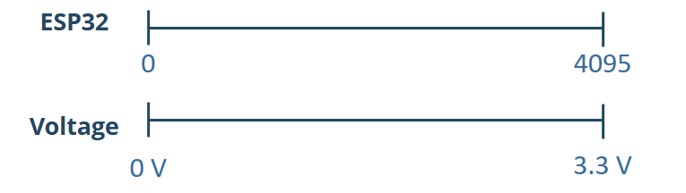

注意，默认ESP32的对应值是1v对应4095，所以为了能够调整需要在代码中控制

+ ADC.ATTN_0DB— 满量程电压：1.2V
+ ADC.ATTN_2_5DB— 满量程电压：1.5V
+ ADC.ATTN_6DB— 满量程电压：2.0V
+ ADC.ATTN_11DB— 满量程电压：3.3V

=== "摇杆"
	要求：在shell窗口打印摇杆的x，y，z坐标数值。
	```py
	from machine import Pin, ADC
	import time


	ps2_y = ADC(Pin(33))
	ps2_y.atten(ADC.ATTN_11DB)  # 这里配置测量量程为3.3V
	ps2_x = ADC(Pin(32))
	ps2_x.atten(ADC.ATTN_11DB)  # 这里配置测量量程为3.3V


	z = Pin(15, Pin.IN)

	while True:
		val_y = ps2_y.read()  # 0-4095
		val_x = ps2_x.read()  # 0-4095
		print("x:{} y:{} z:{}".format(val_x, val_y, z.value()))
		time.sleep(0.1)
	```

## 中断与时钟

### 外部中断

在单片机中，中断是指当 CPU 在正常处理主程序时，突然发生了另一件事件 A（中断发生）需要 CPU 去处理，这时 CPU 就会暂停处理主程序（中断响应），转而去处理事件 A（中断服务）。当事件 A 处理完以后，再回到主程序原来中断的地方继续执行主程序（中断返回）。这一整个过程称为中断。

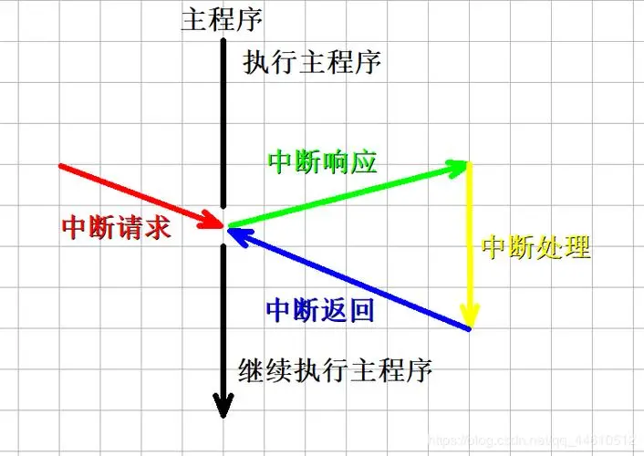

当中断过程 A 中，发生了另一个中断级别更高的中断事件 B,则 CPU 又会中断当前的 A 转而去处理 B，完毕后再回到 A 的断点继续处理。这称为中断的嵌套。中断的嵌套涉及到中断的优先级问题，优先级高的中断就可以在打断优先级低的中断执行。ESP32 无法使用 MicroPython 设置中断的优先级。

中断可以根据中断源分为硬件中断和软件中断：

硬件中断：也被称为外部中断，硬件中断响应外部硬件事件而发生。例如，当检测到触摸时会发生触摸中断，而当 GPIO 引脚的状态发生变化时会发生 GPIO 中断。GPIO 中断和触摸中断属于这一类；
软件中断：当触发软件事件（例如定时器溢出）时，会发生这种类型的中断。定时器中断是软件中断的一个例子。
前面我们在做按键控制实验时，虽然能实现 IO 口输入功能，但代码是一直在检测 IO 输入口的变化，因此效率不高，特别是在一些特定的场合，比如某个按键，可能 1 天才按下一次去执行相关功能，这样我们就浪费大量时间来实时检测按键的情况。

为了解决这样的问题，我们引入外部中断概念，顾名思义，就是当按键被按下（产生中断）时，才去执行相关功能。这大大节省了 CPU 的资源，因此中断在实际项目中应用非常普遍。ESP32 的外部中断有上升沿、下降沿、低电平、高电平触发模式。

若将按键对应 IO 配置为下降沿触发，当按键按下后即触发中断，然后在中断回调函数内执行对应的功能。

=== "外部中断"
	要求：使用外部中断的方式，实现按键控制LED亮灭。
	```py
	import time
	from machine import Pin

	button = Pin(14, Pin.IN, Pin.PULL_DOWN)
	led = Pin(2, Pin.OUT)

	def button_irq(button):
	   time.sleep_ms(80)
	   if button.value() == 1:
		   led.value(not led.value())

	button.irq(button_irq, Pin.IRQ_RISING)
	```

### 定时器中断

ESP32 通过定时器可以完成各种预设好的任务。ESP32 定时器到达指定时间后也会产生中断，然后在回调函数内执行所需功能，这个和外部中断类似。ESP32 内置 4 个 64-bit 通用定时器。每个定时器包含一个 16-bit 预分频器和一个 64-bit 可自动重新加载向上／向下计数器。使用计时器的好处，是实现类似并行处理的功能，也就是一个应用里只能有一个 while True，两个以上都是不可以的，但是如果使用定时器，就可以同时运行多个 while True。

ESP32 定时器位于 machine 模块当中。可以调用的定时器有 timer0-3 共 4 个定时器。

构造函数class machine.Timer(id, ...)：构造给定 id 的新计时器对象，可以是任意整数 n（这个整数会转化成 n % 4），但是最多调用 4 个，新调用的会抢占定时器。

Timer.init(*, mode=Timer.PERIODIC, period=- 1, callback=None)：定时器初始化，其中的参数：

+ mode：2 种工作模式，Timer.ONE_SHOT（执行一次）、Timer.PERIODIC（周期性）；
+ period：单位为 ms；
+ callback：定时器中断后的回调函数。
+ Timer.deinit()：销毁计时器。

=== "定时器中断"
	要求：同时使两个LED反复熄灭亮起，这两个LED亮熄的间隔不同。
	```py
	import time
	from machine import Pin, Timer

	led_1 = Pin(2, Pin.OUT)
	led_2 = Pin(4, Pin.OUT)

	def timer_irq(timer_pin):
	   led_1.value(not led_1.value())

	timer = Timer(0)
	timer.init(period=500, mode=Timer.PERIODIC, callback=timer_irq)

	while True:
	   led_2.value(not led_2.value())
	   time.sleep(1)
	```
	
### RTC实时时钟

RTC 全称为实时时钟（Real-time Clock），是一种与 CPU 互不干扰，独立于 CPU 运行的计时设备。RTC 主要用于在计算机系统关机时，保存计算机系统时钟，以便在下次计算机系统开机时能够从 RTC 中恢复出正确的时间。RTC 的应用场景非常广泛，例如实现时间戳功能、自动唤醒、计时器等。在一些需要记录时间的项目中，RTC 可以作为重要的时间标记。

=== "实时时钟"
	要求：打印单片机的实时时钟到Shell窗口。
	```py
	import machine

	rtc = machine.RTC()
	rtc.datetime(2023, 1, 1, 0, 0, 0, 0)
	print(rtc.datetime())
	```

## 电机

### 直流电机

直流电机是指能将直流电能转换成机械能（直流电动机）或将机械能转换成直流电能（直流发电机）的旋转电机。它是能实现直流电能和机械能互相转换的电机。当它作电动机运行时是直流电动机，将电能转换为机械能；作发电机运行时是直流发电机，将机械能转换为电能。

直流电机的结构应由定子和转子两大部分组成。直流电机运行时静止不动的部分称为定子，定子的主要作用是产生磁场，由机座、主磁极、 换向极、 端盖、轴承和电刷装置等组成。运行时转动的部分称为转子，其主要作用是产生电磁转矩和感应电动势，是直流电机进行能量转换的枢纽，所以通常又称为电枢，由转轴、电枢铁心、电枢绕组、换向器和风扇等组成。

直流电机没有正负之分，在两端加上直流电就能工作。需要知道直流电机的额定电压和额定功率，不能使之长时间超负荷运作。 在交换接线后，可以形成正反转。

单片机主要是用来控制而非驱动，如果直接使用GPIO管脚去驱动大功率器件，容易将芯片烧坏或驱动不起来。所以要驱动大功率器件，比如电机。使用驱动芯片ULN2003，不仅可以用来驱动直流电机，还可用来驱动步进电机。

=== "直流电机"
	要求：使用GPIO驱动ULN2003控制直流电机。
	```py
	from machine import Pin
	dj= Pin(0, Pin.OUT)
	dj.value(1)
	```
	
### 步进电机

步进电机是一种通过步进（即以固定的角度移动）方式使轴旋转的电机。其内部构造使它无需传感器，通过简单的步数计算即可获知轴的确切角位置。这种特性使它适用于多种应用。

与所有电机一样，步进电机也包括固定部分（定子）和活动部分（转子）。定子上有缠绕了线圈的齿轮状突起，而转子为永磁体或可变磁阻铁芯。

步进电机的基本工作原理为：

+ 给一个或多个定子相位通电，线圈中通过的电流会产生磁场，而转子会与该磁场对齐；
+ 依次给不同的相位施加电压，转子将旋转特定的角度并最终到达需要的位置。

这里用到的是 28BYJ-48 步进电机，28BYJ-48 含义：28 指的是电机最大外径，B 指的是步进式电机，Y 指的是永磁式电机，J 指的是减速型电机，48 表示可以四相八拍。换句话说，28BYJ-48 的含义为外径 28 毫米四相八拍式永磁减速型步进电机。

单片机的管脚输出电流较小，只有零点几个毫安，吸纳电没也只有十几个毫安（大多数单片机只有几个毫安），输出最高电压也不会越过 5V，由于这个原因很少用单片机直接驱动外设。ULN2003 的作用就是把单片机的信号进行放大，吸纳电流可以达到 500mA，耐压也提高很多，基本能满足微型步进电机的驱动电流和电压。

[步进电机驱动模块](../bin/esp32/mpy/uln2003.py)

=== "步进电机"
	要求：使用GPIO驱动ULN2003控制步进电机。
	```py
	from machine import Pin
	from libs.uln2003 import Uln2003

	motor = Uln2003(pin1=Pin(13), pin2=Pin(12), pin3=Pin(14), pin4=Pin(27), delay=2, mode='HALF_STEP')
	motor.angle(180, -1)
	```

### 舵机

舵机是一种位置（角度）伺服的驱动器，适用于那些需要角度不断变化并可以保持的控制系统。舵机只是一种通俗的叫法，其本质是一个伺服电机。舵机有很多规格，但所有的舵机都有外接三根线，分别用棕、红、橙三种颜色进行区分，由于舵机品牌不同，颜色也会有所差异，棕色为接地线，红色为电源正极线，橙色为信号线。只要通过信号线给予规定的控制信号即可实现舵机码盘的转动。

SG90 的主要电气参数：

+ 使用电压： 4.8V - 6V
+ 尺寸： 221.5mm x 11.8mm x 22.7mm
+ 重量： 9g
+ 角度范围：0-180°

舵机的工作原理是由接收机或者单片机发出信号给舵机，其内部有一个基准电路，将获得的直流偏置电压与电位器的电压比较，获得电压差输出。经由电路板上的 IC 判断转动方向，再驱动无核心马达开始转动，透过减速齿轮将动力传至摆臂，同时由位置检测器送回信号，判断是否已经到达定位。当电机转速一定时，通过级联减速齿轮带动电位器旋转，使得电压差为0，电机停止转动。一般舵机旋转的角度范围是 0 度到 180 度，当然也有 0 度到 360 度。

我们没有必要了解舵机的内部结构，只需要知道如何通过 PWM 控制其转动即可。舵机的控制就是通过一个固定的频率，给其不同的占空比的，来控制舵机不同的转角。

舵机的转动的角度是通过调节 PWM（脉冲宽度调制）信号的占空比来实现的，标准 PWM（脉冲宽度调制）信号的周期固定为 20ms（50Hz），理论上脉宽分布应在 1ms 到 2ms 之间，但是，事实上脉宽可由 0.5ms 到 2.5ms 之间，脉宽和舵机的转角 0°～180° 相对应。有一点值得注意的地方，由于舵机牌子不同，对于同一信号，不同牌子的舵机旋转的角度也会有所不同。

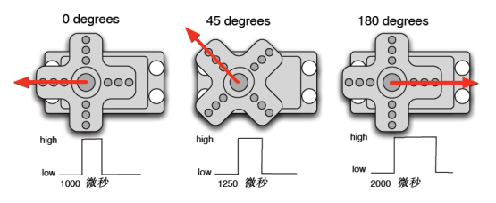

0.5-2.5ms 的 PWM 高电平部分对应控制 180 度舵机的 0-180 度，因此，对应的控制关系是这样的：

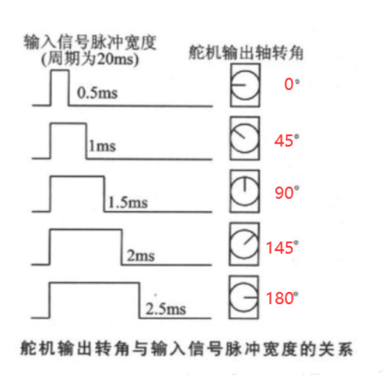

|高电平占整个周期（20ms）的时间|舵机旋转的角度|对应的占空比|
|-|-|-|
|0.5ms|0°|0.5 // 20|
|1ms|45°|1 // 20|
|1.5ms|90°|1.5 // 20|
|2ms|135°|2 // 20|
|2.5ms|180°|2.5 // 20|

[舵机驱动模块](../bin/esp32/mpy/servo.py)

=== "舵机"
	要求：使用PWM控制舵机。
	```py
	import time
	from machine import Pin
	from servo import Servo

	my_servo = Servo(Pin(13), max_us=2500)


	while True:
	   my_servo.write_angle(0)
	   time.sleep(0.5)
	   my_servo.write_angle(45)
	   time.sleep(0.5)
	   my_servo.write_angle(90)
	   time.sleep(0.5)
	   my_servo.write_angle(135)
	   time.sleep(0.5)
	   my_servo.write_angle(180)
	   time.sleep(0.5)
	```

## LCD1602

LCD （ Liquid Crystal Display 的简称）液晶显示器。LCD1602是能够同时显示16x2，32个字符，是一种专门用来显示字母、数字、符号等的点阵型液晶模块。LCD1602液晶显示器是广泛使用的一种字符型液晶显示模块。它是由字符型液晶显示屏（LCD）、控制驱动主电路HD44780及其扩展驱动电路HD44100，以及少量电阻、电容元件和结构件等装配在PCB板上而组成。该显示屏的优点是耗电量低、体积小、辐射低。

LCD1602主要用来显示数字、字母、图形以及少量自定义字符。可以显示2行16个字符，拥有16个引脚，其中8位数据总线D0-D7，和RS、R/W、EN三个控制端口，工作电压为5V，并且带有字符对比度调节V0和背光源AK。

IIC（Inter-Integrated Circuit），也称为I2C，中文叫集成电路总线，它是一种串行通信总线，使用多主从架构，是由飞利浦公司在1980年代初设计的，方便了主板、嵌入式系统或手机与周边设备组件之间的通讯。由于其简单性，它被广泛用于微控制器与传感器阵列，显示器，IoT设备，EEPROM等之间的通信。

最重要的功能包括：

+ 只需要两条总线
+ 所有组件之间都存在简单的主/从关系，连接到总线的每个设备均可通过唯一地址进行软件寻址
+ I2C是真正的多主设备总线，可提供仲裁和冲突检测
+ 传输速度
	+ 标准模式：Standard Mode = 100 Kbps
	+ 快速模式：Fast Mode = 400 Kbps
	+ 高速模式： High speed mode = 3.4 Mbps
	+ 超快速模式： Ultra fast mode = 5 Mbps
+ 最大主设备数：无限制
+ 最大从机数：理论上是127

使用IIC协议控制LCD1602，能大大减少IO口的使用，本来使用的IO口有十几个，通过IIC协议，能够缩减到两个双向信号线，一根是数据线SDA，另一根是时钟线SCL 。

IIC协议在硬件上对于LCD1602，通过PCF8574实现，驱动模块如下：

[LCD_API](../bin/esp32/mpy/lcd_api.py)

[ESP32_LCD1602](../bin/esp32/mpy/esp32_i2c_1602lcd.py)

=== "LCD1602"
	要求：在LCD1602上显示“AGSN WIKI”。
	```py
	import time
	from machine import SoftI2C, Pin
	from esp32_i2c_1602lcd import I2cLcd

	DEFAULT_I2C_ADDR = 0x27
	i2c = SoftI2C(sda=Pin(15),scl=Pin(2),freq=100000)
	lcd = I2cLcd(i2c, DEFAULT_I2C_ADDR, 2, 16)

	lcd.clear()
	lcd.putstr("AGSN\nWIKI")
	```
	如果运行上面程序报错，请将上面程序第5行的0x27改为0x3F，其它不变。

## LCD12864

 LCD12864液晶显示模块是 128×64点阵的汉字图形型液晶显示模块，可显示汉字及图形，内置 8192个中文汉字（16X16 点阵）（需带有字库的型号才能显示中文）、128 个字符（8X16 点阵）及 64X256 点阵显示 RAM（GDRAM）。可与 CPU 直接接口，提供两种界面来连接微处理机：8-位并行及串行两种连接方式。具有多种功能：光标显示、画面移位、睡眠模式等。

SPI协议使用四根线实现快速数据通信， 理论上，SPI是一种全双工的通讯协议。SPI通讯无起始位和停止位，因此数据可以连续流传输而不会中断；没有像IIC这样的复杂的从站寻址系统，数据传输速率比I2C更高（几乎快两倍）。独立的MISO和MOSI线路，可以同时发送和接收数据。

在SPI协议中，设备分为主机与从机。主机是控制设备（通常是微控制器），而从机（通常是传感器，显示器或存储芯片）从主机那获取指令，可以外接多个设备。

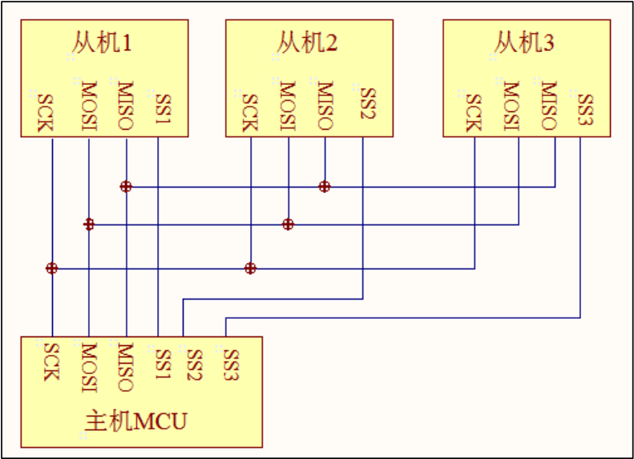

SPI总线包括4条逻辑线，定义如下：

+ MISO：Master input slave output 主机输入，从机输出（数据来自从机）；
+ MOSI：Master output slave input 主机输出，从机输入（数据来自主机）；
+ SCLK ：Serial Clock 串行时钟信号，由主机产生发送给从机；
+ SS：Slave Select 片选信号，由主机发送，以控制与哪个从机通信，通常是低电平有效信号。

其他制造商可能会遵循其他命名规则，但是最终他们指的相同的含义。以下是一些常用术语；

+ MISO也可以是SIMO，DOUT，DO，SDO或SO（在主机端）;
+ MOSI也可以是SOMI，DIN，DI，SDI或SI（在主机端）;
+ NSS也可以是CE，CS或SSEL;
+ SCLK也可以是SCK;

三线SPI不同于四线，区别在于三线SPI将MISO和MOSI共用一条线。

[ST7920](../bin/esp32/mpy/st7920.py)

=== "LCD12864"
	要求：在LCD12864上显示文字。
	```py
	from machine import SPI, Pin
	from st7920 import ST7920
	from time import sleep

	lcd = ST7920(SPI(1, baudrate=2000000), Pin(5))
	lcd.text('AGSN WIKI', 16, 30)
	lcd.show()
	```

## OLED

OLED，即有机发光二极管（Organic Light-Emitting Diode），又称为有机电激光显示（Organic Electroluminesence Display， OELD）。OLED由于同时具备自发光，不需背光源、对比度高、厚度薄、视角广、反应速度快、可用于挠曲性面板、使用温度范围广、构造及制程较简单等优异之特性，被认为是下一代的平面显示器新兴应用技术。

OLED显示技术具有自发光的特性，采用非常薄的有机材料涂层和玻璃基板，当有电流通过时，这些有机材料就会发光，而且OLED显示屏幕可视角度大，并且能够节省电能。

LCD都需要背光，而OLED不需要，因为它是自发光的。这样同样的显示，OLED效果要来得好一些。以目前的技术，OLED的尺寸还难以大型化，但是分辨率确可以做到很高。OLED多使用SPI协议，在前面提到过，这里不加赘述，OLED的驱动芯片常见的有ST7789和SSD1306，根据自己OLED不同的芯片选择不同的驱动模块。

[ST7789](../bin/esp32/mpy/st7789.py)

[SSD1306](../bin/esp32/mpy/ssd1306.py)

=== "OLED"
	要求：在OLED屏幕上显示“AGSNWIKI”。
	```py
	from machine import Pin, SoftSPI
	from libs.ssd1306 import SSD1306_SPI

	spi = SoftSPI(sck=Pin(18), mosi=Pin(13), miso=Pin(19))
	oled = SSD1306_SPI(width=128, height=64, spi=spi, dc=Pin(2),
					  res=Pin(15), cs=Pin(4))
	oled.fill(0)

	oled.text('AGSNWIKI', 10, 38)
	oled.show()
	```
	
如果你想要在屏幕上显示中文，有两种方法：

1. 使用中文字体库，想要使用中文字体库需要烧录支持中文字体库的固件，但是字库文件较大；
2. 使用取模软件，对用到的字体进行取模；

[ST7789](../bin/esp32/tool/st7789py_mpy-master.zip)

[PCTOLCD](../bin/esp32/tool/pctolcd2002.zip)


## 环境传感器

### DS18B20温度传感器

DS18B20是一款常用的高精度的单总线数字温度测量芯片。具有体积小，硬件开销低，抗干扰能力强，精度高的特点。DS18B20只有三个引脚：VCC、GND、DQ；DQ作为信号输入输出端，可以接收或输出信息。同时micropython也有现成的API，无需驱动模块。

=== "DS18B20温度传感器"
	要求：将温度数据打印到Shell窗口。
	```py
	from machine import Pin
	import onewire, ds18x20
	import time

	ds_pin = Pin(13)
	ds_sensor = ds18x20.DS18X20(onewire.OneWire(ds_pin))


	def read_ds_sensor():
		roms = ds_sensor.scan()
		print('发现设备: ', roms)
		ds_sensor.convert_temp()
		for rom in roms:
			temp = ds_sensor.read_temp(rom)
			if isinstance(temp, float):
				temp = round(temp, 2)
				return temp
		# return 0  # 这里删除，那么默认此函数在没有获取到温度的时候返回为默认值None，调用处判断即可


	while True:
		print(read_ds_sensor())
		time.sleep(1)
	```

### DHT温湿度传感器

无论是工业领域还是我们的日常生活，温度和湿度一直都是两个比较重要的指标，DHT11 和 DHT22 是 DHTxx 系列中使用最广泛的两种传感器。它们有着相同的引脚，用法一致，下图是两者的规格对比：

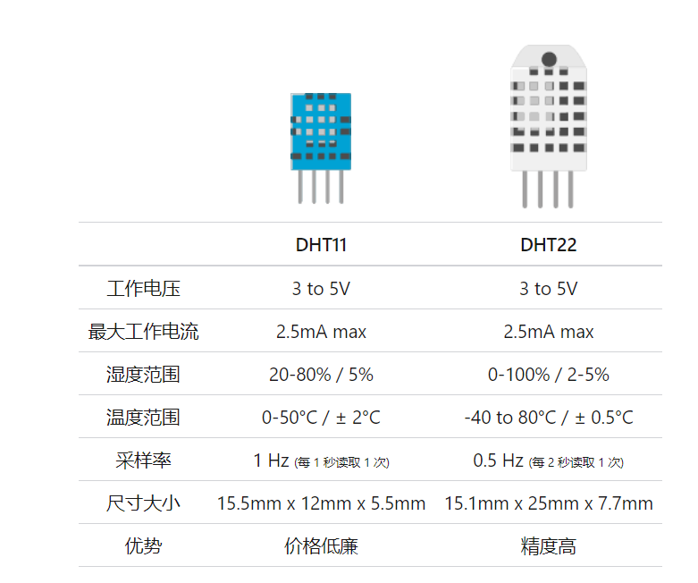

湿度传感部件有两个电极，中间有一个保湿基底（通常是盐或导电塑料聚合物）。随着湿度的升高，基板吸收水蒸气，导致离子的释放和两个电极之间电阻的降低。电阻的变化与湿度成正比，可以测量湿度来估计相对湿度。

DHT11 与 DHT22 还包括用于测量温度的 NTC（热敏电阻）。热敏电阻是一种电阻随温度变化的电阻器。从技术上讲，所有电阻器都是热敏电阻，因为它们的电阻随温度略有变化，但这种变化通常非常小，难以测量。热敏电阻的设计使其电阻随温度而急剧变化（每度 100Ω 或更大），而且电阻随着温度的升高而减小。

DHT与控制器之间采用单总线数据格式，一次通信时间 4ms 左右，数据分小数部分和整数部分，具体格式在下面说明，当前小数部分用于以后扩展，现读出为零。操作流程如下：

一次完整的数据传输为40bits，高位先出。

数据格式：8bits湿度整数数据 + 8bits湿度小数数据 + 8bits温度整数数据 + 8bits温度小数数据 + 8bits校验和

数据传送正确时校验和数据等于8bits 湿度整数数据 + 8bits 湿度小数数据 + 8bits 温度整数数据 + 8bits温度小数数据 所得结果的末 8 位。

和DS18B20一样，MicroPython内置了DHT传感器的模块。

=== "DHT传感器"
	要求：将DHT传感器的数据打印到Shell窗口。
	```py
	import dht
	import machine
	from time import sleep

	d = dht.DHT11(machine.Pin(22))

	while True:
	   d.measure()
	   data = "temp(c): %s°C humidity: %sRH" % (d.temperature(), d.humidity())
	   print(data)
	   sleep(2)
	```

### BMP180大气压传感器

BMP180是一款高精度的气压传感器，具有低功耗、低噪声等特点，广泛使用在气压、海拔测量。其内部附带温度传感器，可对气压测量值进行补偿，使用I2C通信方式。

BMP180的气压和温度数值并不是可以直接读取的，每个不同的传感器中，都有自己独特的校准数值，存储在内置的E2PROM存储器中。当微处理器读取传感器的原始温度和气压数值后，再根据E2PROM中的校准数值进行转换，才能得到真正的温度、气压数据。每个校准数值的存储位置如下，微处理器通过这些地址读取校准数值。

[BMP180](../bin/esp32/mpy/bmp180.py)

=== "BMP180传感器"
	要求：使用BMP180传感器，获取气压、温度值，并计算出海拔。
	```py
	import time
	from machine import Pin,I2C
	from bmp180 import BMP180

	bus = I2C(scl=Pin(18),sda=Pin(19), freq=100000)
	bmp180 = BMP180(bus)
	bmp180.oversample_sett = 2
	bmp180.baseline = 101325

	print('BMP180温度:',bmp180.temperature)
	print('BMP180大气压:',bmp180.pressure)
	print('BMP180海拔高度:', bmp180.altitude)
	```

## 气体传感器

### MQ气体传感器

MQ系列气体传感器是常用的监测气体浓度的传感器，不同型号的传感器会对某种或某几种气体较为敏感，这类传感器灵敏度高、响应快、稳定性好、寿命长、驱动电路简单，广泛适用于家庭气体泄漏报警器、工业可燃气体报警器以及便携式气体检测仪器。

|型号|测量气体|计算公式|
|-|-|-|
|MQ-2|可燃气体、烟雾|ppm=pow(11.5428\*R0/Rs,0.6549)|
|MQ-3|酒精|mg/L=1.43*V|
|MQ-4|甲烷|-|
|MQ-5|天然气、煤气|-|
|MQ-6|液化气、甲烷|-|
|MQ-7|一氧化碳|-|
|MQ-8|氢气|-|
|MQ-9|一氧化碳、甲烷|-|
|MQ-131|臭氧|-|
|MQ-135|有害气体（氨气、硫化物、苯）|ppm=pow((3.367\*10\*V)/(5-V),(1.0/0.3123))|
|MQ-136|硫化氢|-|
|MQ-137|氨气|-|
|MQ-138|甲苯、丙酮、乙醇、氢气|-|

通过MQ系列气体传感器的官方文档，可以推导出计算公式，上表中均为作者推导得出，可能存在一些问题。

官方文档：

+ [MQ系列气体传感器资料(上)](../bin/esp32/docs/MQ系列气体传感器资料(上).pdf)
+ [MQ系列气体传感器资料(下)](../bin/esp32/docs/MQ系列气体传感器资料(下).pdf)

## 人体传感器

## HC-SR04超声波传感器

超声波是一种频率高于 20000Hz 的声波，超声波的方向性好，反射能力强，易于获得较集中的声能，在水中传播距离比空气中远，可用于测距、测速、清洗、焊接、碎石、杀菌消毒等。

超声波用于许多不同的领域。超声波设备用于检测物体和测量距离。超声成像或超声检查常用于医学。在产品和结构的无损检测中，超声波用于检测不可见的缺陷。在工业上，超声波用于清洁、混合和加速化学过程。蝙蝠和鼠海豚等动物使用超声波来定位猎物和障碍物。

HC-SR04有四个引脚：

+ VCC：5V 供电引脚；
+ GND：接地；
+ TRIG：控制信号输入；
+ ECHO：回响信号输出；

+ 采用 IO 口 TRIG 触发测距，给一个 10us 的高电平信号；
+ 模块自动发送 8 个 40khz 的方波，自动检测是否有信号返回；
+ 有信号返回，通过 IO 口 ECHO 输出一个高电平，高电平持续的时间就是超声波从发射到返回的时间。测试距离=（高电平时间*声速（340M/S））/2

回响信号的脉冲宽度与所测的距离成正比。由此通过发射信号到收到的回响信号时间间隔可以计算得到距离。

[HC-SR04](../bin/esp32/mpy/hcsr04.py)

这个驱动模块内容简单，对信号进行了简单的处理，即应用了上述公式。

=== "HC-SR04传感器"
	要求：将HC-SR04测得的距离打印在Shell窗口。
	```py
	from machine import Pin,SoftI2C,Timer
	from hcsr04 import HCSR04


	trig = Pin(45,Pin.OUT)
	echo = Pin(0,Pin.IN)
	HC=HCSR04(trig,echo)

	#中断回调函数
	def fun(tim):
	   print(str(Distance)+' CM')

	#开启RTOS定时器
	tim = Timer(1)
	tim.init(period=1000, mode=Timer.PERIODIC, callback=fun) #周期1s
	```
	


## UART串口通信

单片机中最常用的通讯协议有 UART、I2C、SPI。我们已经学习了 I2C 和 SPI。这节内容讲到 UART，也就是串口通信。串口基本上是所有单片机中都具备的资源外设，使用它可实现程序下载，串口通信等。由于串口通信的简单方便，现如今越来越多的设备和模块支持串口通信功能，让开发工作变得越来越简单且高效。这节课我们来学习如何使用 MicroPython 控制 ESP32 的串口实现数据收发。

要了解串口通信就要先了解串行通信和并行通信：

并行通信就是说我们的数据字节用多条数据线同时开始发送，这种传输方式只适合短距离传输，这种传输方式使用较少，而且长距离传输成本高，所以只需要简单了解即可；
串行通信是将数据字节一位一位的形式在一条传输线上逐个的传输，只需要一条数据线就可以了。发送时，要把并行数据变成串行数据发送到线路上，接收时，再把串行数据变为并行数据。
而关于串行数据传输也分为了两种方式，异步串行通信和同步串行通信，一般同步串行方式使用较少，一般不会使用，不了解也没关系，而一定要了解的是异步串行通信方式。异步通信是指通信的发送与接收设备使用各自的时钟控制数据的发送和接收过程，为使双方收发协调，要求发送和接收的设备的时钟尽可能一致。

异步通信是以字符（构成的帧）为单位进行传输，字符与字符之间的间隙（时间间隔）是任意的，当每个字符的各位是以固定的时间传送的，即字符之间不一定有位间隔的整数倍关系，但同一字符内的各位之间的距离均为位间隔的整数倍。异步通信的一帧字符信息由 4 部分组成，如下图所示:

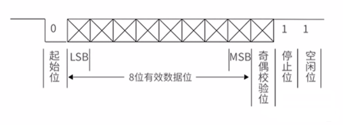

起始位，数据位，校验位还有就是停止位，由上图所示，一般我们也不需要使用校验位。但是串行通信偶尔也会使用校验位，校验位由名字就可以知道，就是说看你这帧数据有没有错误，在我们的串行通信中一般使用奇偶校验，数据位尾随的 1 位为奇偶校验位。奇校验时，数据中 1 的个数与校验位的和是奇数就为奇校验，反之就是偶校验，接收字符时，我们通过对 1 的个数的校验，若发现 1 的个数不一致，那么就说明数据传输过程中出现了错误。

UART 全称为通用异步收发传输器（Universal Asynchronous Receiver/Transmitter），其工作原理是约定好通讯的波特率，然后将数据一位位地进行传输。ESP32 的 RXD 引脚连串口模块的 TXD，TXD 连 RXD，让 ESP32 和 串口模块都连接电脑。

UART 在 machine 的 UART 模块中，我们也是只需要了解其构造对象函数和使用方法即可。

构造函数 UART(id, baudrate, rx=None, tx=None, bits=8, parity=None, stop=1)，作用是创建 UART 对象。

+ id：0、1、2；
+ baudrate：波特率，常用 115200、9600；关于波特率，单片机或计算机在串口通信时的速率用波特率表示，它定义为每秒传输二进制代码的个数，即 1 波特= 1 位/秒，单位是 bps。关于波特率的计算，在串行通信中，收发双方对发送或接收数据的速率要有约定。我们的电脑可以使用串口调试工具来设置我们电脑得参数，而我们的 ESP32 单片机就只能通过编程来设置了。
+ rx：数据接收引脚；
+ tx：数据发送引脚；
+ bits：数据位，默认为 8，在数据包的起始位之后紧接着的就是要传输的主体数据内容，也称为有效数据，有效数据的长度常被约定为 8 位或 9 位长。
+ parity：数据校验位，默认为 None，在有效数据之后，有一个可选的数据校验位。
+ stop：默认为 1，停止位。

[串口调试助手](../bin/esp32/tool/Sscom.7z)

=== "串口通信"
	要求：返回使用串口调试助手发送的文本。
	```py
	from machine import UART

	uart = UART(1, 115200)
	uart.write('AGSNWIKI')

	while True:
	   if uart.any():
		   text = uart.read(20)
		   print(text)
	```

## IRDA红外通信

## Bluetooth蓝牙通信

## Wi-Fi局域网通信

Wi-Fi是基于IEEE 802.11标准的无线网络技术让联网设备以无线电波的形式，加入采用TCP/IP通信协议的网络。如今物联网市场异常火爆，WIFI 是物联网中非常重要的角色，现在基本上家家户户都有 WIFI 网络，通过 WIFI 接入到互联网，成了智能家居产品普遍的选择。ESP32 内部已集成 WIFI 功能，可以说它就是为 WIFI 无线连接而生的。WIFI 模块也是为什么 ESP32 可以迅速崛起的主要原因之一。

Wi-Fi网络环境通常有两种模式：

+ Access Point(AP) 无线接入点，提供无线接入的设备，家里的光猫就是结合WiFi和internet路由功能的AP。AP和AP可以相互连接。
+ Station(STA) 无线终端，连接到AP的装置，手机，电脑等需要联网的设备都是出于STA模式，这个模式不允许其他设备接入。

Wi-Fi常用参数：

|参数|描述|
|-|-|
|AP/STA|工作模式：无线接入点/无线终端|
|SSID|服务集标识符|
|BSSID|基本服务集标识符|
|ESSID|延伸式服务集标识符|
|WPA|Wi-Fi保护访问|
|PASSWORD|Wi-Fi访问密码|

Wi-Fi构造函数：network.WLAN(interface_id)

interface_id是指各种模式，可选参数：AP_IF或STA_IF

Wi-Fi配置（方法）： 

|方法|说明|参数|返回值|
|-|-|-|-|
|active([is_active])|激活/停用网络接口；查询网络接口状态|True/False|True/False|
|connect(ssid=None, password=None, \*, bssid=None)|使用指定的密码连接到指定的无线网络|-|-|
|disconnect()|断开当前连接的无线网络|-|-|
|scan()|扫描只能在 STA 接口上进行|-|(ssid, bssid, channel, RSSI, authmode, hidden)|
|status([param])|返回无线连接的当前状态|-|STAT_IDLE – 无连接，无活动、STAT_CONNECTING –正在进行连接、STAT_WRONG_PASSWORD – 由于密码错误而失败、STAT_NO_AP_FOUND – 失败，因为没有接入点回复、STAT_CONNECT_FAIL – 由于其他问题而失败、STAT_GOT_IP – 连接成功。|
|isconnected()|查询连接是否成功/是否被连接|True/False|True/False|
|ifconfig([(ip, subnet, gateway, dns)])|获取/设置 IP 级网络接口参数|IP 地址、子网掩码、网关和 DNS 服务器|当不带参数调用时，此方法返回一个包含上述信息的 4 元组。要设置上述值，请传递带有所需信息的 4 元组|
|config(param=value, ...)|获取或设置一般的网络接口参数|参数见下表|-|
 

|参数|描述|
|-|-|
|mac|MAC地址（字节） (bytes)|
|essid|WiFi 接入点名称（字符串）|
|channel|WiFi通道（整数）|
|hidden|ESSID 是否隐藏（布尔值）|
|authmode|支持认证模式（枚举）0 – open、1 – WEP、2 – WPA-PSK、3 – WPA2-PSK、4 – WPA/WPA2-PSK|
|password|访问密码（字符串）|
|dhcp_hostname|要使用的 DHCP 主机名|
|reconnects|尝试重新连接的次数（整数，0=无，-1=无限制）|

=== "AP模式"
	要求：使用Wi-Fi的AP模式开启热点。
	```py
	import network

	ap = network.WLAN(network.AP_IF)
	ap.active(True)
	ap.config(essid='ESP32',authmode=network.AUTH_WPA_WPA2_PSK, password='AGSNWIKI')
	```
=== "STA模式"
	要求：连接Wi-Fi热点。
	```py
	import time
	import network

	ssid = 'AGSNWIKI'
	password = '12345678'

	# 创建 WIFI 连接对象
	wlan = network.WLAN(network.STA_IF)
	# 激活 wlan 接口
	wlan.active(True)
	# 扫描允许访问的 WiFi
	print('扫描周围信号源：', wlan.scan())

	print("正在连接 WiFi 中", end="")
	wlan.connect(ssid, password)

	# 如果一直没有连接成功，则每隔 0.1s 在命令行中打印一个点
	while not wlan.isconnected():
	 print(".", end="")
	 time.sleep(0.1)

	# 连接成功之后，打印出 IP、子网掩码、网关、DNS地址
	print(f"\n{wlan.ifconfig()}")
	```
	
## NFC近场通信

NFC（Near Field Communication）近场通信，这个技术由非接触式射频识别（RFID）演变而来，由飞利浦半导体（现恩智浦半导体公司）、诺基亚和索尼共同研制开发，其基础是RFID及互连技术。NFC是一种短距离高频的无线电技术，在13.56Mhz频率运行于20cm距离内。其传输速度有106Kbit/s、212Kbit/s或者424Kbit/s三种。目前近场通信已通过并成为ISO/IEC IS 18092国际标准、ECMA-340标准与ETSI TS 102 190标准。

NFC的工作模式有卡模式、读写器模式和点对点模式三种

+ 卡模式：这个模式其实就是相当于一张采用RFID技术的IC卡。可以替代大量的IC卡（包括信用卡）场合商场刷卡、公交卡、门禁管制，车票，门票等等。此种方式下，有一个极大的优点，那就是卡片通过非接触读卡器的RF域来供电，即便是寄主设备（如手机）没电也可以工作。
+ 读写器模式：这个模式可以模拟读读卡器功能，读取MIFARE和FeliCa卡的信息
+ 点对点模式：这个模式和红外线差不多，可用于数据交换，只是传输距离较短，传输创建速度较快，传输速度可快些，功耗低（蓝牙也类似）。将两个具备NFC功能的设备链接，能实现数据点对点传输，如下载音乐、交换图片或者同步设备地址簿。一次通过NFC，多个设备如数码相机、PDA、计算机和手机之间都可以交换资料或者服务

NFC与RFID的区别有如下三点：

+ NFC将非接触读卡器、非接触卡和点对点功能整合进一块单芯片，而RFID必须有阅读器和标签组成。RFID只能实现信息的读取以及判定，而NFC技术则强调的是信息交互。通俗的说NFC就是RFID的演进版本，双方可以近距离交换信息。NFC手机内置NFC芯片，组成RFID模块的一部分，可以当作RFID无源标签使用进行支付费用；也可以当作RFID读写器，用作数据交换与采集，还可以进行NFC手机之间的数据通信
+ NFC传输范围比RFID小，RFID的传输范围可以达到几米、甚至几十米，但由于NFC采取了独特的信号衰减技术，相对于RFID来说NFC具有距离近、带宽高、能耗低等特点
+ 应用方向不同。NFC看更多的是针对于消费类电子设备相互通讯，有源RFID则更擅长在长距离识别

NFC近场通信的过程在本节内容中不是重点，重点是数据的传输和处理。NFC技术中有两个重要元素：阅读器和标签。通俗上讲，阅读器就是读卡器，而标签就是IC卡。以下是IC卡的常见类型：

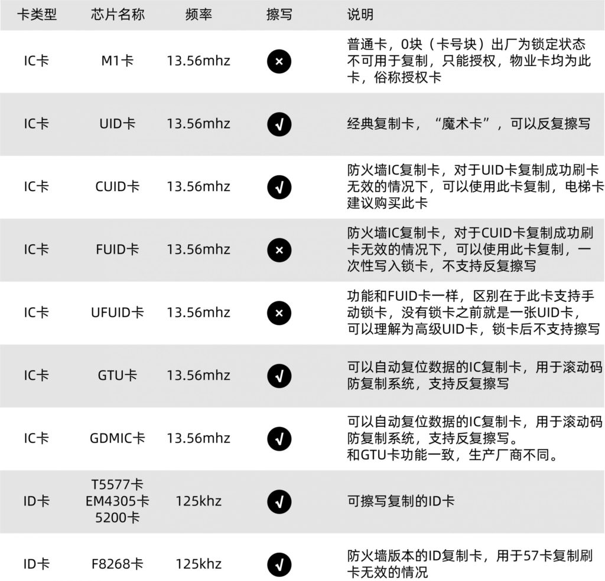

IC卡实际上是一个存储器，其相关信息与数据结构如下：

+ UID：卡片唯一的序列识别号
+ ATQA：卡片响应类型，用于描述卡片的物理特征
+ SAK：选择应答字节

IC卡数据分为16个扇区（0~15），每个扇区分为4个块（0~3），每个块分为32位。其中0、1、2块为数据块，3块为控制块。一共有64个块（0~63）。

0扇区的0块是特殊的块（属性块），存储了IC卡的UID、ATQA和SAK，0块的前8位是UID，而后24位存储了ATQA和SAK以及其他可能的信息，其存储位置也因卡类型、厂商不尽相同。部分卡还可以根据ATQA和SAK分辨卡的类型。

每个扇区的（除0扇区0块）的0、1、2块都是数据块，可以任意存储信息，其格式由所有者自由规定。3块是控制块，前12位为密码A，中间8位为控制位，后面12位为密码B，默认密码是FFFFFFFF。如果正确验证了某一扇区的密码，则能够读取这个扇区的数据，否则不能。

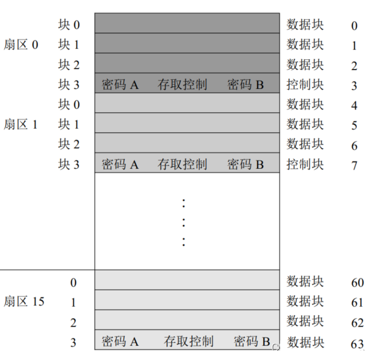

接下来讲解如何使用ESP32控制RC522对IC卡进行读写操作，由于我们不讨论IC卡读写过程，而是讨论IC卡数据传输和处理，这里直接给出驱动模块。

[MFRC522](../bin/esp32/mpy/mfrc522.py)

=== "读取IC卡UID"
	要求：读取IC卡的UID（唯一序列号）。
	```py
	from time import sleep_ms
	from machine import Pin, SPI
	from mfrc522 import MFRC522

	sck = Pin(18, Pin.OUT)
	mosi = Pin(23, Pin.OUT)
	miso = Pin(19, Pin.OUT)

	spi = SPI(baudrate=100000, polarity=0, phase=0, sck=sck, mosi=mosi, miso=miso)
	sda = Pin(5, Pin.OUT)

	def read_id():
		# 1. 创建RFID操作对象
		rfid = MFRC522(spi, sda)

		# 2. 循环读取数据
		while True:

			# 3. 复位应答
			stat, tag_type = rfid.request(rfid.REQIDL)
			if stat == rfid.OK:
				# 4. 防冲突检测，提取id号
				stat, raw_uid = rfid.anticoll()
				if stat == rfid.OK:
					_id = "0x%02x%02x%02x%02x" % (raw_uid[0], raw_uid[1], raw_uid[2], raw_uid[3])
					print("rfid卡片的id:", _id)

			sleep_ms(500)


	if __name__ == "__main__":
		read_id()
	```
=== "读取IC卡数据"
	要求：使用默认密码读取空白IC卡的数据。
	```py
	from time import sleep_ms, sleep
	from machine import Pin, SPI
	from mfrc522 import MFRC522

	sck = Pin(18, Pin.OUT)
	mosi = Pin(23, Pin.OUT)
	miso = Pin(19, Pin.OUT)
	spi = SPI(baudrate=100000, polarity=0, phase=0, sck=sck, mosi=mosi, miso=miso)

	sda = Pin(5, Pin.OUT)

	def read_all_data():


		rfid = MFRC522(spi, sda)
		while True:
			print("正在工作")
			stat, tag_type = rfid.request(rfid.REQIDL)
			if stat == rfid.OK:
				stat, raw_uid = rfid.anticoll()
				print("检测到IC卡")
				if stat == rfid.OK:
					uid = "0x%02x%02x%02x%02x" % (raw_uid[0], raw_uid[1], raw_uid[2], raw_uid[3])
					print("uid>>>", uid)
					if rfid.select_tag(raw_uid) == rfid.OK:
						print("正在读取数据：")
						key = [0xFF, 0xFF, 0xFF, 0xFF, 0xFF, 0xFF]
						for i in range(64):
							if rfid.auth(rfid.AUTHENT1A, i, key, raw_uid) == rfid.OK:
								print("%d-->" % i, rfid.read(i))
							else:
								print("%d-->" % i, " error...")

						rfid.stop_crypto1()

			sleep(1)

	if __name__ == "__main__":
		read_all_data()
	```
=== "写入IC卡数据"
	要求：在某一块写入数据。
	```py
	from mfrc522 import MFRC522
	from machine import Pin, SPI


	def write_date():

		sck = Pin(18, Pin.OUT)
		mosi = Pin(23, Pin.OUT)
		miso = Pin(19, Pin.OUT)
		spi = SPI(baudrate=100000, polarity=0, phase=0, sck=sck, mosi=mosi, miso=miso)
		sda = Pin(5, Pin.OUT)

		rfid = MFRC522(spi, sda)


		while True:
			stat, tag_type = rfid.request(rfid.REQIDL)
			if stat == rfid.OK:

				# 读取id
				stat, raw_uid = rfid.anticoll()
				if stat == rfid.OK:
					print("检测到卡片：")
					print("  - 类型: 0x%02x" % tag_type)
					print("  - id号: 0x%02x%02x%02x%02x" % (raw_uid[0], raw_uid[1], raw_uid[2], raw_uid[3]))

					# 选择要操作的本卡片
					if rfid.select_tag(raw_uid) == rfid.OK:
						# 密码
						key = [0xFF, 0xFF, 0xFF, 0xFF, 0xFF, 0xFF]
						# 要操作的块序号（0~63）
						block_num = 10
						# 密码认证
						if rfid.auth(rfid.AUTHENT1A, block_num, key, raw_uid) == rfid.OK:
							stat = rfid.write(block_num, b"\x00\x01\x02\x03\x04\x05\x06\x07\x08\x09\x0a\x0b\x0c\x0d\x0e\x0f")
							if stat == rfid.OK:
								print("数据已经写入到卡片...")
							else:
								print("error:数据写入失败...")
							rfid.stop_crypto1()
						else:
							print("密码错误...")


	if __name__ == "__main__":
		write_date()
	```

## 超再生通信

## LoRa通信

## FM调频通信

## 2.4G无线通信

## 5G无线通信

## SD存储

## CAM摄像头

## ASRPRO语音识别

## LVGL图形库

## WebREPL远程访问

与 Python 相同，MicroPython 也同样具有命令行交互式环境，简称 REPL，因此 WebREPL 就是网络版 MicroPython 交互环境。

虽然 MicroPython 具有传统 Python 语言的基本语法和使用规则，但 MicroPython 是专为嵌入式系统所设计。因此 MicroPython 与 Python 在应用环境方面具有一些区别。

我们在 Thonny 上用的 MicroPython REPL 是通过数据线来通讯的。作为物联网开发板，ESP32 的强项是 WIFI 联网，使用 WIFI 实现 REPL 的功能就是 WebREPL 了。

1. 在shell窗口中输入import webrepl_setup，输入以上指令并按下回车后，我们将进入WebREPL的设置模式。
2. 在命令行中会出现的第一个问题是询问我们是否让该开发板每次启动时自动开启WebREPL，E是开启，D是关闭，空行表示退出。这里，我们输入字符E并按下回车。
3. 为WebREPL设置密码。以后每次登录WebREPL都将用到此密码。输入密码，确保两次输入内容一致。密码为 4-9 个字符组合。
4. 系统设置完成后需要重启ESP32开发板，输入y即可。
5. 在MicroPython设备中看到多了一个新文件webrepl_cfg.py，其中的内容是你之前的密码。并且boot.py文件中，原本注释起来的内容，也解开注释了。

现在，我们还需要对boot.py文件进行修改，让他在启动的时候先链接WiFi，再开启 webrepl。将boot.py的内容修改如下：

=== "WebREPL"
	```py
	# This file is executed on every boot (including wake-boot from deepsleep)
	#import esp
	#esp.osdebug(None)
	import webrepl
	import time
	import network

	wlan = network.WLAN(network.STA_IF)
	wlan.active(True)
	wlan.disconnect()
	print('扫描周围信号源：', wlan.scan())
	print("正在连接 WiFi 中", end="")
	wlan.connect("ssid", "password")#修改SSID和密码
	while not wlan.isconnected():
	  print(".", end="")
	  time.sleep(0.1)
	print(f"\n{wlan.ifconfig()}")

	webrepl.start(password='password')#修改REPL密码
	```

设置完毕后，保存代码，重启 ESP32 单片机。

打开Thonny的运行>>配置解释器，在配置解释器窗口中，在”端口或WebREPL“选择WebREPL，URL配置为ws://192.168.0.8:8266/，密码则输入你设置的REPL密码。

正常连接单片机，这个操作可以让你后期对成品项目进行调试时，不需要连接数据线，只需要在同一局域网下，就可以实现对单片机编程。需要注意的是，WebREPL最大连接数为 1。

## Web请求

当我们在浏览器中输入网址或者使用应用程序时，我们实际上是向服务器发出请求。HTTP 请求是客户端（如浏览器）与服务器之间通信的方式，用于获取或发送 Web 资源。这些资源可以是文本文件、图像、脚本等，客户端通过 HTTP 协议发起请求，服务器返回相应的响应。

HTTP 请求通常由以下几个部分组成：

+ 请求行：包含请求方法、请求 URL 和 HTTP 协议版本，HTTP 协议版本一般都是HTTP/1.1，URL 是你要访问的地址，而请求方法除了 GET 还有 POST、PUT、DELETE 经常使用的 4 个请求方式，以及一些其他的请求方法。
+ 请求头：包含与请求相关的信息，例如浏览器类型、请求时间等。
+ 请求体：包含请求所需的数据。

我们虽然可以对任意网址发送网络请求，但是这样毫无意义，比如，我想要获取某个地区的天气状况，就需要调用相对应的接口，也就是 API。

API（Application Programming Interface）是指应用程序编程接口，它定义了应用程序之间进行通信的方式和规范。API 允许不同的应用程序之间进行数据交换，使得应用程序可以共享资源和信息，从而提高应用程序的效率和可用性。

API 通常使用 HTTP 请求来提供服务，客户端通过发送 HTTP 请求访问 API，服务器则通过 HTTP 响应返回所需的数据。API 可以提供许多不同的服务，例如访问数据库、获取实时数据、处理图像等。

当我们使用别人提供的 API 的时候就需要遵守别人制定的规则，使用对应的链接、请求方法等等，我们需要查看 API 文档来获取这些信息。比如，我们今天使用聚合数据的 API 接口。HTTP 请求是客户端与服务器之间通信的方式，API 则是应用程序之间通信的方式。通过 HTTP 请求访问 API，我们可以实现不同应用程序之间的数据交换和共享。

JSON（JavaScript Object Notation）是一种轻量级的数据交换格式，常用于 Web 应用程序之间的数据传输。它是一种文本格式，易于阅读和编写，并且可以被各种编程语言支持。

JSON 数据由键值对组成，其中键是字符串，值可以是字符串、数字、布尔值、数组、对象等数据类型。JSON 数据通常用于 Web 应用程序中，例如从后端服务器获取数据或向后端服务器发送数据。在前端 JavaScript 中，可以使用内置的 JSON 对象将 JSON 字符串转换为 JavaScript 对象，或将 JavaScript 对象转换为 JSON 字符串。

当我们使用 MicroPython 在嵌入式系统中开发物联网（IoT）应用时，我们通常需要使用网络连接。通过使用 MicroPython 的 urequests 模块，可以轻松地从 Web 服务器上获取数据，实现基于网络的功能。

urequests 模块是用于在 MicroPython 中进行 HTTP 请求的模块。它实现了 HTTP 客户端协议，允许我们使用 GET、POST、PUT 和 DELETE 请求等基本的 HTTP 请求类型。

+ get(url, data=None, json=None, headers={}, \*\*kw)：发送 HTTP GET 请求。data 参数用于指定请求数据，json 参数用于指定 JSON 数据，headers 参数用于指定 HTTP 标头，\*\*kw 参数用于传递其他参数
+ post(url, data=None, json=None, headers={}, \*\*kw)：发送 HTTP POST 请求。data 参数用于指定请求数据，json 参数用于指定 JSON 数据，headers 参数用于指定 HTTP 标头，\*\*kw 参数用于传递其他参数
+ put(url, data=None, \*\*kw)：发送 HTTP PUT 请求。data 参数用于指定请求数据，\*\*kw 参数用于传递其他参数
+ delete(url, \*\*kw)：发送 HTTP DELETE 请求。\*\*kw 参数用于传递其他参数。

=== "发送Web请求"
	要求：使用urequests模块发送Web请求
	```py
	import urequests
	import time
	import network

	ssid = 'SSID'
	password = 'PASSWORD'
	wlan = network.WLAN(network.STA_IF)
	wlan.active(True)
	print('扫描周围信号源：', wlan.scan())
	print("正在连接 WiFi 中", end="")
	wlan.connect(ssid, password)
	while not wlan.isconnected():
	  print(".", end="")
	  time.sleep(0.1)
	print(f"\n{wlan.ifconfig()}")

	response = urequests.get('https://www.example.com')
	print(response.text)
	```

## Web服务

当涉及到网络通信时，Socket 是一个常见的概念。它是在计算机网络中实现通信的一种抽象概念或编程接口。通过 Socket，不同计算机之间可以建立连接并进行数据交换。

Socket 可以看作是一种通信端点，它使用 IP 地址和端口号来标识不同的设备和应用程序。每个 Socket 都与一个特定的协议相关联，例如 TCP 或 UDP，用于在网络上进行数据传输。

Socket 翻译过来其实就是插座的意思，在台湾和香港被翻译成网络插座，这种翻译方式其实也很好的反映了 Socket 通信的特点。

Socket 是通信的基石，是支持 TCP/IP 协议的网络通信的基本操作单元。它是网络通信过程中端点的抽象表示，包含进行网络通信必须的五种信息：连接使用的协议（通常是 TCP 或 UDP），本地主机的IP地址，本地进程的协议端口，远地主机的 IP 地址，远地进程的协议端口。

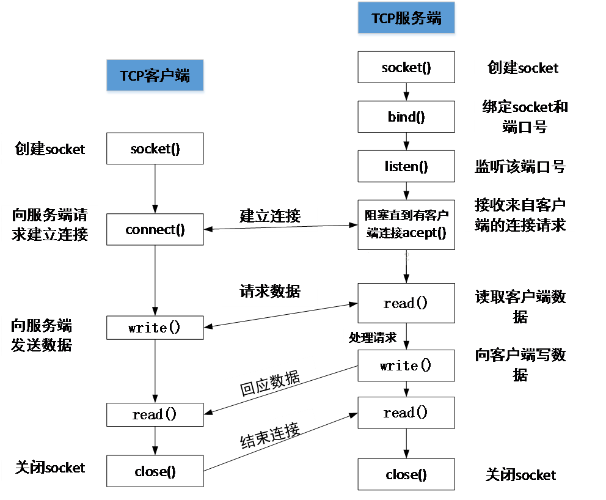

从上图可以看到，建立 Socket 通信需要一个服务器端和一个客户端。对于客户端，则需要知道电脑端的 IP 和端口即可建立连接。（端口可以自定义，范围在 0~65535，注意不占用常用的80等端口即可。）

下面是 Socket 的一些关键概念：

IP地址：在计算机网络中，每个设备都有一个唯一的 IP 地址，用于标识设备的位置。IP 地址由一系列数字组成，例如 IPv4 地址是由四个十进制数（0-255）组成，中间用点分隔，如 192.168.0.1。

端口号：端口号用于标识一个特定的应用程序或服务，使数据可以传输到正确的目的地。端口号是一个数字，范围从 0 到 65535。0 到 1023 的端口号是为一些特定的服务保留的，例如HTTP的端口号是80，HTTPS的端口号是443。

Socket 类型：在 Socket 编程中，有两种常见的套接字类型：Stream Socket（流套接字）和Datagram Socket（数据报套接字）。

+ Stream Socket（流套接字） 使用 TCP 协议，提供可靠的、面向连接的通信，确保数据的可靠性和按顺序的传输。
+ Datagram Socket（数据报套接字）使用 UDP 协议，提供无连接的通信，适用于实时性要求高的应用，如音视频传输。

客户端和服务器：在Socket通信中，通常有两个主要角色：客户端 和 服务器。

+ 客户端是发起连接请求的一方，通常是一个应用程序或设备。
+ 服务器是提供服务的一方，它监听指定的端口号，并等待客户端的连接请求。
通过Socket，客户端和服务器可以建立连接，并通过发送和接收数据进行通信。客户端可以向服务器发送请求，并接收服务器的响应。服务器可以接收客户端的请求，并向客户端发送响应。

在实际的 Socket 编程中，使用不同编程语言提供的 Socket API，如 C/C++ 的 socket 库、Python 的 socket 模块等，来创建、连接、发送和接收数据。这些 API 提供了一组函数和方法，开发者可以使用这些函数和方法来实现网络通信的各个方面。

总而言之，Socket是一种用于实现网络通信的抽象概念，通过使用 IP 地址和端口号，不同计算机之间的应用程序可以建立连接，并通过发送和接收数据进行通信。

所以，socket的出现只是可以更方便的使用 TCP/IP 协议栈而已，简单理解就是其对 TCP/IP 进行了抽象，形成了几个最基本的函数接口。比如 create，listen，accept，connect，read 和 write 等等。以下是通讯流程：

以上的内容，简单来说就是如果用户面向应用来说，那么 ESP32 只需要知道通讯协议是 TCP 或 UDP、服务器的 IP 和端口号这 3 个信息，即可向服务器发起连接和发送信息。

 ESP32 可以作为服务端，也就是说把 ESP32 作为一个服务器，实际上，这种方式并不常用，因为ESP32的性能与一般的云服务器完全没有可比性，但是也许有一些特殊的情况，导致我们不得不使用 ESP32 作为服务器的时候。

Microdot 是一个受 Flask 启发的简约 Python Web 框架，被设计为轻量级的 Web 服务器，适用于资源受限的嵌入式设备，例如 ESP32，ESP8266。它只需要很少的 RAM 和存储空间，并且具有较低的 CPU 消耗.

你可以通过定义多个路由来处理不同的 URL 请求。每个路由由 URL 路径和相应的处理函数组成。当收到匹配的请求时，服务器将调用相应的处理函数。Microdot 还支持静态文件服务，可以轻松地将静态文件（如 HTML、CSS、JavaScript、图像等）提供给客户端。你只需要指定一个目录，服务器将自动处理静态文件的请求。集成了简单的模板引擎，使您可以轻松地生成动态的HTML响应。您可以在 HTML 文件中定义占位符，然后使用模板引擎将占位符替换为实际的值。

Microdot 支持 HTTP 的 GET 和 POST 请求。您可以通过定义相应的路由和处理函数来处理不同类型的请求。

```py
@app.route('/')
def index(request):
    return 'Hello, world!'

@app.get('/users/<int:id>')
def get_user(request, id):
    # ...

@app.post('/users')
def create_user(request):
    # ...

@app.put('/users/<int:id>')
def edit_user(request, id):
    # ...

@app.patch('/users/<int:id>')
def edit_user(request, id):
    # ...

@app.delete('/users/<int:id>')
def delete_user(request, id):
    # ...

@app.before_request
def func(request):
    # ...

@app.after_request
def func(request, response):
    # ...

    return response
@app.after_error_request
def func(request, response):
    # ...
    return response

@app.errorhandler(404)
def not_found(request):
    return 'Not found'
```

[Microdot](../bin/esp32/tool/microdot-main.zip)

=== "建立Web服务"
	要求：建立一个简单的控制灯开关的Web服务。
	```py
	import time
	import network
	from microdot import Microdot
	from machine import Pin

	ap = network.WLAN(network.AP_IF)
	ap.active(True)
	ap.config(essid='ESP32',authmode=network.AUTH_WPA_WPA2_PSK, password='AGSNWIKI')
	print(ap.ifconfig())

	led_pin = Pin(2, Pin.OUT)

	app = Microdot()

	htmldoc = '''<!DOCTYPE html>
	<html>
		<head>
			<title>ESP32 MicroPython Microdot Web 服务</title>
			<meta http-equiv="Content-Type" content="text/html; charset=utf-8">
		</head>
		<body>
			<div>
				<h1>ESP32 MicroPython Microdot Web 服务</h1>
				<p>你好，Microdot!</p>
				<p><a href="/shutdown">关闭服务</a></p>
				<p><a href="/led">开关灯</a></p>
			</div>
		</body>
	</html>
	'''


	@app.route('/')
	def hello(request):
		return htmldoc, 200, {'Content-Type': 'text/html'}


	@app.route('/shutdown')
	def shutdown(request):
		request.app.shutdown()
		return 'The server is shutting down...'

	@app.route('/led')
	def led(request):
		led_pin.value(not led_pin.value())
		return htmldoc, 200, {'Content-Type': 'text/html'}


	app.run(host='0.0.0.0', port=5000, debug=True)
	```

## MQTT通信协议